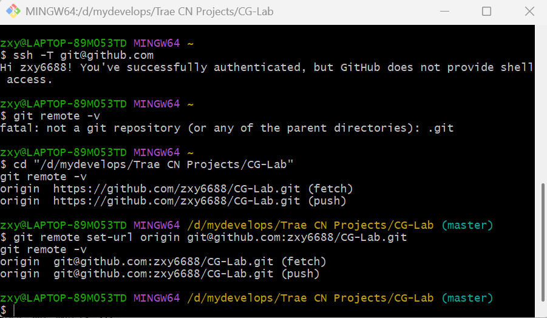

# CG-Lab 计算机图形学实验仓库

本仓库用于存放计算机图形学课程实验代码、实验说明文档与效果展示资源，主要基于 **Python + Taichi** 实现。

当前仓库已经按照实验内容重新整理为多个独立的 work 目录，并统一配套了对应的 README 与演示资源，便于运行、展示和后续维护。

目前仓库包含以下实验内容：

- **work1**：万有引力粒子群仿真实验
- **work2**：三维 MVP 变换实验
- **work3**：贝塞尔曲线实验（

## 一、当前项目结构

```text
CG-Lab/
├── assets/
│   ├── work1/
│   │   └── work1-demo.gif
│   ├── work2/
│   │   └── work2-demo.gif
│   ├── work3/
│   │   └── work3-demo.gif
│   └── ssh_set.png
├── src/
│   ├── work1/
│   │   ├── __pycache__/
│   │   ├── __init__.py
│   │   ├── config.py
│   │   ├── main.py
│   │   ├── physics.py
│   │   └── README.md
│   ├── work2/
│   │   ├── __init__.py
│   │   ├── cube_demo.py
│   │   ├── cube_interp_demo.py
│   │   ├── main.py
│   │   ├── README.md
│   │   └── test.py
│   └── work3/
│       ├── bezier_curve.py
│       ├── bezier_curve_antialias.py
│       ├── bspline_curve_compare.py
│       ├── README.md
│       └── test.py
├── .gitignore
├── imgui.ini
├── pyproject.toml
├── README.md
└── uv.lock
```

说明：

- `assets/` 用于存放各实验的演示 GIF、截图等可视化资源
- `src/` 用于存放各实验的源代码与子 README
- 每个 `work` 对应一次独立实验或一组相关实验内容
- 根目录 `README.md` 用于介绍整个仓库的总体结构与运行方式

## 二、各实验内容概览

### work1：万有引力粒子群仿真实验

本实验基于 Taichi 实现二维平面中的粒子万有引力相互作用与实时可视化。

主要内容包括：

- 粒子系统初始化
- 引力计算
- 粒子运动更新
- 图形界面实时显示
- 参数配置与实验结构组织

对应文件：

- `src/work1/config.py`：参数配置
- `src/work1/physics.py`：物理计算核心
- `src/work1/main.py`：主程序入口
- `src/work1/README.md`：实验说明文档

演示资源位置：

- `assets/work1/work1-demo.gif`

### work2：三维 MVP 变换实验

本实验围绕图形学中的 **Model - View - Projection** 变换展开，实现三维场景到二维屏幕空间的映射过程。

主要内容包括：

- 模型变换（Model Transform）
- 视图变换（View Transform）
- 投影变换（Projection Transform）
- 三维图形在二维屏幕上的绘制
- 立方体演示与旋转插值扩展

对应文件：

- `src/work2/main.py`：基础 MVP 实验主程序
- `src/work2/cube_demo.py`：立方体透视旋转展示
- `src/work2/cube_interp_demo.py`：立方体旋转插值演示
- `src/work2/README.md`：实验说明文档

演示资源位置：

- `assets/work2/work2-demo.gif`

### work3：贝塞尔曲线实验

本实验围绕贝塞尔曲线的交互式绘制展开，基于 De Casteljau 算法、像素光栅化和图形界面事件处理完成基础实验，并进一步扩展了两个选做内容。

主要内容包括：

- 基础贝塞尔曲线绘制
- 控制点与控制折线显示
- 基于 De Casteljau 算法的曲线采样
- 像素级光栅化绘制
- 反走样贝塞尔曲线
- Bezier 与 B-Spline 对比展示

对应文件：

- `src/work3/bezier_curve.py`：必做基础版
- `src/work3/bezier_curve_antialias.py`：选做一，反走样版本
- `src/work3/bspline_curve_compare.py`：选做二，Bezier 与 B-Spline 对比版
- `src/work3/README.md`：实验说明文档

演示资源存放位置：

- `assets/work3/demo_basic.gif`
- `assets/work3/demo_antialias.gif`
- `assets/work3/demo_bspline_compare.gif`

## 三、环境说明

本项目推荐使用 **uv** 或 **conda** 配置 Python 环境。

项目主要依赖：

- Python 3.12
- Taichi
- NumPy

## 四、使用 uv 运行

如果你使用 `uv` 进行环境管理，可在项目根目录执行：

```bash
uv add taichi numpy
uv run python src/work1/main.py
uv run python src/work2/main.py
uv run python src/work3/bezier_curve.py
```

如果要运行 work3 的两个扩展版本：

```bash
uv run python src/work3/bezier_curve_antialias.py
uv run python src/work3/bspline_curve_compare.py
```

## 五、使用 conda 运行

如果你使用 `conda`，可在项目根目录执行：

```bash
conda create -n cg_env python=3.12 -y
conda activate cg_env
pip install taichi numpy
python src/work1/main.py
python src/work2/main.py
python src/work3/bezier_curve.py
```

如果要运行 work3 的扩展版本：

```bash
python src/work3/bezier_curve_antialias.py
python src/work3/bspline_curve_compare.py
```

## 六、各实验 README 入口

如果需要查看某个实验的详细说明、原理分析、交互方式或实现细节，可以直接阅读对应目录下的 README：

- `src/work1/README.md`
- `src/work2/README.md`
- `src/work3/README.md`


## 八、SSH 配置说明

如果本地已经配置好 SSH key，并且已经添加到 GitHub 账号中，可以直接跳到“切换仓库远程地址”部分。（老师给了非常非常详细的手册，爱了爱了）

### 为什么推荐使用 SSH 连接 GitHub

本仓库支持使用 HTTPS 或 SSH 与 GitHub 连接，但从课程实验和日常开发维护的角度，推荐优先使用 **SSH**。

使用 SSH 的主要好处包括：

- 不需要在每次 push / pull 时重复处理账号密码或 token
- 配置完成后，后续提交代码更方便
- 适用于 public 仓库和 private 仓库
- 更适合长期维护课程项目
- 是 GitHub 常用且稳定的连接方式之一

### 1. 检查本机是否已有 SSH 密钥

建议使用 **Git Bash**。

在终端中输入：

```bash
ls -al ~/.ssh
```

如果看到类似下列文件，说明已经存在 SSH 密钥：

- `id_rsa`
- `id_rsa.pub`

或者：

- `id_ed25519`
- `id_ed25519.pub`

其中：

- 不带 `.pub` 的文件是私钥，保留在本机，不能泄露
- 带 `.pub` 的文件是公钥，需要添加到 GitHub

### 2. 查看公钥内容

如果使用的是 RSA 密钥，可输入：

```bash
cat ~/.ssh/id_rsa.pub
```

如果使用的是 ed25519 密钥，可输入：

```bash
cat ~/.ssh/id_ed25519.pub
```

终端会输出一整串内容，将其完整复制。

### 3. 将公钥添加到 GitHub

在 GitHub 中依次进入：

- 右上角头像
- `Settings`
- `SSH and GPG keys`
- `New SSH key`

然后填写：

- `Title`：任意名称，例如 `My Laptop`
- `Key`：粘贴刚才复制的公钥内容

添加完成后，GitHub 就会将这台电脑识别为你的可信设备。

### 4. 测试 SSH 是否配置成功

在 Git Bash 中输入：

```bash
ssh -T git@github.com
```

如果配置成功，会看到类似提示：

```text
Hi zxy6688! You've successfully authenticated, but GitHub does not provide shell access.
```

这表示本机已经能够通过 SSH 与 GitHub 建立身份验证连接。

### 5. 将当前仓库的远程地址切换为 SSH

如果当前仓库仍然使用 HTTPS 地址，可以在项目根目录中执行：

```bash
git remote set-url origin git@github.com:zxy6688/CG-Lab.git
```

然后检查是否切换成功：

```bash
git remote -v
```

如果看到如下形式，说明仓库已经改为 SSH 连接：

```text
origin  git@github.com:zxy6688/CG-Lab.git (fetch)
origin  git@github.com:zxy6688/CG-Lab.git (push)
```





## 九、资源组织说明

为了保持仓库结构清晰，所有实验展示资源统一放在 `assets/` 目录下，并按实验分文件夹管理：

- `assets/work1/`：work1 演示资源
- `assets/work2/`：work2 演示资源
- `assets/work3/`：work3 演示资源

推荐将每个实验的 GIF、截图、结果图等都保存在对应目录中，并在各自 README 中通过相对路径引用。

## 十、当前仓库整理说明

相较于早期版本，本仓库于2026年4月9日做了较大规模的结构整理与重命名，主要包括：

- 将实验内容按 `work1 / work2 / work3` 重新组织
- 将资源文件统一迁移到 `assets/` 目录下分类保存
- 调整了整体目录结构，使代码、文档和展示资源的关系更加清晰

## 十一、后续维护建议

为了避免项目继续变乱，建议后续遵循以下规则：

- 每个新实验单独建立一个新的 `src/workX/` 目录
- 所有演示资源统一放在 `assets/workX/`
- 统一使用小写目录命名，如 `work1`、`work2`、`work3`
- 修改完成一个实验后及时提交 Git

## 十二、仓库用途说明

本仓库主要用于：

- 课程实验代码整理
- 作业提交与展示
- 图形学实验过程记录
- GIF / 截图等效果展示
- 后续实验扩展与维护
