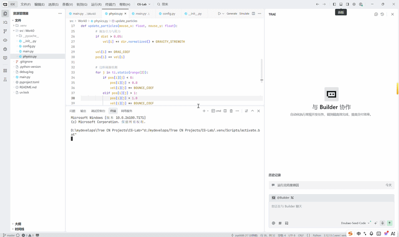

# Work1 - Graphics Development Environment and Gravity Particle System

计算机图形学实验一：**图形学开发环境搭建与万有引力粒子群仿真**

本实验基于 **Python + uv + Taichi + Git** 完成，围绕老师布置的实验一要求，依次完成了：
1. 开发环境与项目级虚拟环境搭建
2. 基于 `src` 布局的工程重构与代码分层
3. 使用 Taichi 实现二维万有引力粒子群仿真
4. 实时可视化与交互展示
5. Git 仓库整理与 README 文档编写

本 README 将重点放在以下内容上：
- 当前实验文件结构与每个文件的职责
- 每一个实现如何对应老师布置的实验要求与具体任务
- `uv`、`src` 布局、Taichi GPU 并行计算的核心原理
- 代码中的关键实现细节与整体数据流
- 可视化效果与 GIF 展示位置
- 如何运行、如何检查 GPU 调用情况

## 一、文件结构

当前 `src/work1/` 目录包含如下文件：

    work1/
    ├── __init__.py
    ├── config.py
    ├── physics.py
    ├── main.py
    └── README.md

仓库当前与本实验相关的推荐组织方式如下：

    CG-Lab/
    ├── assets/
    │   ├── work1/
    │       └── work1-demo.gif
    ├── src/
    │   ├── work1/
    │       ├── __init__.py
    │       ├── config.py
    │       ├── physics.py
    │       ├── main.py
    │       └── README.md
    ├── .gitignore
    ├── pyproject.toml
    ├── uv.lock
    └── README.md

其中各文件职责如下：

- `__init__.py`
  - 空文件即可
  - 用于将 `work1` 标记为标准 Python 包
  - 使 `config.py`、`physics.py`、`main.py` 之间可以进行模块化导入

- `config.py`
  - 参数配置中心
  - 统一存放粒子数量、窗口尺寸、引力相关参数、颜色参数等
  - 对应老师要求中的“参数配置与代码解耦”

- `physics.py`
  - 物理计算核心
  - 负责粒子之间的万有引力作用、状态更新与并行计算逻辑
  - 对应老师要求中的“GPU 并行计算与底层物理模拟”

- `main.py`
  - 程序入口
  - 负责初始化 Taichi、创建窗口、驱动主循环、调用渲染与交互逻辑
  - 对应老师要求中的“展示带交互的粒子渲染窗口”

- `README.md`
  - 当前实验说明文档
  - 对实验目标、项目结构、实现逻辑、运行结果与提交要求进行系统整理

## 二、可视化展示

注：本实验将图片与 GIF 资源统一保存在仓库根目录下的：

    assets/work1/

即：`assets/work1/work1-demo.gif`

本 README 位于 `src/work1/README.md`，因此插入 GIF 的相对路径为：

    ../../assets/work1/work1-demo.gif

### 1. 当前实验演示图

展示了以下内容：
- 启动程序
- 粒子群在窗口中的动态演化
- 演示鼠标交互效果
- 终端中 Taichi 后端启动信息

### 2. 备注：后续实验 GIF 位置预留

为了让整个仓库的资源组织保持统一，后续继续沿用以下命名方式：

    assets/work2/work2-demo.gif
    assets/work3/work3-demo.gif

比如后续实验三也保持这种结构，在 `src/work3/README.md` 中引用路径时直接写为：

    ../../assets/work3/work3-demo.gif

## 三、实验背景与目的

现代计算机图形学实验不仅要求实现具体算法，还要求建立规范、稳定、易扩展的开发环境与项目结构。

本实验的主要目的包括：

1. 理解现代 Python 项目级环境隔离思想，掌握 `uv` 的基本使用方式
2. 理解 `src` 布局在图形学工程中的意义，建立清晰的项目组织方式
3. 理解 Taichi 在图形学并行计算中的作用，打通 Python 与 GPU 计算链路
4. 完成一个二维万有引力粒子群仿真案例，验证环境、结构与计算流程是否可用
5. 建立后续实验可以直接复用的统一工程基础

换句话说，本实验要“让粒子动起来”，完成从：

    环境搭建 → 代码解耦 → GPU 计算 → 可视化展示 → Git 提交

这一整条图形学开发链路。

## 四、实验要求与完成情况对应说明

这一部分直接对应老师给出的实验要求。

### 要求 1：理解现代 Python 项目级环境隔离原理，掌握 `uv` 局部虚拟环境配置

本实验已完成：
- 使用 `uv` 管理项目依赖
- 在项目目录下维护独立环境
- 避免全局 Python 环境污染
- 为后续实验继续复用当前项目环境打下基础

这一部分体现的是：不同实验不再依赖系统级 Python 混装环境，而是在项目内部维护清晰、独立、可复制的依赖关系。

### 要求 2：理解现代工程规范与解耦思想，构建标准 `src` 布局

本实验已完成：
- 在 `src/` 目录下组织实验代码
- 使用 `src/work1/` 存放本实验核心内容
- 将代码拆分为 `config.py`、`physics.py`、`main.py`
- 将参数配置、底层计算与图形展示物理分离

这一部分体现的是：项目组织不是随意堆文件，而是有明确层次和边界。

### 要求 3：理解图形学底层硬件加速机制，通过 Taichi 实现 GPU 并行计算

本实验已完成：
- 使用 Taichi 编写粒子仿真程序
- 通过 Taichi 运行时自动选择可用硬件后端
- 完成粒子群的动态更新与可视化展示
- 可通过终端信息检查是否成功使用了 GPU 或图形加速后端

这一部分体现的是：图形学程序不再只是普通 Python 脚本，而是通过 Taichi 与底层硬件建立连接。

## 五、具体任务对应说明

这一部分直接对应老师给出的“具体任务”。

### 任务 1：完成基础图形学开发环境搭建

任务要求：
- 安装 Trae IDE 与 `uv`
- 初始化 `CG-Lab` 项目
- 生成独立虚拟环境

本实验完成情况：
- 已完成项目初始化
- 已使用 `uv` 管理依赖与环境
- 已建立统一工程目录，便于继续扩展更多实验内容

### 任务 2：安装 Taichi，建立 `src` 布局并完成代码拆分

任务要求：
- 安装 Taichi
- 严格按照 `src` 布局规范重构项目目录
- 建立 `config.py`、`physics.py`、`main.py`

本实验完成情况：
- 已安装 Taichi
- 已采用 `src/work1/` 结构组织本实验代码
- 已将参数、物理计算、主程序入口拆分到不同文件中

### 任务 3：实现万有引力粒子群仿真，并通过模块化指令运行程序

任务要求：
- 编写并完善粒子群仿真代码
- 使用 Taichi 接管底层并行计算
- 使用模块化或项目级运行方式启动图形窗口

本实验完成情况：
- 已实现二维粒子群仿真
- 已实现动态可视化显示
- 已支持交互展示
- 已可通过如下命令运行：

    uv run python src/work1/main.py

如果你后续继续统一包运行方式，也可以进一步整理为模块启动，但当前命令已经能稳定完成实验要求。

### 任务 4：上传 Git 平台，编写 README 并展示运行结果

任务要求：
- 上传完整代码到 GitHub / Gitee
- 使用 `.gitignore` 忽略 `.venv` 等本地环境目录
- 编写 README 说明项目架构、代码逻辑、实现功能
- 在 README 中插入运行演示 GIF
- 最终提交仓库链接

本实验完成情况：
- 已完成代码仓库管理
- 已整理 GIF 资源路径
- 已在当前 README 中说明项目结构、实现逻辑与运行效果
- 已将实验结果组织为可直接展示的仓库内容

## 六、核心工具在本实验中的作用

### 1. Trae / IDE

本实验使用 IDE 进行代码编写、目录管理、运行调试和 Git 提交。
它的意义在于提高开发效率，并帮助保持项目结构清晰。

### 2. uv

`uv` 是项目级环境与依赖管理工具。
在本实验中，它的作用是：
- 为当前项目维护独立环境
- 统一依赖版本
- 避免全局环境冲突
- 为后续实验继续复用环境

### 3. Taichi

Taichi 是本实验最核心的图形学与并行计算工具。
在本实验中，它的作用是：
- 管理粒子状态
- 编译并执行高性能计算逻辑
- 自动尝试连接合适的硬件后端
- 提供可视化窗口与渲染能力

### 4. Git

Git 用于管理项目版本历史。
在本实验中，它的作用是：
- 记录实验开发过程
- 将项目同步到 GitHub 仓库
- 便于老师查看仓库与实验结果
- 为后续多个实验统一维护同一个仓库

## 七、核心原理说明（笔记）

### 1. 为什么要使用 `src` 布局

如果把所有代码都直接堆在仓库根目录，会产生以下问题：
- 根目录混乱
- 配置、逻辑、入口耦合在一起
- 路径容易混淆
- 后续新增实验不方便管理

采用 `src/work1/` 后：
- 每个实验拥有独立代码空间
- 根目录保持整洁
- 模块边界更清晰
- 后续 `work2`、`work3` 可以自然扩展

因此，`src` 布局不是形式问题，而是工程规范问题。

### 2. 为什么要把代码拆成 `config.py`、`physics.py`、`main.py`

这一步体现的是“逻辑解耦”。

- `config.py` 负责参数
- `physics.py` 负责计算
- `main.py` 负责入口、渲染和交互

拆分之后的好处是：
- 修改参数时不必动底层逻辑
- 优化物理计算时不必打乱界面部分
- 程序结构更清晰
- 后续排查错误更容易

### 3. 万有引力粒子群仿真的基本思想

本实验将粒子视为二维平面中的离散点，每个粒子具有位置、速度等状态。
在每一帧更新中，粒子会受到其他粒子的引力影响，从而改变自身运动状态。

随着时间推进，所有粒子的局部相互作用叠加在一起，就形成了整体可视化的动态效果。

### 4. Taichi 在本实验中的作用

Taichi 的优势在于它既保留了 Python 的表达能力，又能将关键计算部分编译到更高效的执行后端。

在本实验中，Taichi 的作用主要体现在：
- 提供粒子状态存储结构
- 管理仿真计算逻辑
- 自动尝试使用 `cuda`、`metal`、`vulkan`、`opengl` 或 `cpu/x64`
- 支持实时可视化窗口输出

## 八、代码核心流程

本实验的整体执行流程可以概括为以下几个阶段：

### 1. 初始化环境

程序启动后，首先初始化 Taichi，并创建图形窗口。
这一步决定了后续使用什么执行后端，以及如何建立显示界面。

### 2. 读取配置参数

程序从 `config.py` 中读取粒子数量、窗口大小、颜色参数、物理参数等内容。
这样做能保证所有关键参数集中管理。

### 3. 初始化粒子状态

程序为粒子分配初始位置与其他状态信息。
这是仿真系统的初始条件，也是后续动态效果的起点。

### 4. 执行物理更新

每一帧都会调用 `physics.py` 中的核心逻辑，计算粒子间相互作用，并更新粒子的运动状态。
这是整个仿真的核心计算部分。

### 5. 执行渲染

状态更新后，程序会将粒子当前位置绘制到窗口中。
用户看到的连续动画，就是“计算一帧—绘制一帧”的结果。

### 6. 处理交互与刷新

如果程序中包含鼠标交互或其他输入逻辑，则会在这一阶段处理。
随后窗口刷新并进入下一帧。

## 九、如何检查是否成功调用 GPU

运行程序后，应观察终端中的 Taichi 启动信息。

如果出现类似以下输出，通常说明程序成功连接到了较合适的图形或 GPU 后端：

- `[Taichi] Starting on arch=cuda`
- `[Taichi] Starting on arch=metal`
- `[Taichi] Starting on arch=vulkan`
- `[Taichi] Starting on arch=opengl`

如果出现类似以下输出：

- `[Taichi] Starting on arch=cpu`
- `[Taichi] Starting on arch=x64`

则说明当前没有成功使用 GPU 后端，而是退回到了 CPU。
程序仍然可以运行，但在粒子数较大时性能可能会下降。

## 十、运行方式

在项目根目录下运行：

    uv run python src/work1/main.py

如果当前环境已经正确配置，也可以直接运行：

    python src/work1/main.py

## 十一、技术栈

本实验主要使用如下技术栈：

- Python
- uv
- Taichi
- Git
- 实时图形可视化
- 并行计算

## 十二、实验结果总结

本实验完整完成了老师布置的实验一核心任务，并成功打通了图形学实验开发流程中的基础环节。

### 1. 已完成的工程任务

已经完成：
- 项目级虚拟环境管理
- `src` 布局组织
- 参数配置、物理计算、主程序入口分层
- Git 仓库管理与提交规范整理
- README 编写与 GIF 展示资源组织

### 2. 已完成的程序任务

已经完成：
- 万有引力粒子群仿真
- 粒子动态可视化
- 基础交互支持
- Taichi 后端初始化与运行
- 实验运行展示

### 3. 已建立的后续基础

本实验不仅完成了当前任务，也为后续实验建立了统一基础：
- `src/work1/`
- `assets/work1/`

这样后续实验可以在统一仓库下继续维护，不需要每次重新组织项目，只需要在 `src/workX/` 目录下创建新的文件即可。

## 十三、实验体会

通过本实验，我对计算机图形学实验的理解：
1. 图形学实验首先需要规范的工程环境
2. GPU 并行计算并不是抽象概念，而是可以通过 Taichi 在实际项目中直接观察与验证的
3. README、GIF、Git 仓库整理也是实验提交质量的重要组成部分

## 十四、后续可继续改进的方向（记录）

如果继续扩展本实验，还可以尝试：

- 调整粒子数量与引力参数，观察不同动力学现象
- 增强鼠标交互逻辑
- 增加速度、颜色或轨迹显示
- 优化粒子初始化方式，使视觉效果更丰富
- 在根目录 README 中加入总导航页，统一展示 work1、work2、work3
- 继续保持 `assets/workX` 与 `src/workX` 的统一命名规则

## 十五、附注

本实验作为整个课程实验仓库的起点，建立统一的环境管理方式、仓库展示规范。

## 十六、作者

**xinyuan zhou**