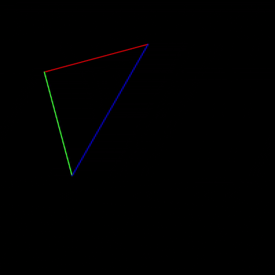

# Work2：三维 MVP 变换与立方体旋转实验

**基于 Taichi 的模型变换、视图变换、投影变换、透视投影与旋转插值实现**

本实验对应计算机图形学课程中“旋转与变换”部分的核心内容。  
在基础任务中，我完成了三维空间中线框三角形经过 **模型变换（Model）—视图变换（View）—投影变换（Projection）** 后映射到二维屏幕的全过程；  
在扩展部分中，我进一步实现了 **三维线框立方体、透视旋转，以及两个不同姿态之间的旋转插值动画**，使实验效果从“二维线框演示”提升到更具有空间感的“三维几何体展示”。

## 一、实验概述

本实验围绕图形学中的 **MVP 变换流程** 展开，其目标并不是单纯画出一个三角形，而是通过一个完整的小型图形学程序，理解三维物体如何一步步被映射到二维屏幕上。

老师给出的基础实验框架中，三角形顶点位于三维空间：

- `v0 = (2.0, 0.0, -2.0)`
- `v1 = (0.0, 2.0, -2.0)`
- `v2 = (-2.0, 0.0, -2.0)`

实验的核心任务，是将这些顶点通过：

- 模型变换矩阵 `Model`
- 视图变换矩阵 `View`
- 投影变换矩阵 `Projection`

组合成完整的 `MVP` 矩阵后，映射到二维屏幕坐标，并在 Taichi GUI 中绘制出线框图形。

在完成基础要求后，我继续实现了以下扩展内容：

- 将线框三角形扩展为三维线框立方体
- 使用透视投影显示三维空间感
- 使用两个不同姿态的立方体进行旋转插值
- 提供更完整的动态可视化展示效果

## 二、实验目标与任务对应

本实验与老师给出的目标和要求是一一对应的，主要体现在以下几个方面。

### 1. 对三维坐标变换流程的理解

本实验完整实现了从模型空间到屏幕空间的变换流程，具体包括：

- 物体在自身坐标系中的姿态变化
- 相机坐标系下的观察变换
- 透视投影到标准设备坐标
- 从归一化坐标映射到屏幕坐标

这对应老师要求中的：

- 深入理解 3D 空间中的坐标变换流程
- 理解 Model、View、Projection 三个矩阵的作用
- 理解齐次坐标与透视除法的必要性

### 2. 对三个核心函数的代码实现

老师要求补全以下三个函数：

- `get_model_matrix(angle)`
- `get_view_matrix(eye_pos)`
- `get_projection_matrix(eye_fov, aspect_ratio, zNear, zFar)`

本实验已经完成了这三个核心函数，并将它们真正用于三维顶点的屏幕变换过程。

### 3. 对 Taichi 矩阵与向量运算的掌握

本实验使用 Taichi 完成：

- 三维顶点存储
- 屏幕坐标计算
- 齐次矩阵乘法
- GUI 窗口绘制
- 按键交互响应


### 4. 选做内容

老师在选做部分提出了两个方向：

- 构建 3D 立方体并进行透视旋转
- 添加旋转的插值功能


## 三、文件结构

当前 `src/work2/` 目录建议组织如下：

```text
work2/
├── __init__.py
├── cube_demo.py
├── cube_interp_demo.py
├── main.py
├── test.py
└── README.md
```

各文件职责如下：

- `main.py`
  - 基础实验主程序
  - 对应老师要求中的标准 MVP 变换任务
  - 包含三角形顶点定义、MVP 变换、透视除法、屏幕映射与按键旋转交互

- `cube_demo.py`
  - 选做内容一
  - 将二维线框三角形扩展为三维线框立方体
  - 展示立方体在透视投影下的空间旋转效果

- `cube_interp_demo.py`
  - 选做内容二
  - 在三维立方体基础上，创建两个不同姿态
  - 使用旋转插值实现姿态之间的平滑过渡动画

- `test.py`
  - 辅助测试文件
  - 用于对照老师代码与自己的实现差异，帮助理解矩阵、顶点与变换流程

- `README.md`
  - 当前实验说明文档
  - 对实验目标、实现逻辑、代码结构、数学原理和展示效果进行系统整理

## 四、可视化展示


### 1. 基础实验演示图

<p align="center">
  
</p>

<p align="center">
  <em>基础部分效果：线框三角形在三维 MVP 变换后映射到二维屏幕并支持按键旋转</em>
</p>


## 五、基础实验所完成的内容

基础任务的核心是：在给定三维三角形顶点的基础上，完成完整的 MVP 变换，并将其显示在 Taichi 窗口中。

具体来说，本实验完成了以下内容：

1. 定义三维空间中的三角形顶点
2. 构造绕 Z 轴旋转的模型矩阵
3. 构造将相机平移到原点的视图矩阵
4. 构造透视投影矩阵
5. 按照正确顺序组合 `MVP = Projection @ View @ Model`
6. 对变换后的齐次坐标执行透视除法
7. 将结果映射到屏幕坐标
8. 在 GUI 中绘制线框三角形
9. 使用 `A` / `D` 键控制旋转
10. 使用 `Esc` 键退出程序

这部分已经完整对应老师给出的基础要求。

## 六、核心数学原理

### 1. 模型变换矩阵

模型变换描述的是物体自身的变换方式。

本实验要求实现的是：

- 输入一个角度值
- 返回一个绕 **Z 轴旋转** 的 `4 × 4` 齐次变换矩阵

这意味着：三角形本身会围绕 Z 轴旋转，而不是相机在动，也不是投影参数在变化。

这一部分的重点是：

- 角度需要先转换为弧度
- 使用 `sin` 和 `cos` 构造旋转矩阵
- 最终写成齐次坐标形式，便于与 View、Projection 统一相乘

### 2. 视图变换矩阵

视图变换描述的是“相机如何看场景”。

老师要求中给出的 `get_view_matrix(eye_pos)` 本质上是：

- 接收相机位置
- 构造一个平移矩阵
- 将场景整体朝相反方向平移
- 使相机在视图空间中等价于位于原点

这一部分的核心理解是：

- 相机本身并不是直接“移动图像”
- 而是通过对整个世界做反向平移，实现观察效果

### 3. 投影变换矩阵

投影变换负责把三维视锥体中的点映射到二维显示平面。

本实验采用透视投影，流程为：

1. 先将透视平截头体挤压到正交长方体
2. 再做标准正交投影
3. 最终将结果归一化到可显示范围

这一部分最重要的细节包括：

- `eye_fov` 是角度制，必须先转弧度
- 上下左右边界需要通过 `tan(fov / 2)` 和近平面距离推导
- 在右手坐标系中，相机看向 `-Z` 方向，因此近平面与远平面在实际矩阵里需要注意符号关系

### 4. 齐次坐标与透视除法

经过 `MVP` 变换后，顶点会得到齐次坐标：

```text
(x, y, z, w)
```

在映射到屏幕之前，必须执行：

```text
x /= w
y /= w
z /= w
```

这一步称为 **透视除法**。  
如果没有这一步，就无法正确得到标准设备坐标，也就无法形成真正的透视效果。

### 5. 屏幕坐标映射

完成透视除法之后，点通常位于 `[-1, 1]` 的归一化设备坐标系中。  
为了真正显示在窗口上，还需要进一步将其映射到屏幕像素坐标。


```text
模型空间 → 视图空间 → 裁剪空间 → 归一化设备坐标 → 屏幕空间
```

## 七、代码的整体实现流程

从程序运行逻辑上看，基础版主程序的执行流程可以概括为以下几个阶段：

### 1. 初始化 Taichi 与窗口

程序启动后，首先初始化 Taichi，并创建 GUI 窗口。  
这一步决定了后续图形如何显示，也决定了按键交互如何接入主循环。

### 2. 定义原始顶点

在程序中，先定义三角形在三维空间中的原始顶点位置。  
这些顶点就是后续所有变换的输入。

### 3. 构造三个变换矩阵

对于每一帧，程序根据当前角度与参数计算：

- `Model`
- `View`
- `Projection`

然后将三者相乘，得到总变换矩阵 `MVP`。

### 4. 执行顶点变换与透视除法

将每个顶点扩展为齐次坐标后，乘以 `MVP` 矩阵。  
随后对结果做透视除法，得到可用于显示的坐标。

### 5. 映射到屏幕并绘制图形

程序将变换后的顶点映射到屏幕位置，再使用 GUI 绘制线框边。  
最终在窗口中显示为旋转中的线框三角形。

### 6. 处理交互输入

用户按下：

- `A`：逆时针旋转
- `D`：顺时针旋转
- `Esc`：退出程序

程序根据输入更新角度，再重新执行下一帧的变换与绘制。


## 八、选做内容的实现思路

### 1. 三维立方体透视旋转

老师建议在基础三角形之上构建一个真正的三维立方体，以观察更明显的空间效果。

本实验中，我在选做部分定义了一个中心位于原点的立方体：

- 中心：`(0, 0, 0)`
- 边长：`2`
- 顶点范围：`[-1, 1]`

立方体共有：

- `8` 个顶点
- `12` 条边

与基础版只绘制三条边不同，选做版需要遍历立方体所有边，并对每个顶点执行相同的 MVP 变换。  
这样就能在屏幕上看到真正具有透视感的三维线框立方体旋转效果。

### 2. 旋转插值

老师在补充任务中进一步提出：

- 创建两个不同姿态的立方体
- 用旋转插值实现姿态过渡

本实验中，选做增强版通过设置两个不同旋转姿态，使立方体在这两个状态之间进行平滑过渡。

这一步的重点不再只是“能转”，而是：

- 让旋转过程更连续
- 让不同空间朝向之间的过渡更自然
- 更好地体现三维物体的姿态变化过程

在实现上，我使用四元数或等价插值思想来保证旋转过渡的平滑性，从而避免简单欧拉角线性插值可能带来的不自然效果。

## 九、选做部分相较基础部分的提升

与基础版相比，扩展版的提升主要体现在以下几个方面：

1. 从二维线框图形扩展到真正的三维几何体
2. 从单一绕 Z 轴旋转扩展到更有空间感的立方体旋转
3. 从静态旋转控制扩展到姿态之间的动态插值
4. 从“看懂公式”进一步发展为“看见真实空间效果”
5. 在可视化层面更适合作为实验展示与 GIF 演示


## 十、程序交互方式

### 基础版 `main.py`

- `A` 键：逆时针旋转
- `D` 键：顺时针旋转
- `Esc` 键：退出程序

### 立方体演示版 `cube_demo.py`

可根据实现支持：
- 自动旋转
- 多轴旋转观察
- 退出程序

### 旋转插值版 `cube_interp_demo.py`

可根据实现支持：
- 自动播放插值动画
- 切换自动 / 手动模式
- 调整插值参数
- 重置动画状态
- 退出程序

## 十一、运行环境

推荐运行环境如下：

- 操作系统：Windows
- Python 版本：3.12
- Taichi 版本：1.7.4
- NumPy：1.x 或 2.x

如果已经完成实验一的环境搭建，则可以直接在原有项目环境中继续运行本实验。

## 十二、运行方式

在项目根目录下运行基础版本：

```bash
uv run python src/work2/main.py
```

运行立方体扩展版本：

```bash
uv run python src/work2/cube_demo.py
```

运行旋转插值增强版：

```bash
uv run python src/work2/cube_interp_demo.py
```

如果不使用 `uv`，也可以直接运行：

```bash
python src/work2/main.py
python src/work2/cube_demo.py
python src/work2/cube_interp_demo.py
```

## 十三、实验结果与现象

程序成功运行后，可以观察到以下现象：

### 基础部分

- 窗口中会显示一个线框三角形
- 三角形经过 MVP 变换后能够正确显示在二维屏幕上
- 按下 `A` / `D` 键时，三角形会绕 Z 轴旋转
- 说明模型矩阵、视图矩阵、投影矩阵和透视除法实现正确

### 选做部分

- 屏幕中会显示一个具有透视效果的三维线框立方体
- 随着旋转，能够明显观察到前后深度关系
- 在插值版中，两个不同姿态之间会进行平滑过渡
- 说明程序已经从基础二维线框提升到更完整的三维几何可视化

## 十四、本实验的关键收获

通过这一实验，可以从三个层面理解三维图形变换问题。

### 1. 数学层面

掌握了：

- 旋转矩阵的构造
- 视图平移矩阵的构造
- 透视投影矩阵的推导思路
- 齐次坐标与透视除法的意义

### 2. 代码实现层面

掌握了：

- 把 4×4 矩阵真正写成代码
- 用 Taichi 管理顶点与坐标数据
- 完成三维顶点到二维屏幕的映射
- 组织主循环与交互逻辑

### 3. 图形学理解层面

真正理解了：
- 为什么三维物体不能直接画到屏幕上
- 为什么必须经过 Model、View、Projection 三个阶段
- 为什么透视效果会产生“近大远小”
- 为什么选做中的立方体比基础三角形更能体现三维空间感


