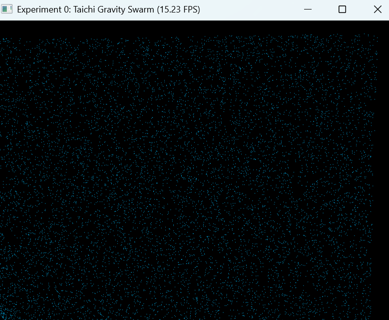
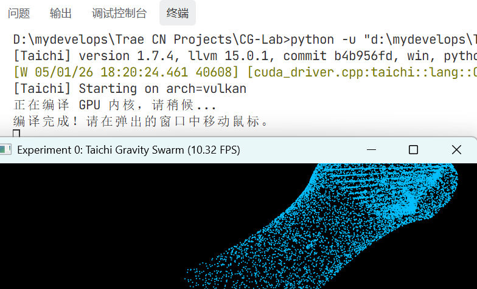
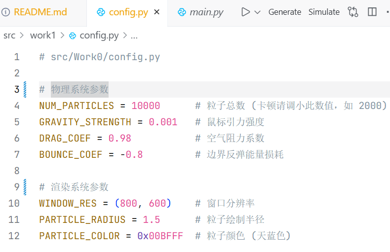

# 计算机图形学实验一：图形学开发工具 Graphics Development Tools

<br>

<p align="center">
  
  
  
  
  
  
</p>

<br>

<a id="toc"></a>

## 目录

<details open>
<summary><strong>一、本次实验任务与收获</strong></summary>

- [一、本次实验任务与收获](#section-1)

</details>

<details open>
<summary><strong>二、文件结构</strong></summary>

- [二、文件结构](#section-2)

</details>

<details open>
<summary><strong>三、运行方式</strong></summary>

- [三、运行方式](#section-3)
  - [3.1 基础版：万有引力粒子群仿真](#section-3-1)
  - [3.2 使用 uv 运行](#section-3-2)
  - [3.3 GPU 后端检查](#section-3-3)

</details>

<details open>
<summary><strong>四、可视化结果</strong></summary>

- [四、可视化结果](#section-4)
  - [4.1 基础粒子群仿真](#section-4-1)
  - [4.2 高密度粒子群效果](#section-4-2)
  - [4.3 强引力聚集效果](#section-4-3)
  - [4.4 边界反弹与阻尼效果](#section-4-4)
  - [4.5 GPU 后端运行检查](#section-4-5)

</details>

<details open>
<summary><strong>五、实验背景与目标</strong></summary>

- [五、实验背景与目标](#section-5)
  - [5.1 实验背景](#section-5-1)
  - [5.2 实验目标](#section-5-2)
  - [5.3 核心技能点](#section-5-3)

</details>

<details open>
<summary><strong>六、核心工具简介</strong></summary>

- [六、核心工具简介](#section-6)

</details>

<details open>
<summary><strong>七、实验原理</strong></summary>

- [七、实验原理](#section-7)
  - [7.1 src 布局与模块解耦](#section-7-1)
  - [7.2 uv 项目级环境隔离](#section-7-2)
  - [7.3 Taichi GPU 并行计算](#section-7-3)
  - [7.4 粒子系统状态量](#section-7-4)
  - [7.5 鼠标引力模型](#section-7-5)
  - [7.6 阻尼与边界反弹](#section-7-6)

</details>

<details open>
<summary><strong>八、基础任务实现</strong></summary>

- [八、基础任务实现](#section-8)
  - [任务 1：完成基础图形学开发环境搭建](#section-8-1)
    - [任务要求](#section-8-1-1)
    - [实现方式](#section-8-1-2)
  - [任务 2：安装 Taichi 并重构 src 布局](#section-8-2)
    - [任务要求](#section-8-2-1)
    - [实现方式](#section-8-2-2)
  - [任务 3：实现万有引力粒子群仿真](#section-8-3)
    - [任务要求](#section-8-3-1)
    - [实现方式](#section-8-3-2)
  - [任务 4：完成 Git 同步与文档展示](#section-8-4)
    - [任务要求](#section-8-4-1)
    - [实现方式](#section-8-4-2)

</details>

<details open>
<summary><strong>九、参数调节与可视化方案</strong></summary>

- [九、参数调节与可视化方案](#section-9)

</details>

<details open>
<summary><strong>十、效果图目录</strong></summary>

- [十、效果图目录](#section-10)

</details>

<details open>
<summary><strong>十一、运行与调试记录</strong></summary>

- [十一、附：运行与调试记录](#section-11)

</details>

<details open>
<summary><strong>十二、Git 提交与仓库规范</strong></summary>

- [十二、附：Git 提交与仓库规范](#section-12)

</details>

<details open>
<summary><strong>十三、个人笔记</strong></summary>

- [十三、个人笔记](#section-13)

</details>


<details open>
<summary><strong>十四、附注</strong></summary>

- [十四、附注](#section-15)

</details>

<details open>
<summary><strong>十五、作者</strong></summary>

- [十五、作者](#section-16)

</details>

<a id="section-1"></a>

## 一、本次实验任务与收获

本次实验是整个计算机图形学实验仓库的起点，核心目标不是只完成一个粒子动画，而是建立一套后续实验可以继续沿用的开发工作流。实验内容围绕 **环境搭建、工程结构、GPU 并行计算、可视化展示与 Git 管理** 展开。

**第一项任务是完成图形学开发环境搭建。** 本实验使用 Trae 作为开发环境，使用 `uv` 管理 Python 项目环境，并将依赖安装在项目级虚拟环境中，避免污染全局 Python 环境。通过这一步，后续每个实验都可以在同一个仓库中稳定运行。

**第二项任务是建立统一的 src 布局。** 本实验将代码放在 `src/work1/` 目录下，并拆分为 `config.py`、`physics.py` 和 `main.py`。其中，`config.py` 负责统一管理实验参数，`physics.py` 负责底层粒子物理计算，`main.py` 负责窗口创建、鼠标交互和画面渲染。这样的结构比把所有内容写在一个文件中更清晰，也更方便后续实验继续扩展。

**第三项任务是实现基于 Taichi 的万有引力粒子群仿真。** 程序在显存中存储粒子位置和速度，通过 Taichi kernel 并行更新所有粒子状态，再将粒子绘制到 GUI 窗口中。用户移动鼠标时，粒子会受到鼠标位置的吸引，形成聚集、扩散和边界反弹等动态效果。

**第四项任务是完成 Git 仓库同步与 README 展示。** 本实验将代码、说明文档和运行效果统一整理到仓库中，为后续 `work2`、`work3`、`work4`、`work5` 的实验文档风格打下基础。

<p align="right"><a href="#toc">回到目录 ↑</a></p>

<a id="section-2"></a>

## 二、文件结构

```text
CG-Lab/
├── assets/
│   └── work1/
│       ├── demo_basic.gif             # 基础任务：鼠标引力粒子群动态演示
│       ├── demo_basic.png             # 基础任务：粒子群静态效果图
│       ├── demo_high_density.gif      # 参数展示：高粒子数量下的密集粒子群效果
│       ├── demo_strong_gravity.gif    # 参数展示：增强鼠标引力后的快速聚集效果
│       ├── demo_bounce.gif            # 参数展示：边界反弹与阻尼运动效果
│       ├── terminal_gpu.png           # GPU 后端检查终端截图
│       └── config_params.png          # 参数配置说明截图
│
├── src/
│   └── work1/
│       ├── __init__.py                # Python 包初始化文件
│       ├── config.py                  # 配置模块：粒子数量、引力强度、阻尼、窗口大小、颜色等参数
│       ├── physics.py                 # 物理模块：粒子位置、速度 Field，以及初始化和更新 kernel
│       ├── main.py                    # 主程序：GPU 初始化、窗口创建、鼠标交互和粒子绘制
│       └── README.md                  # 实验说明文档
│
├── .gitignore                         # Git 忽略规则，排除 .venv、缓存文件和本地临时文件
├── pyproject.toml                     # uv 项目配置与依赖声明
├── uv.lock                            # uv 锁定文件，保证依赖版本可复现
└── README.md                          # 仓库总说明文档
```

<p align="right"><a href="#toc">回到目录 ↑</a></p>

<a id="section-3"></a>

## 三、运行方式

在项目根目录下运行。

<a id="section-3-1"></a>

### 3.1 基础版：万有引力粒子群仿真

```bash
python -u "src/work1/main.py"
```

该版本完成实验一的核心功能，包括 Taichi GPU 初始化、粒子随机生成、鼠标引力更新、阻尼运动、边界碰撞和实时窗口渲染。

<a id="section-3-2"></a>

### 3.2 使用 uv 运行

如果使用 `uv` 管理环境，可以在项目根目录运行：

```bash
uv run python src/work1/main.py
```

如果项目已经按模块方式配置，也可以使用：

```bash
uv run python -m work1.main
```

运行成功后，程序会弹出粒子群窗口。移动鼠标时，粒子会向鼠标位置聚集；持续移动鼠标可以观察粒子群在不同方向上的流动效果。

<a id="section-3-3"></a>

### 3.3 GPU 后端检查

运行时终端会输出 Taichi 初始化信息。若看到类似下面的内容，说明程序已经成功使用 GPU 或兼容图形后端运行：

```text
[Taichi] Starting on arch=vulkan
```

常见后端含义如下：

| 后端输出 | 含义 |
| --- | --- |
| `cuda` | 使用 NVIDIA 独立显卡，性能通常最好 |
| `metal` | 使用 macOS Apple Silicon 图形后端 |
| `vulkan` | Windows 或 Linux 下常见的现代图形后端 |
| `opengl` | 兼容性较强的图形后端 |
| `cpu` | 未调用 GPU，只使用 CPU 执行 |

如果 Windows 终端出现 `nvcuda.dll lib not found`，但随后显示启动在 `vulkan` 后端，一般不影响实验运行。这说明当前设备没有使用 CUDA，而是自动切换到了 Vulkan。

<p align="right"><a href="#toc">回到目录 ↑</a></p>

<a id="section-4"></a>

## 四、可视化结果

<a id="section-4-1"></a>

### 4.1 基础粒子群仿真

<table align="center">
  <tr>
    <td align="center"><strong>动态交互演示</strong></td>
    <td align="center"><strong>静态效果图</strong></td>
  </tr>
  <tr>
    <td align="center">
      
    </td>
    <td align="center">
      
    </td>
  </tr>
</table>

该组图展示了基础万有引力粒子群仿真的运行效果。动态演示中，粒子会根据鼠标位置不断更新速度和位置，并逐渐向鼠标附近聚集。静态效果图展示了某一时刻粒子在窗口中的分布状态，说明程序已经完成粒子初始化、GPU 并行更新和窗口渲染。

<a id="section-4-2"></a>

### 4.2 高密度粒子群效果

<p align="center">
  
</p>

该动图用于展示提高粒子数量后的运行效果。当 `NUM_PARTICLES` 增大时，画面中的粒子更加密集，鼠标移动时可以形成更明显的整体流动趋势。该效果主要用于说明 Taichi 后端可以并行处理大量粒子更新。为了图示区别，我换了个黑蓝背景 + 青绿色粒子，这个很像能量流，高密度效果特别好。BACKGROUND_COLOR = 0x020617，PARTICLE_COLOR = 0x2DD4BF

<a id="section-4-3"></a>

### 4.3 强引力聚集效果

<p align="center">
  
</p>

该动图用于展示增大 `GRAVITY_STRENGTH` 后的快速聚集效果。相比默认参数，粒子会更快地向鼠标位置靠拢，适合观察引力参数对运动速度和聚集形态的影响。我换了一个漂亮的紫色星云风格颜色，使粒子群在窗口中更加醒目。BACKGROUND_COLOR = 0x1E1B4B，PARTICLE_COLOR = 0xC084FC

<a id="section-4-4"></a>

### 4.4 边界反弹与阻尼效果

<p align="center">
  
</p>

该动图用于展示粒子接近窗口边界后的反弹效果。通过调整 `BOUNCE_COEF` 和 `DRAG_COEF`，可以观察粒子碰撞边界后的能量损耗和速度衰减。这个效果说明程序不仅实现了鼠标引力，也处理了基本边界约束。赛博霓虹粉，动图很显眼，颜色是BACKGROUND_COLOR = 0x020617，PARTICLE_COLOR = 0xF472B6

<a id="section-4-5"></a>

### 4.5 GPU 后端运行检查

<table align="center">
  <tr>
    <td align="center"><strong>GPU 后端终端截图</strong></td>
    <td align="center"><strong>参数配置说明</strong></td>
  </tr>
  <tr>
    <td align="center">
      
    </td>
    <td align="center">
      
    </td>
  </tr>
</table>

终端截图记录 Taichi 的后端启动信息。显示 `cuda`、`metal`、`vulkan` 或 `opengl`，说明程序已经成功通过 GPU 兼容图形后端执行。
参数配置说明图记录本实验中粒子数量、引力强度、阻尼系数、窗口大小和颜色等核心参数。这些是默认参数，我调整了几次具体参数，写在了第九大点中，观察了粒子群的运动效果。

<p align="right"><a href="#toc">回到目录 ↑</a></p>

<a id="section-5"></a>

## 五、实验背景与目标

<a id="section-5-1"></a>

### 5.1 实验背景

现代计算机图形学实验不仅需要写出正确的算法，还需要一个稳定、清晰、可维护的工程环境。本次实验引入 `uv` 作为 Python 项目环境管理工具，使用 `src` 布局组织代码，并结合 Taichi 编写 GPU 并行粒子群仿真程序。

这套流程打通了从 **环境搭建** 到 **模块拆分**，再到 **GPU 计算** 和 **可视化展示** 的完整链路。后续实验中的 MVP 变换、贝塞尔曲线、光照模型和光线追踪，都可以继续沿用这套仓库结构和文档规范。

<a id="section-5-2"></a>

### 5.2 实验目标

本实验的目标可以概括为三个方面。

1. 理解现代 Python 项目级环境隔离的意义，掌握使用 `uv` 创建和管理局部虚拟环境的方法，避免不同实验之间产生依赖冲突。

2. 理解图形学项目中的工程规范与解耦思想，通过 `src` 布局分离配置、计算和可视化逻辑，提高项目可维护性。

3. 理解 Taichi 的 GPU 并行计算机制，通过万有引力粒子群仿真验证图形学程序从 CPU 逻辑到 GPU 计算再到窗口显示的完整流程。

<a id="section-5-3"></a>

### 5.3 核心技能点

| 技能点 | 本实验中的体现 |
| --- | --- |
| IDE 使用 | 使用 Trae / VS Code 风格环境进行代码编辑、运行和调试 |
| Python 环境管理 | 使用 `uv` 管理项目依赖和虚拟环境 |
| Taichi 图形学库 | 使用 Taichi Field、Kernel 和 GUI 完成粒子群仿真 |
| Git 代码管理 | 使用 Git 跟踪代码改动，并同步到远程仓库 |

<p align="right"><a href="#toc">回到目录 ↑</a></p>

<a id="section-6"></a>

## 六、核心工具简介

| 工具 | 作用 | 本实验中的意义 |
| --- | --- | --- |
| Trae | 基于 VS Code 内核的集成开发环境 | 用于代码编辑、运行、调试和项目管理 |
| uv | 高性能 Python 环境与包管理器 | 为项目创建隔离环境，统一依赖版本 |
| Taichi | 面向并行计算和图形学的 Python 库 | 将粒子更新逻辑编译并部署到 GPU 或兼容后端 |
| Git | 分布式版本控制系统 | 跟踪代码历史，管理实验提交和远程同步 |
| Markdown | 文档编写格式 | 用于编写仓库说明、实验记录和运行展示 |

<p align="right"><a href="#toc">回到目录 ↑</a></p>

<a id="section-7"></a>

## 七、实验原理

<a id="section-7-1"></a>

### 7.1 src 布局与模块解耦

本实验采用 `src/work1/` 组织代码。相比所有文件堆在根目录，`src` 布局能让项目代码、依赖配置、说明文档和资源文件保持清晰边界。

在本实验中，代码被拆分为三个核心模块：

| 文件 | 作用 |
| --- | --- |
| `config.py` | 保存粒子数量、引力强度、阻尼系数、窗口大小、颜色等参数 |
| `physics.py` | 定义粒子位置和速度 Field，并实现粒子初始化与更新 kernel |
| `main.py` | 初始化 Taichi，创建 GUI 窗口，读取鼠标位置并绘制粒子 |

这样的拆分使参数调整、物理逻辑和渲染逻辑互不混乱。后续如果需要增加轨迹显示、颜色渐变或新的交互方式，也可以在对应模块中独立修改。

<a id="section-7-2"></a>

### 7.2 uv 项目级环境隔离

`uv` 的作用是为当前项目创建独立虚拟环境。项目依赖不会直接安装到全局 Python 中，而是被隔离在项目环境内。这样可以避免不同课程、不同实验之间因为依赖版本不同而互相影响。

本实验中，`uv` 主要承担三个作用：

1. 创建项目级虚拟环境，避免污染系统 Python。

2. 安装并管理 Taichi 等实验依赖。

3. 通过 `uv run` 在正确环境中启动实验程序。

<a id="section-7-3"></a>

### 7.3 Taichi GPU 并行计算

粒子群仿真包含大量重复计算。每个粒子的更新逻辑基本相同，因此适合并行执行。Taichi 的 `@ti.kernel` 可以把 Python 风格的循环编译到底层后端，由 GPU 或兼容图形后端并行运行。

粒子更新的核心循环可以理解为：每一帧中，所有粒子同时根据鼠标位置更新速度和位置。相比在普通 Python 循环中逐个更新粒子，GPU 并行方式更适合处理大规模粒子群。

<a id="section-7-4"></a>

### 7.4 粒子系统状态量

每个粒子需要维护两个基本状态：位置和速度。

$$
p_i = (x_i, y_i)
$$

$$
v_i = (v_{x,i}, v_{y,i})
$$

其中，`p_i` 表示第 `i` 个粒子在窗口中的归一化坐标，`v_i` 表示第 `i` 个粒子的速度。程序中使用 Taichi 的 `Vector.field` 在显存中保存所有粒子的状态。

<a id="section-7-5"></a>

### 7.5 鼠标引力模型

设鼠标当前位置为：

$$
m = (m_x, m_y)
$$

第 `i` 个粒子的位置为：

$$
p_i = (x_i, y_i)
$$

粒子指向鼠标的方向向量为：

$$
d_i = m - p_i
$$

距离为：

$$
r_i = \lVert d_i \rVert
$$

当距离大于一个很小的阈值时，程序对粒子速度施加朝向鼠标的加速度：

$$
v_i \leftarrow v_i + g \frac{d_i}{r_i}
$$

其中，`g` 对应配置文件中的 `GRAVITY_STRENGTH`。这个模型不是严格的物理万有引力公式，而是一个适合实时交互演示的简化引力模型，能够稳定地产生粒子向鼠标聚集的视觉效果。

<a id="section-7-6"></a>

### 7.6 阻尼与边界反弹

为了避免粒子速度无限增大，程序每帧对速度乘以阻尼系数：

$$
v_i \leftarrow \lambda v_i
$$

其中，`\lambda` 对应配置文件中的 `DRAG_COEF`。当 `\lambda` 越接近 1，粒子运动越持久；当 `\lambda` 更小，粒子速度衰减更明显。

粒子位置更新为：

$$
p_i \leftarrow p_i + v_i
$$

当粒子越过窗口边界时，程序把粒子位置限制在 `[0, 1]` 范围内，并反转对应方向的速度：

$$
v_{i,j} \leftarrow c v_{i,j}
$$

其中，`c` 对应 `BOUNCE_COEF`，通常为负数，用来表示碰撞后的反向反弹和能量损耗。

<p align="right"><a href="#toc">回到目录 ↑</a></p>

<a id="section-8"></a>

## 八、基础任务实现

<a id="section-8-1"></a>

## 任务 1：完成基础图形学开发环境搭建

<a id="section-8-1-1"></a>

### 任务要求

实验要求安装并配置 Trae IDE 与 `uv` 工具链，初始化 `CG-Lab` 项目，并生成独立虚拟环境，为后续图形学实验建立稳定开发基础。

<a id="section-8-1-2"></a>

### 实现方式

本实验在本地创建 `CG-Lab` 仓库，并使用 `uv` 管理 Python 环境。后续实验都放在同一个仓库下，通过 `src/workX/` 和 `assets/workX/` 的方式统一组织代码与展示资源。

对应操作包括：

```bash
uv init
uv add taichi
uv run python src/work1/main.py
```

<a id="section-8-2"></a>

## 任务 2：安装 Taichi 并重构 src 布局

<a id="section-8-2-1"></a>

### 任务要求

实验要求安装 Taichi 依赖库，并严格按照 `src` 布局组织代码，完成配置、物理计算和主程序的分层拆分。

<a id="section-8-2-2"></a>

### 实现方式

本实验将代码拆分为 `config.py`、`physics.py` 和 `main.py` 三个文件。参数全部集中在 `config.py` 中，粒子物理状态和更新逻辑放在 `physics.py` 中，窗口创建与渲染循环放在 `main.py` 中。

这种结构使代码职责更加清楚，也方便后续通过修改参数快速得到不同可视化效果。

<a id="section-8-3"></a>

## 任务 3：实现万有引力粒子群仿真

<a id="section-8-3-1"></a>

### 任务要求

实验要求编写并完善万有引力粒子群仿真代码，确保程序成功调用底层 GPU 或兼容图形后端进行并行计算，并通过窗口展示带交互的粒子群效果。

<a id="section-8-3-2"></a>

### 实现方式

程序使用 `ti.Vector.field` 存储粒子位置和速度，并通过两个 kernel 完成核心计算。`init_particles()` 用于随机初始化粒子位置，`update_particles(mouse_x, mouse_y)` 根据鼠标位置更新所有粒子的速度和位置。

主程序每一帧读取鼠标坐标，并调用 `update_particles()` 驱动 GPU 端物理计算。随后通过 `gui.circles(...)` 将粒子位置绘制到窗口中，实现实时交互效果。

对应代码位置：

```python
init_particles()
update_particles(mouse_x, mouse_y)
gui.circles(pos.to_numpy(), color=PARTICLE_COLOR, radius=PARTICLE_RADIUS)
```

<a id="section-8-4"></a>

## 任务 4：完成 Git 同步与文档展示

<a id="section-8-4-1"></a>

### 任务要求

实验要求将完整项目代码上传至 Git 平台，并在 README 中说明项目结构、代码逻辑和运行效果，同时附上演示 GIF 或视频。

<a id="section-8-4-2"></a>

### 实现方式

本仓库使用 Git 管理全部实验代码，并通过 `.gitignore` 排除 `.venv`、缓存文件和本地临时文件。README 中按照实验任务顺序说明环境搭建、代码结构、物理模型、参数调节和运行效果，并将 GIF 和截图统一放在 `assets/work1/` 下。

常用提交命令如下：

```bash
git status
git add src/work1 assets/work1
git commit -m "polish work1 development environment demo"
git push origin master:main
```

<p align="right"><a href="#toc">回到目录 ↑</a></p>

<a id="section-9"></a>

## 九、参数调节与可视化方案

为了让实验一的展示更丰富，本实验可以通过修改 `config.py` 中的参数录制多组 GIF。不同参数组合会带来不同粒子群视觉效果。

| 展示 | 参数 | 视觉效果 |
| --- | --- | --- |
| 基础交互效果 | `NUM_PARTICLES = 10000`，`GRAVITY_STRENGTH = 0.001`，`DRAG_COEF = 0.98` | 粒子稳定向鼠标聚集，适合展示基础功能 |
| 高密度粒子群 | `NUM_PARTICLES = 20000`，`PARTICLE_RADIUS = 1.0` | 画面更密集，适合展示 GPU 并行处理能力 |
| 强引力聚集 | `GRAVITY_STRENGTH = 0.003`，`DRAG_COEF = 0.985` | 粒子更快追随鼠标，聚集和流动更明显 |
| 柔和拖尾感 | `GRAVITY_STRENGTH = 0.0006`，`DRAG_COEF = 0.995` | 粒子运动更慢、更丝滑，适合录制美观动图 |
| 边界反弹效果 | `BOUNCE_COEF = -0.95`，`DRAG_COEF = 0.99` | 粒子撞到边界后反弹更明显 |


<p align="right"><a href="#toc">回到目录 ↑</a></p>

<a id="section-10"></a>

## 十、效果图目录

| 实验部分 | 动态演示 | 静态效果图 |
| --- | --- | --- |
| 基础粒子群仿真 | [查看动态演示](#section-4-1) | [查看静态效果图](#section-4-1) |
| 高密度粒子群效果 | [查看动态演示](#section-4-2) | [查看参数说明](#section-4-5) |
| 强引力聚集效果 | [查看动态演示](#section-4-3) | [查看参数说明](#section-4-5) |
| 边界反弹与阻尼效果 | [查看动态演示](#section-4-4) | [查看参数说明](#section-4-5) |
| GPU 后端运行检查 | [查看基础运行效果](#section-4-1) | [查看终端截图](#section-4-5) |

<p align="right"><a href="#toc">回到目录 ↑</a></p>

<a id="section-11"></a>

## 十一、附：运行与调试记录

本实验中最关键的调试点是确认 Taichi 是否成功接管底层计算后端。运行程序时，如果终端输出显示 `vulkan`，说明在当前 Windows 环境下已经成功启用兼容图形后端；如果输出为 `cpu`，则说明程序退回 CPU 执行，粒子群仍然可以运行，但在粒子数量较大时可能出现明显卡顿。

另一个需要注意的问题是运行路径。建议始终在项目根目录下运行程序，使 `src/work1/`、`assets/work1/` 和配置文件路径保持一致。这样可以避免相对路径混乱，也方便后续实验继续使用统一命令运行。

如果粒子数量过大导致窗口卡顿，可以先将：

```python
NUM_PARTICLES = 10000
```

临时调小为：

```python
NUM_PARTICLES = 3000
```

确认程序能够流畅运行后，再逐步增加粒子数量并录制展示效果。

<p align="right"><a href="#toc">回到目录 ↑</a></p>

<a id="section-12"></a>

## 十二、附：Git 提交与仓库规范

本实验作为课程仓库的起点，需要保持清晰的 Git 提交习惯。常用流程如下：

```bash
git status
git add src/work1 assets/work1 README.md
git commit -m "polish work1 development environment demo"
git push origin master:main
```

`.gitignore` 中应忽略本地虚拟环境和缓存文件，例如：

```text
.venv/
__pycache__/
*.pyc
.DS_Store
```

仓库中应保留源码、README、配置文件和必要的实验展示图，不应提交 `.venv` 这类本地环境目录。这样远程仓库会更干净，也更方便提交作业链接。

<p align="right"><a href="#toc">回到目录 ↑</a></p>

<a id="section-13"></a>

## 十三、个人笔记

本实验是第一个实验，它更像是整个图形学课程实验的工程起点：我要先把环境、目录、依赖、运行方式和展示方式统一起来，后面的每一个实验才不会反复陷入路径混乱、依赖冲突和运行命令不统一的问题。

本实验中最重要的工程思想是 **分层解耦**。`config.py` 管参数，`physics.py` 管底层计算，`main.py` 管窗口与交互。这样做以后，想调整视觉效果时只需要修改参数；想改物理规则时只需要进入 `physics.py`；想改窗口交互时再修改 `main.py`。这个结构比把所有代码都塞在一个文件里更适合作为课程仓库长期维护。

另一个重要体会是 **CPU 与 GPU 的分工**。CPU 更适合负责窗口事件、鼠标输入和程序流程控制；GPU 更适合处理大量粒子的重复计算。Taichi 的价值就在于用接近 Python 的写法表达并行逻辑，再把核心计算交给底层后端执行。

最后，README 的作用不只是解释代码，也是实验结果的一部分。一个清晰的 README 能让别人快速知道这个实验完成了什么、怎么运行、效果如何、文件为什么这样组织。后续实验会继续沿用本实验建立的文档风格。

<p align="right"><a href="#toc">回到目录 ↑</a></p>

<a id="section-14"></a>


## 十四、附注

本实验作为整个课程实验仓库的起点，建立了统一的环境管理方式、仓库结构和展示规范。后续实验会继续沿用 `src/workX/` 存放代码、`assets/workX/` 存放效果图、`README.md` 说明实验内容的组织方式。

<p align="right"><a href="#toc">回到目录 ↑</a></p>

<a id="section-16"></a>

## 十五、作者

xinyuan zhou，BNU CS

<p align="right"><a href="#toc">回到目录 ↑</a></p>