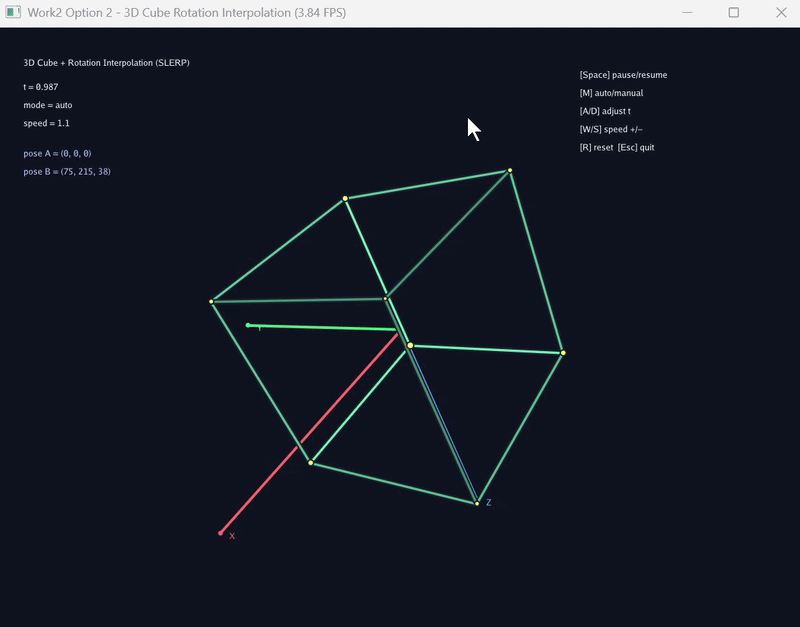
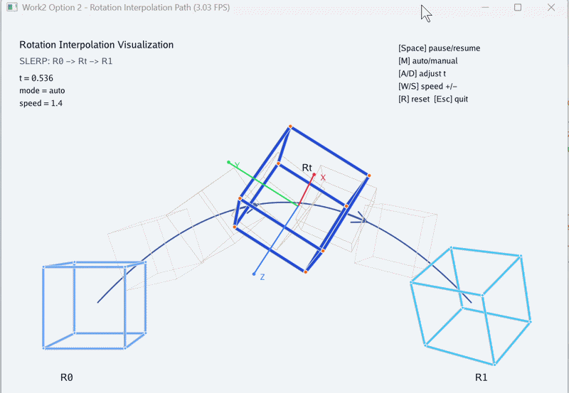
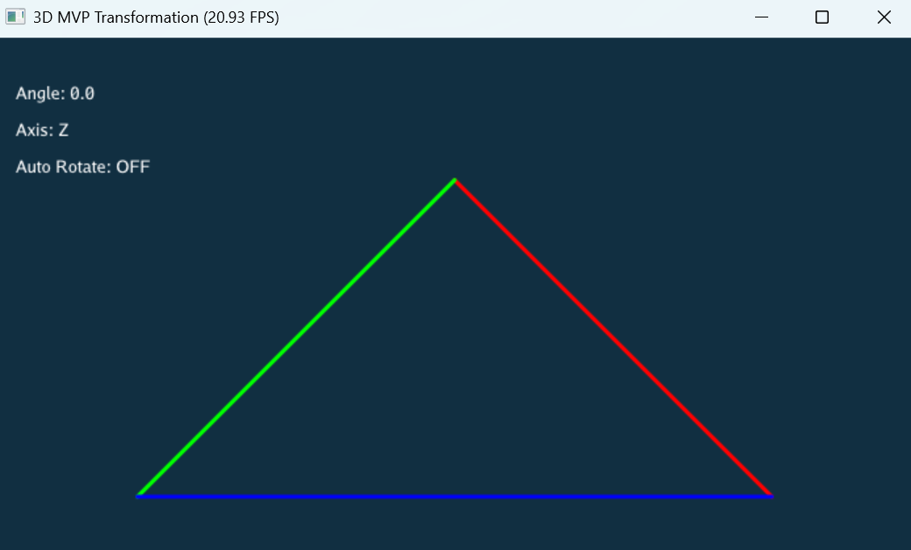
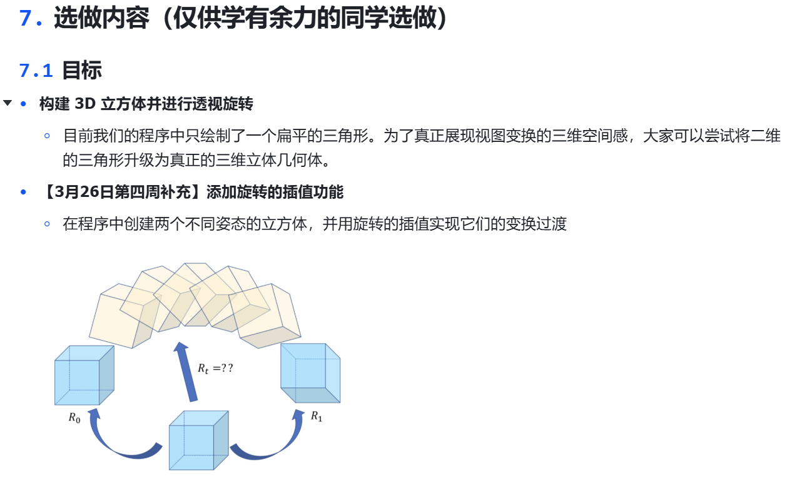
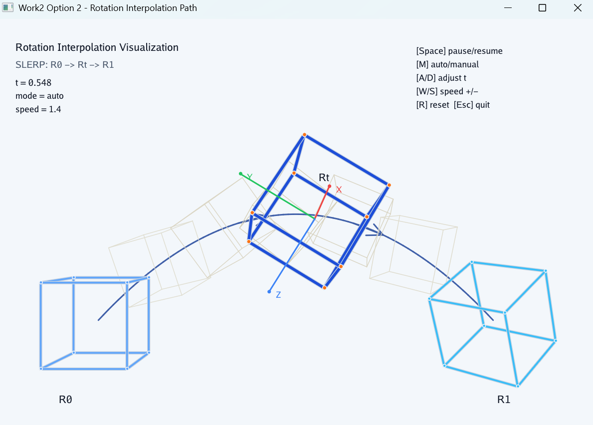

# 计算机图形学实验二：旋转与变换 MVP Transformation

<br>

<p align="center">
  
  
  
  
  
</p>

<br>

<a id="toc"></a>

## 目录

<details open>
<summary><strong>一、本次实验任务与收获</strong></summary>

- [一、本次实验任务与收获](#section-1)

</details>

<details open>
<summary><strong>二、文件结构</strong></summary>

- [二、文件结构](#section-2)

</details>

<details open>
<summary><strong>三、运行方式</strong></summary>

- [三、运行方式](#section-3)
  - [3.1 参考代码测试版](#section-3-1)
  - [3.2 基础版：三角形 MVP 变换](#section-3-2)
  - [3.3 选做一：三维立方体透视旋转](#section-3-3)
  - [3.4 选做二：旋转插值动画](#section-3-4)
  - [3.5 使用 uv 运行](#section-3-5)

</details>

<details open>
<summary><strong>四、实验目标</strong></summary>

- [四、实验目标](#section-4)
  - [4.1 理解 3D 坐标变换流程](#section-4-1)
  - [4.2 实现 Model、View、Projection 矩阵](#section-4-2)
  - [4.3 掌握齐次坐标与透视除法](#section-4-3)
  - [4.4 理解 Taichi 中的矩阵与交互绘制](#section-4-4)

</details>

<details open>
<summary><strong>五、实验原理</strong></summary>

- [五、实验原理](#section-5)
  - [5.1 MVP 变换流程](#section-5-1)
  - [5.2 模型变换矩阵](#section-5-2)
  - [5.3 视图变换矩阵](#section-5-3)
  - [5.4 透视投影矩阵](#section-5-4)
  - [5.5 透视除法与 NDC 坐标](#section-5-5)
  - [5.6 屏幕坐标映射](#section-5-6)
  - [5.7 立方体线框与旋转插值](#section-5-7)

</details>

<details open>
<summary><strong>六、基础任务实现</strong></summary>

- [六、基础任务实现](#section-6)
  - [任务 1：实现模型变换矩阵](#section-6-1)
    - [任务要求](#section-6-1-1)
    - [实现方式](#section-6-1-2)
  - [任务 2：实现视图变换矩阵](#section-6-2)
    - [任务要求](#section-6-2-1)
    - [实现方式](#section-6-2-2)
  - [任务 3：实现透视投影矩阵](#section-6-3)
    - [任务要求](#section-6-3-1)
    - [实现方式](#section-6-3-2)
  - [任务 4：完成 MVP 变换、透视除法与屏幕绘制](#section-6-4)
    - [任务要求](#section-6-4-1)
    - [实现方式](#section-6-4-2)
  - [基础任务可视化结果](#section-6-5)

</details>

<details open>
<summary><strong>七、选做内容</strong></summary>

- [七、选做内容](#section-7)
  - [7.1 选做一：三维立方体透视旋转](#section-7-1)
    - [7.1.1 任务要求](#section-7-1-1)
    - [7.1.2 数学原理](#section-7-1-2)
    - [7.1.3 实现思路](#section-7-1-3)
    - [7.1.4 可视化结果](#section-7-1-4)
    - [7.1.5 本部分小结](#section-7-1-5)
  - [7.2 选做二：旋转插值动画](#section-7-2)
    - [7.2.1 任务要求](#section-7-2-1)
    - [7.2.2 数学原理](#section-7-2-2)
    - [7.2.3 实现思路](#section-7-2-3)
    - [7.2.4 可视化结果](#section-7-2-4)
    - [7.2.5 本部分小结](#section-7-2-5)

</details>

<details open>
<summary><strong>八、实验总结</strong></summary>

- [八、实验总结](#section-8)

</details>

## 效果图目录

| 实验部分 | 动态演示 | 静态效果图 |
| --- | --- | --- |
| 基础三角形 MVP 变换 | [查看动态演示](#section-6-5) | [查看静态效果图](#section-6-5) |
| 三维立方体透视旋转 | [查看动态演示图](#section-7-1-4) | [查看进阶效果图](#section-7-1-4) |
| 旋转插值动画 | [查看动态演示](#section-7-2-4) | [查看静态效果图](#section-7-2-4) |

<a id="section-1"></a>

## 一、本次实验任务与收获

本次实验围绕 **三维 MVP 变换与旋转可视化** 展开，主要完成了三个层次的内容。

**第一项任务是完成基础三角形 MVP 变换系统，对应 `main.py`。** 程序在三维空间中定义线框三角形顶点，通过模型变换、视图变换和投影变换将三维点映射到二维屏幕中，并支持使用 `A`、`D` 键控制三角形绕 `Z` 轴旋转。通过这一部分，可以完整理解从模型空间到屏幕空间的坐标变换流程。

**第二项任务是完成三维立方体透视旋转，对应 `cube_demo.py`。** 基础任务中只绘制一个扁平三角形，空间感较弱。立方体版本将几何体扩展为具有 8 个顶点、12 条边的三维线框立方体，并沿用 MVP 变换流程进行透视绘制，从而更直观地展示三维空间中的旋转、深度和透视关系。

**第三项任务是完成旋转插值动画，对应 `cube_interp_demo.py`。** 该版本在三维立方体基础上设置两个不同姿态，并通过四元数 SLERP 实现姿态之间的平滑过渡。通过这一部分，程序从简单的按键旋转扩展到连续姿态变化，能够更自然地表现三维物体的空间朝向变化。

此外，`test.py` 用于运行参考代码测试版，方便对比课程示例与本实验实现之间在矩阵构造、坐标变换和可视化效果上的差异。

<p align="right"><a href="#toc">回到目录 ↑</a></p>

<a id="section-2"></a>

## 二、文件结构

```text
CG-Lab/
├── assets/
│   └── work2/
│       ├── optional_tasks.png        # 实验文档中的选做内容截图
│       ├── work2_demo.gif            # 基础任务：三角形 MVP 变换动态演示
│       ├── work2_demo.png            # 基础任务：三角形 MVP 变换静态效果图
│       ├── cube_demo.gif             # 选做一：三维立方体透视旋转动态演示
│       ├── cube_demo_2.gif           # 选做一：三维立方体透视旋转进阶效果图
│       ├── cube_interp_demo.gif      # 选做二：旋转插值动态演示
│       └── cube_interp_demo.png      # 选做二：旋转插值静态效果图
│
├── src/
│   └── work2/
│       ├── __init__.py               # Python 包初始化文件
│       ├── main.py                   # 基础版：三角形 MVP 变换、透视除法、屏幕映射与按键旋转
│       ├── cube_demo.py              # 选做一：三维线框立方体构建与透视旋转
│       ├── cube_interp_demo.py       # 选做二：两个立方体姿态之间的旋转插值动画
│       ├── test.py                   # 参考代码测试版
│       └── README.md                 # 实验说明文档
```

<p align="right"><a href="#toc">回到目录 ↑</a></p>

<a id="section-3"></a>

## 三、运行方式

在项目根目录下运行。

<a id="section-3-1"></a>

### 3.1 参考代码测试版

```bash
python -u "src/work2/test.py"
```

该文件用于运行参考代码测试版，方便观察课程示例中的矩阵变换流程，并与自己的实现进行对比。

<a id="section-3-2"></a>

### 3.2 基础版：三角形 MVP 变换

```bash
python -u "src/work2/main.py"
```

该版本完成实验二基础任务，包括三角形顶点定义、模型变换、视图变换、投影变换、透视除法、屏幕坐标映射和按键旋转交互。

<p align="center">
  
</p>

<a id="section-3-3"></a>

### 3.3 选做一：三维立方体透视旋转

```bash
python -u "src/work2/cube_demo.py"
```

该版本将基础三角形扩展为三维线框立方体，通过 MVP 变换展示具有透视关系的三维旋转效果。

<p align="center">
  
</p>

<a id="section-3-4"></a>

<p align="center">
  
</p>

<a id="section-3-4"></a>

### 3.4 选做二：旋转插值动画

```bash
python -u "src/work2/cube_interp_demo.py"
```

该版本在三维立方体基础上设置两个不同姿态，并通过四元数 SLERP 展示姿态之间的平滑过渡过程。

<p align="center">
  
</p>

<a id="section-3-5"></a>

### 3.5 使用 uv 运行

如果使用 `uv` 管理环境，也可以在项目根目录运行：

```bash
uv run python src/work2/main.py
```

```bash
uv run python src/work2/cube_demo.py
```

```bash
uv run python src/work2/cube_interp_demo.py
```

如果运行时出现类似 `nvcuda.dll lib not found` 的提示，但后面显示启动在 `vulkan` 后端，一般不影响程序运行。这说明当前机器没有使用 CUDA，而是自动切换到了 Vulkan 后端。

<p align="right"><a href="#toc">回到目录 ↑</a></p>

<a id="section-4"></a>

## 四、实验目标

<a id="section-4-1"></a>

### 4.1 理解 3D 坐标变换流程

本实验要求理解三维点从模型空间出发，依次经过模型变换、视图变换、投影变换、透视除法和屏幕映射，最终显示在二维窗口中的全过程。这个流程是现代图形渲染管线中最基础的几何变换部分。

<a id="section-4-2"></a>

### 4.2 实现 Model、View、Projection 矩阵

实验要求补全三个核心函数：`get_model_matrix(angle)`、`get_view_matrix(eye_pos)` 和 `get_projection_matrix(eye_fov, aspect_ratio, zNear, zFar)`。这三个函数分别对应物体自身变换、相机观察变换和透视投影变换。

<a id="section-4-3"></a>

### 4.3 掌握齐次坐标与透视除法

三维点在 MVP 变换后会变成四维齐次坐标。程序必须对坐标执行透视除法，才能得到标准设备坐标。透视除法是透视投影中形成近大远小效果的关键步骤。

<a id="section-4-4"></a>

### 4.4 理解 Taichi 中的矩阵与交互绘制

本实验使用 Taichi 表示向量和矩阵，并通过 GUI 窗口绘制线框图形。程序在主循环中处理键盘输入，通过更新旋转角度或插值参数实时改变图形姿态，从而把数学矩阵和图形交互联系起来。

<p align="right"><a href="#toc">回到目录 ↑</a></p>

<a id="section-5"></a>

## 五、实验原理

<a id="section-5-1"></a>

### 5.1 MVP 变换流程

三维图形从模型空间到屏幕空间的完整流程可以表示为：

$$
v_{clip} = M_{proj} M_{view} M_{model} v_{model}
$$

其中，`M_model` 表示模型变换矩阵，`M_view` 表示视图变换矩阵，`M_proj` 表示投影变换矩阵。由于程序使用列向量，矩阵乘法从右向左依次执行，也就是先做模型变换，再做视图变换，最后做投影变换。

<a id="section-5-2"></a>

### 5.2 模型变换矩阵

模型变换描述物体自身在世界空间中的姿态变化。基础任务要求三角形绕 `Z` 轴旋转，设旋转角度为 `\theta`，对应的齐次矩阵为：

$$
M_{model} =
\begin{bmatrix}
\cos\theta & -\sin\theta & 0 & 0 \\
\sin\theta & \cos\theta & 0 & 0 \\
0 & 0 & 1 & 0 \\
0 & 0 & 0 & 1
\end{bmatrix}
$$

由于 Python 和 Taichi 中的三角函数使用弧度制，程序需要先将角度转换为弧度：

$$
\theta_{rad} = \theta_{deg} \cdot \frac{\pi}{180}
$$

<a id="section-5-3"></a>

### 5.3 视图变换矩阵

视图变换描述相机如何观察场景。实验中给定相机位置 `eye_pos`，需要把相机平移到坐标原点。等价做法是将整个世界向相反方向平移。

设相机位置为：

$$
e = (e_x, e_y, e_z)
$$

则视图矩阵为：

$$
M_{view} =
\begin{bmatrix}
1 & 0 & 0 & -e_x \\
0 & 1 & 0 & -e_y \\
0 & 0 & 1 & -e_z \\
0 & 0 & 0 & 1
\end{bmatrix}
$$

<a id="section-5-4"></a>

### 5.4 透视投影矩阵

透视投影负责把视锥体中的三维点映射到裁剪空间。实验采用右手坐标系，相机看向 `-Z` 方向，因此近远平面在相机空间中为：

$$
n = -zNear
$$

$$
f = -zFar
$$

根据垂直视场角 `fov` 和屏幕宽高比，可以计算视锥体边界：

$$
t = \tan\left(\frac{fov}{2}\right)\cdot |n|
$$

$$
b = -t
$$

$$
r = aspect\_ratio \cdot t
$$

$$
l = -r
$$

透视投影可以拆成两步：先把透视平截头体挤压为正交长方体，再进行正交投影。透视到正交的矩阵为：

$$
M_{persp \to ortho} =
\begin{bmatrix}
n & 0 & 0 & 0 \\
0 & n & 0 & 0 \\
0 & 0 & n + f & -nf \\
0 & 0 & 1 & 0
\end{bmatrix}
$$

<a id="section-5-5"></a>

### 5.5 透视除法与 NDC 坐标

经过 MVP 矩阵变换后，顶点会变成齐次坐标：

$$
v_{clip} = (x, y, z, w)
$$

在映射到屏幕之前，必须执行透视除法：

$$
x_{ndc} = \frac{x}{w}
$$

$$
y_{ndc} = \frac{y}{w}
$$

$$
z_{ndc} = \frac{z}{w}
$$

得到的坐标位于标准设备坐标系中。透视除法是透视投影真正生效的关键步骤。

<a id="section-5-6"></a>

### 5.6 屏幕坐标映射

标准设备坐标通常位于 `[-1, 1]` 范围内，而窗口像素坐标位于 `[0, width]` 和 `[0, height]` 范围内。设窗口宽度为 `W`，高度为 `H`，则屏幕坐标可以写成：

$$
x_{screen} = \frac{x_{ndc} + 1}{2}W
$$

$$
y_{screen} = \frac{y_{ndc} + 1}{2}H
$$

程序将三角形或立方体顶点映射到屏幕坐标后，再使用 GUI 绘制线框边。

<a id="section-5-7"></a>

### 5.7 立方体线框与旋转插值

立方体由 8 个顶点和 12 条边组成。若立方体中心位于原点、边长为 2，则顶点坐标范围为：

$$
[-1, 1]
$$

每一帧中，程序对立方体顶点执行与基础三角形相同的 MVP 变换：

$$
v_{clip} = M_{proj} M_{view} M_{model} v_{model}
$$

透视除法后，程序将 8 个顶点映射到屏幕坐标，再按照边表连接 12 条线段。与三角形相比，立方体更能体现三维空间中的前后关系和旋转变化。

若用插值参数 `\alpha` 表示当前动画进度，则有：

$$
\alpha \in [0, 1]
$$

当 `\alpha` 从 0 变化到 1 时，立方体从起始姿态平滑过渡到目标姿态。

<p align="right"><a href="#toc">回到目录 ↑</a></p>

<a id="section-6"></a>

## 六、基础任务实现

<a id="section-6-1"></a>

## 任务 1：实现模型变换矩阵

<a id="section-6-1-1"></a>

### 任务要求

实验要求补全 `get_model_matrix(angle)`，接收角度制旋转角度，返回绕 `Z` 轴旋转该角度的 `4 × 4` 齐次坐标变换矩阵。

<a id="section-6-1-2"></a>

### 实现方式

本实验在 `main.py` 中将输入角度转换为弧度，然后根据 `cos` 和 `sin` 构造绕 `Z` 轴旋转矩阵。该矩阵作用在三角形顶点上，使三角形随按键输入绕 `Z` 轴旋转。程序还保留了绕 `X/Y/Z` 三个坐标轴切换的扩展交互，便于观察不同旋转轴对应的屏幕投影变化。

对应代码位置：

```python
get_model_matrix(angle, axis)
get_rotation_x(angle)
get_rotation_y(angle)
get_rotation_z(angle)
```

<a id="section-6-2"></a>

## 任务 2：实现视图变换矩阵

<a id="section-6-2-1"></a>

### 任务要求

实验要求补全 `get_view_matrix(eye_pos)`，接收相机位置，并返回将相机移动到世界坐标系原点的视图变换矩阵。

<a id="section-6-2-2"></a>

### 实现方式

程序通过构造平移矩阵实现视图变换。若相机位置为 `eye_pos`，则世界坐标中的所有物体都需要向 `-eye_pos` 方向平移。这样在视图空间中，相机等价于位于原点。

对应代码位置：

```python
get_view_matrix(eye_pos)
```

<a id="section-6-3"></a>

## 任务 3：实现透视投影矩阵

<a id="section-6-3-1"></a>

### 任务要求

实验要求补全 `get_projection_matrix(eye_fov, aspect_ratio, zNear, zFar)`，根据视场角、屏幕宽高比、近截面距离和远截面距离返回透视投影矩阵。

<a id="section-6-3-2"></a>

### 实现方式

程序首先将 `eye_fov` 转换为弧度，然后根据近截面距离和视场角计算 `t`、`b`、`r`、`l` 四个边界。由于相机看向 `-Z` 方向，代码中将 `zNear` 和 `zFar` 转换为实际相机空间中的负值，再构造透视到正交矩阵和正交投影矩阵，最后相乘得到投影矩阵。

对应代码位置：

```python
get_projection_matrix(eye_fov, aspect_ratio, zNear, zFar)
```

<a id="section-6-4"></a>

## 任务 4：完成 MVP 变换、透视除法与屏幕绘制

<a id="section-6-4-1"></a>

### 任务要求

实验要求将三维顶点扩展为齐次坐标，按正确顺序乘以 `Projection @ View @ Model`，执行透视除法，并将标准设备坐标映射到屏幕坐标后绘制线框三角形。

<a id="section-6-4-2"></a>

### 实现方式

程序每一帧根据当前旋转角度重新计算 `Model`、`View` 和 `Projection` 矩阵，然后组合成 `MVP`。三角形三个顶点分别执行矩阵变换和透视除法，最后映射到 `700 × 700` 窗口坐标，并使用 GUI 绘制三条线段。按下 `A` 键时角度增加，按下 `D` 键时角度减小，按下 `Esc` 键退出程序。

对应代码位置：

```python
compute_transform(angle, axis)
get_model_matrix(angle, axis)
get_view_matrix(eye_pos)
get_projection_matrix(...)
```

<a id="section-6-5"></a>

## 基础任务可视化结果

<table align="center">
  <tr>
    <td align="center"><strong>动态交互演示</strong></td>
    <td align="center"><strong>静态效果图</strong></td>
  </tr>
  <tr>
    <td align="center">
      
    </td>
    <td align="center">
      
    </td>
  </tr>
</table>

该组图展示了基础三角形 MVP 变换的运行效果。动态演示中，程序将三维空间中的线框三角形依次经过 Model、View 和 Projection 矩阵变换，再通过透视除法映射到二维屏幕。用户可以通过 `A/D` 键控制三角形绕 `Z` 轴旋转，也可以切换 `X/Y/Z` 轴观察不同旋转方向下的屏幕投影变化。静态效果图展示了某一时刻的线框三角形姿态和界面提示信息，用于说明基础版本已经完成矩阵变换、透视投影、屏幕映射和交互旋转。

<p align="right"><a href="#toc">回到目录 ↑</a></p>

<a id="section-7"></a>

## 七、选做内容

下图为实验文档中给出的选做内容说明。

<p align="center">
  
</p>

本实验进一步完成了两个选做内容，分别是 **三维立方体透视旋转** 和 **旋转插值动画**。下面按照实验要求分别说明实现思路与结果。

<a id="section-7-1"></a>

## 7.1 选做一：三维立方体透视旋转

<a id="section-7-1-1"></a>

### 7.1.1 任务要求

基础任务只绘制三维空间中的线框三角形。选做一要求构建一个真正的三维正方体，并通过透视投影和旋转变换展示其空间结构。

<a id="section-7-1-2"></a>

### 7.1.2 数学原理

立方体中心放置在原点，边长为 2，因此每个顶点的坐标分量都位于：

$$
[-1, 1]
$$

立方体共有 8 个顶点和 12 条边。每个顶点仍然执行基础任务中的 MVP 变换：

$$
v_{clip} = M_{proj} M_{view} M_{model} v_{model}
$$

透视除法后，程序将 8 个顶点映射到屏幕坐标，再按照边表连接 12 条线段。与三角形相比，立方体更能体现三维空间中的前后关系和旋转变化。

<a id="section-7-1-3"></a>

### 7.1.3 实现思路

`cube_demo.py` 在基础版 `main.py` 的 MVP 变换流程上扩展几何数据。程序定义 8 个立方体顶点和 12 条边，每一帧对所有顶点进行模型变换、视图变换和投影变换，再遍历边表绘制线框。模型矩阵支持绕 `X/Y/Z` 轴切换，默认绕 `Y` 轴自动旋转，使立方体具有更明显的三维空间感。

对应代码位置：

```python
cube_demo.py
init_cube()
compute_transform(angle, axis)
get_model_matrix(...)
get_view_matrix(...)
get_projection_matrix(...)
```

<a id="section-7-1-4"></a>

### 7.1.4 可视化结果

<table align="center">
  <tr>
    <td align="center"><strong>动态交互演示</strong></td>
    <td align="center"><strong>进阶效果图</strong></td>
  </tr>
  <tr>
    <td align="center">
      
    </td>
    <td align="center">
      
    </td>
  </tr>
</table>

该组图展示了三维线框立方体的透视旋转效果。程序将基础任务中的三角形扩展为具有 8 个顶点和 12 条边的立方体，并对每个顶点执行相同的 MVP 变换流程。随着立方体绕不同坐标轴旋转，可以明显观察到前后边之间的空间关系和透视投影产生的三维空间感。

<a id="section-7-1-5"></a>

### 7.1.5 本部分小结

选做一保留基础任务中的矩阵变换流程，但将输入几何体从三角形扩展为立方体。通过遍历立方体边表绘制线框，程序能够更直观地展示三维空间中的旋转、深度和透视关系。

<a id="section-7-2"></a>

## 7.2 选做二：旋转插值动画

<a id="section-7-2-1"></a>

### 7.2.1 任务要求

实验文档补充要求在程序中创建两个不同姿态的立方体，并用旋转插值实现它们之间的变换过渡。该任务的重点是让立方体姿态变化更加连续，而不是只做固定角速度旋转。

<a id="section-7-2-2"></a>

### 7.2.2 数学原理

旋转插值可以用参数 `\alpha` 表示当前过渡进度：

$$
\alpha \in [0, 1]
$$

当 `\alpha = 0` 时，立方体处于起始姿态；当 `\alpha = 1` 时，立方体处于目标姿态。程序根据 `\alpha` 生成中间姿态，使旋转过程连续变化。

若使用角度插值思想，可以写成：

$$
\theta(\alpha) = (1 - \alpha)\theta_0 + \alpha\theta_1
$$

其中，`\theta_0` 表示起始姿态角度，`\theta_1` 表示目标姿态角度。本实验在代码中使用四元数 SLERP 来完成旋转插值，使姿态过渡更加自然，避免简单欧拉角插值可能产生的不平滑问题。

<a id="section-7-2-3"></a>

### 7.2.3 实现思路

`cube_interp_demo.py` 在立方体版本基础上增加插值参数。程序预设两个不同的旋转姿态，并在主循环中更新插值参数 `t`。每一帧根据当前插值进度计算中间四元数，再转换为旋转矩阵，对立方体顶点进行投影并绘制线框。程序还加入了坐标轴显示、深度排序和手动调节模式，使插值过程更直观。

对应代码位置：

```python
cube_interp_demo.py
slerp(q0, q1, t)
quat_to_matrix(q)
draw_cube(gui, vertices_world)
draw_axes(gui, rot)
```

<a id="section-7-2-4"></a>

### 7.2.4 可视化结果

<table align="center">
  <tr>
    <td align="center"><strong>动态交互演示</strong></td>
    <td align="center"><strong>静态效果图</strong></td>
  </tr>
  <tr>
    <td align="center">
      
    </td>
    <td align="center">
      
    </td>
  </tr>
</table>

该组图展示了立方体旋转插值动画。程序设置两个不同的立方体姿态，并使用四元数 SLERP 在两个姿态之间生成连续中间状态。动态演示中，立方体不是简单地固定角速度旋转，而是在两个指定空间朝向之间平滑过渡，因此更符合实验文档补充要求中“旋转插值”的目标。静态效果图展示了插值过程中某一时刻的中间姿态、坐标轴方向和当前插值参数。

<a id="section-7-2-5"></a>

### 7.2.5 本部分小结

选做二在立方体透视旋转基础上进一步加入姿态插值，使程序不再只是展示单一旋转，而是能够展示两个空间朝向之间的平滑过渡。该部分扩展了实验的动画表达能力，也加深了对三维旋转表示的理解。

<p align="right"><a href="#toc">回到目录 ↑</a></p>

<a id="section-8"></a>

## 八、实验总结

本实验完成了实验文档中要求的基础 MVP 变换任务，并进一步完成了三维立方体透视旋转和旋转插值两个选做内容。基础部分实现了 `get_model_matrix(angle)`、`get_view_matrix(eye_pos)` 和 `get_projection_matrix(eye_fov, aspect_ratio, zNear, zFar)` 三个核心函数，并将它们用于真实的三维顶点变换、透视除法和屏幕绘制。

在实现方式上，程序将三维几何点表示为齐次坐标，通过 `Projection @ View @ Model` 的顺序完成从模型空间到裁剪空间的变换，再经过透视除法得到标准设备坐标，最后映射到窗口像素坐标。通过 `A`、`D` 键控制角度变化，程序能够实时展示矩阵变换对线框三角形的影响。

选做部分中，立方体透视旋转将基础图形从三角形扩展到三维线框立方体，使空间深度和透视关系更加明显；旋转插值版本进一步展示了两个不同姿态之间的平滑过渡，使实验从静态矩阵推导扩展到动态姿态动画。整体来看，本实验从矩阵推导、代码实现、齐次坐标、透视投影和三维可视化多个方面完成了对旋转与变换流程的系统实现。

**反思：** 本实验的实际程序效果比实验文档中的基础描述更丰富，这是因为在满足基础要求的前提下，又加入了扩展交互与增强可视化。例如，基础版本除了支持绕 `Z` 轴旋转外，还加入了 `X/Y/Z` 三轴切换；立方体版本除了完成透视旋转外，还增加了自动旋转与界面提示；插值版本则进一步使用四元数 SLERP 实现了更平滑的姿态过渡。因此，如果最终展示效果看起来比实验文档中的最基础示意更复杂，这并不表示实现错误，而是说明程序在完成规定任务的同时，也做了合理扩展，使实验展示更加完整、美观、直观。

<p align="right"><a href="#toc">回到目录 ↑</a></p>