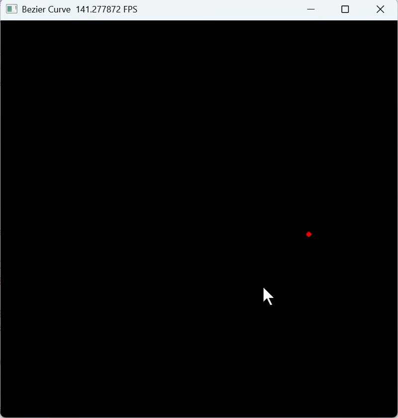
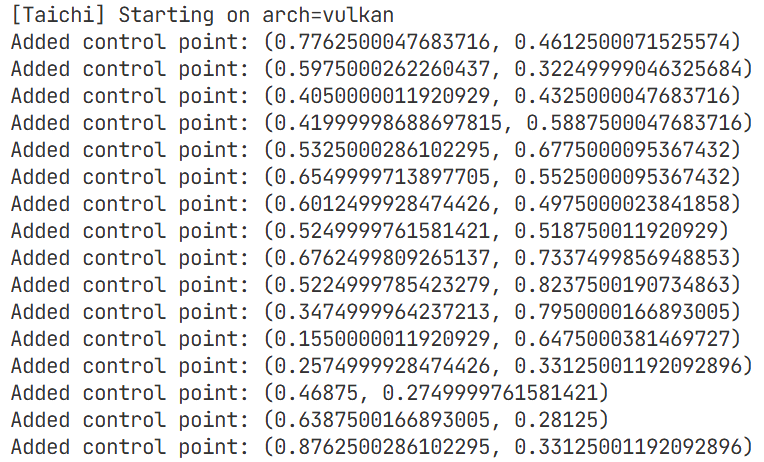
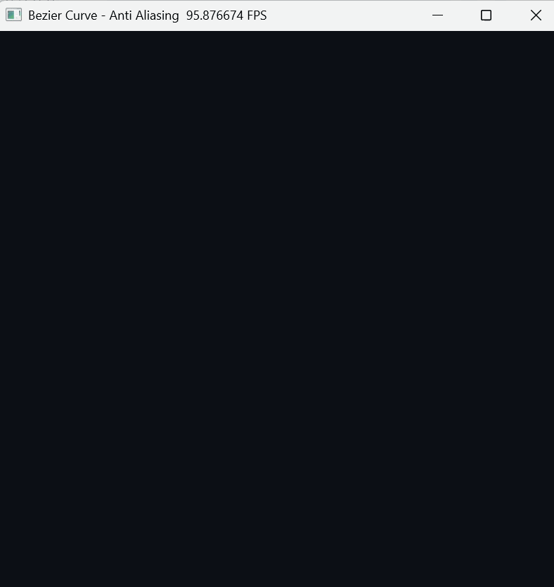
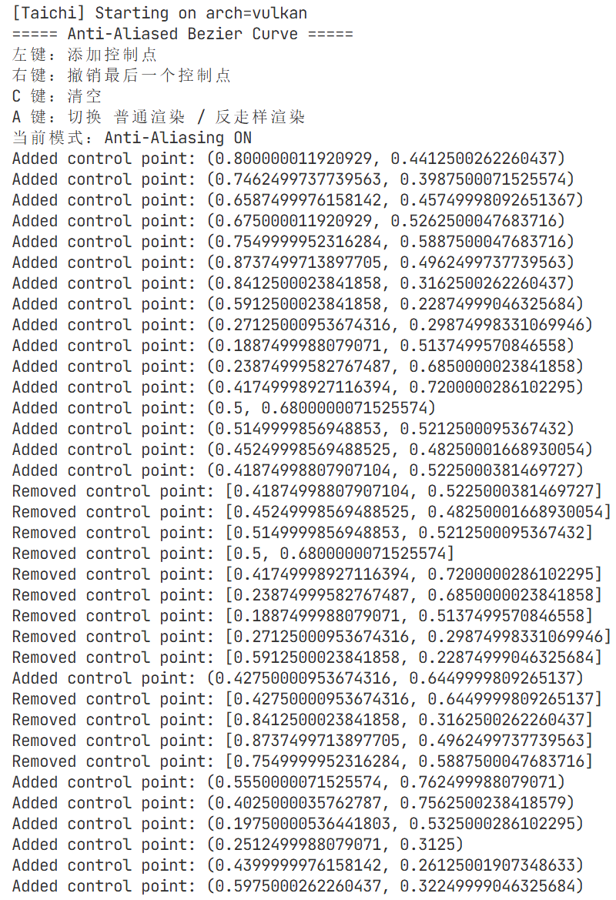
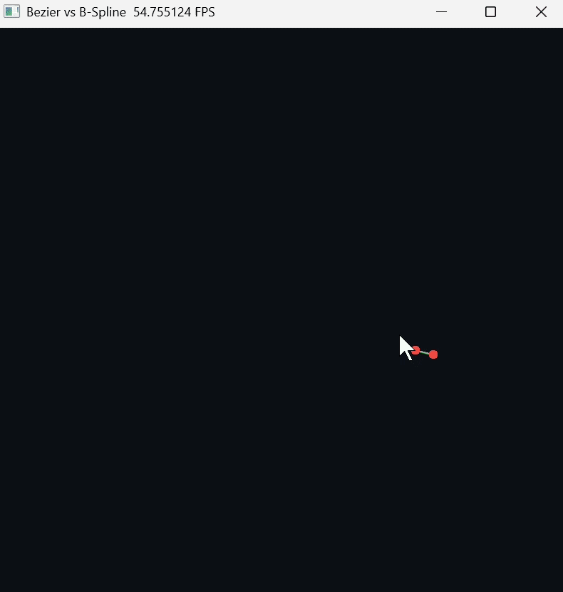
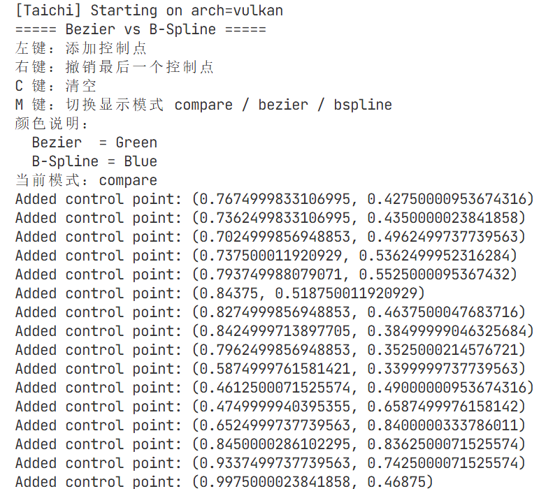

# Work3 - Bezier Curve

计算机图形学实验三：**贝塞尔曲线（Bezier Curve）**

本实验基于 **Python + Taichi** 完成，围绕老师布置的贝塞尔曲线实验要求，依次实现了：
1. 必做部分：交互式贝塞尔曲线绘制
2. 选做一：反走样贝塞尔曲线
3. 选做二：均匀三次 B 样条曲线对比展示

本 README 将重点放在以下内容上：
- 当前实验文件结构与每个文件的职责，每一个实现如何对应老师布置的实验任务
- 贝塞尔曲线、De Casteljau 算法、光栅化、反走样、B 样条的核心原理
- 代码中真正关键的实现细节与数据流
- 可视化效果与 GIF 展示位置
- 如何运行、如何交互

## 一、文件结构

当前 `src/Work3/` 目录建议包含如下文件：

    Work3/
    ├── bezier_curve.py
    ├── bezier_curve_antialias.py
    ├── bspline_curve_compare.py
    ├── test.py
    └── README.md

其中各文件职责如下：

- `bezier_curve.py`
  - 必做实验主程序
  - 严格按照老师给出的任务要求实现标准贝塞尔曲线绘制
  - 包含控制点输入、控制折线显示、De Casteljau 曲线采样、GPU 光栅化等核心流程

- `bezier_curve_antialias.py`
  - 选做一：反走样版本
  - 在基础贝塞尔曲线绘制的基础上，改进像素渲染逻辑
  - 通过局部像素邻域的距离加权，让曲线边缘更加平滑

- `bspline_curve_compare.py`
  - 选做二：Bezier 与 B-Spline 的对比版本
  - 在同一组控制点下，同时绘制贝塞尔曲线与均匀三次 B 样条曲线
  - 便于观察两类曲线在几何行为上的差异，尤其是“全局控制”和“局部控制”的区别

- `test.py`
  - 作为课程实验结构的一部分，尝试老师的代码的和我的代码有什么不同

- `README.md`
  - 当前实验说明文档，对实验目标、实现过程、代码结构、原理说明和可视化展示进行系统整理

## 二、可视化展示

本实验将所有图片和 GIF 资源统一保存在仓库根目录下的：

    assets/work3/

即：

    assets/work3/demo_basic.gif
    assets/work3/demo_antialias.gif
    assets/work3/demo_bspline_compare.gif

### 1. 必做实验演示图

<table>
  <tr>
    <td align="center" width="50%">
      
      
<strong>动态演示图</strong>

    </td>
    <td align="center" width="50%">
      
      
<strong>终端输出说明图</strong>

    </td>
  </tr>
</table>

- 启动程序
- 鼠标左键连续添加多个控制点
- 显示控制点、控制折线和绿色贝塞尔曲线
- 最后按 `C` 清空画布

### 2. 选做一：反走样演示图

<table>
  <tr>
    <td align="center" width="50%">
      
      
<strong>动态演示图</strong>

    </td>
    <td align="center" width="50%">
      
      
<strong>终端输出说明图</strong>

    </td>
  </tr>
</table>

- 添加若干控制点
- 显示普通渲染与反走样渲染的效果差异
- 演示曲线边缘更加平滑的视觉效果

### 3. 选做二：Bezier 与 B-Spline 对比演示图

<table>
  <tr>
    <td align="center" width="50%">
      
      
<strong>动态演示图</strong>

    </td>
    <td align="center" width="50%">
      
      
<strong>终端输出说明图</strong>

    </td>
  </tr>
</table>

- 添加超过 4 个控制点
- 同屏显示 Bezier 曲线与 B-Spline 曲线
- 观察两者形态差异
- 切换不同显示模式进行比较
## 三、实验目标

本实验围绕给出的任务说明，目标包括：

- 理解贝塞尔曲线的几何意义
- 理解并实现 De Casteljau 算法
- 掌握像素缓冲区的基本概念与直接光栅化思想
- 掌握图形界面中的鼠标点击与键盘输入处理
- CPU 与 GPU 的职责分离以及批量数据传输的重要性
- 在基础版本上进一步探索反走样与 B 样条曲线这两个扩展方向

## 四、本实验代码是如何实现各项任务

这一部分直接对应给出的实验任务，说明本实验是如何一项一项完成的。

### 任务 1：初始化与显存预分配

任务要求：
- `ti.init(arch=ti.gpu)`
- 屏幕尺寸 `800 x 800`
- 曲线采样数 `NUM_SEGMENTS = 1000`
- 最大控制点数 `MAX_CONTROL_POINTS = 100`
- 分配 `pixels`、`curve_points_field`、`gui_points` 三大 GPU 缓冲区

本实验实现：
- 在 `bezier_curve.py` 中使用 `ti.init(arch=ti.gpu)` 初始化 GPU 后端
- 定义了固定屏幕尺寸与控制点上限
- 创建了像素缓冲区 `pixels`
- 创建了曲线采样点缓冲区 `curve_points_field`
- 创建了控制点对象池 `gui_points`
- 额外增加了 `gui_indices`，用于绘制控制折线的索引池，使控制多边形显示更加稳定

这一步的重点是：**所有核心显存对象都在程序开始时预先分配**，避免主循环中频繁动态申请内存。

### 任务 2：实现 De Casteljau 算法

任务要求编写纯 Python 函数 `de_casteljau(points, t)`

本实验实现了：
- 在基础版和两个扩展版中都实现了 `de_casteljau(points, t)` 函数
- 输入为控制点列表与参数 `t`
- 输出为贝塞尔曲线在参数 `t` 处的二维点坐标
- 采用递归线性插值的方式完成计算

这一部分直接对应老师给出的数学原理，是曲线采样的核心。

### 任务 3：编写 GPU 绘制内核

任务要求：
- 编写 `draw_curve_kernel(n: ti.i32)`
- 从 `curve_points_field` 中读取浮点坐标
- 映射到整数像素索引
- 在 `pixels` 中点亮绿色像素
- 做越界检查

本实验实现了：
- 在 `bezier_curve.py` 中实现了 `draw_curve_kernel(n: ti.i32)`
- kernel 内部遍历曲线点缓冲区
- 将 `[0,1]` 范围的归一化坐标映射为屏幕像素坐标
- 使用越界判断保证只访问合法像素位置
- 将对应像素着色为绿色

注意这里的重点不是“会不会画点”，而是：**绘制发生在 GPU Kernel 中，而不是在 Python 循环中逐像素跨界写显存**。

### 任务 4：主循环、曲线逻辑与交互响应

任务要求：
- 创建窗口 `window = ti.ui.Window(...)`
- 在 `while window.running:` 中处理交互
- 鼠标左键添加控制点
- 键盘 `C` 清空
- 当控制点数不少于 2 时：
  - CPU 端循环计算所有曲线点
  - 使用 `from_numpy` 批量传给 GPU
  - 调用 kernel 绘制
  - 使用 `canvas.set_image(pixels)` 显示

本实验实现：
- 在主循环中监听鼠标左键与键盘事件
- 鼠标左键点击后把当前坐标加入控制点列表
- 按下 `C` 键后清空控制点列表
- 当控制点数量大于等于 2 时：
  - 在 CPU 端逐个参数采样曲线点
  - 将采样结果存入 NumPy 数组
  - 使用 `curve_points_field.from_numpy(...)` 一次性传输到 GPU
  - 调用 `draw_curve_kernel(...)` 批量光栅化
  - 最终使用 `canvas.set_image(pixels)` 显示图像

这一步完整体现了强调的 **Batching 思路**：
- CPU 负责数学计算
- GPU 负责批量绘制
- 两者之间通过一次性数据传输衔接

### 任务 5：对象池技巧绘制控制点

实验要求：
- `canvas.circles()` 只能接收定长 Field
- 建议创建固定长度 NumPy 数组
- 先全部填成屏幕外坐标，再覆盖前面若干真实控制点

本实验实现：
- 创建固定长度的 `gui_points`
- 每一帧使用 NumPy 生成一个长度为 `MAX_CONTROL_POINTS` 的数组
- 初始全部填充为 `-10.0`
- 再把真实控制点写入前若干位置
- 最后上传给 `gui_points` 并调用 `canvas.circles(...)` 绘制

此外，控制折线也采用类似的固定大小索引池 `gui_indices`，从而使控制多边形绘制保持稳定，符合对“固定大小显存池”的要求。

## 五、代码的总体数据流

真正理解代码要看懂“数据到底从哪里来，到哪里去”。

本实验的数据流可以概括为：

1. 用户在窗口中点击鼠标
2. 鼠标坐标被记录到 Python 列表 `control_points`
3. CPU 端调用 `de_casteljau(points, t)` 或 B 样条采样函数，生成曲线采样点
4. 曲线点被整理成 NumPy 数组
5. NumPy 数组通过 `from_numpy(...)` 一次性传给 GPU Field
6. GPU Kernel 或 CPU 光栅化逻辑将曲线点转换为屏幕像素
7. 图像写入 `pixels`
8. `canvas.set_image(pixels)` 将结果显示到窗口中
9. 控制点和控制折线通过固定大小对象池在界面上叠加绘制

这一流程体现了现代图形程序的基本组织方式：
- 输入事件在 CPU 处理
- 数学建模主要在 CPU 处理
- 渲染和显示由 GPU 负责或由 GPU 显示最终结果

## 六、数学原理说明

### 1. 贝塞尔曲线

贝塞尔曲线由一组控制点决定。设控制点为：

    P0, P1, ..., Pn-1

引入参数：

    t ∈ [0, 1]

当 `t` 从 0 连续变化到 1 时，曲线上的点依次被计算出来，所有这些点连接起来就形成贝塞尔曲线。

贝塞尔曲线的特点是：
- 曲线整体由全部控制点共同决定
- 修改某个控制点，通常会影响整条曲线
- 控制点越多，曲线阶数越高

### 2. De Casteljau 算法

De Casteljau 算法是贝塞尔曲线最经典、最直观的求值算法。

思想如下：
- 对相邻控制点做线性插值
- 得到一层新的点
- 再对新的一层做相同的插值
- 不断重复，直到只剩一个点
- 这个点就是曲线在当前参数 `t` 处的位置

线性插值公式为：

    P'_i = (1 - t) * P_i + t * P_{i+1}

这一方法数值稳定、几何意义清晰，非常适合教学实验。

### 3. 光栅化

屏幕本质上是一个二维像素网格。数学上曲线点的坐标是连续浮点值，而最终显示需要落到离散像素上。

本实验的光栅化过程是：
- 先得到归一化曲线点坐标 `[x, y]`
- 将其乘以屏幕宽高映射到像素坐标
- 转为整数索引
- 将对应像素赋值为目标颜色

这一步完成了从几何模型到图像显示的转换。

## 七、必做代码中的核心实现与细节

### 1. 为什么曲线点要在 CPU 端先算完

老师特别强调：不要在 Python 中每算出一个点就立刻去改 GPU Field。

原因是：
- CPU 和 GPU 是分离的
- 每一次 Python 端写 GPU Field 都会发生跨设备通信
- 如果 1000 多个曲线点都逐个通信，会非常慢

因此正确做法是：
- 先在 CPU 端把 1000 多个点全部算完
- 存到一个 NumPy 数组里
- 再一次性传到 GPU

这就是本实验采用的方式。

### 2. 为什么要预分配对象池

GUI 的 `circles()` 和 `lines()` 更适合接收定长缓冲区，而不是主循环里反复创建形状不同的对象。

因此本实验对控制点和控制折线都采用固定大小对象池：
- `gui_points` 保存控制点
- `gui_indices` 保存折线连接关系

这样做的优点是：
- 数据结构稳定
- 主循环逻辑更清楚
- 更符合老师希望学生理解的“预分配显存池”思想

### 3. 为什么需要控制折线

老师要求的是“观察控制点与曲线的关系”，因此仅仅画曲线是不够的。控制折线能直观展示：
- 控制点之间的几何连接关系
- 曲线如何受这些点影响
- 新增控制点后控制多边形如何变化

所以代码中不仅绘制红色控制点，也绘制了灰色控制折线。

## 八、选做一：反走样贝塞尔曲线

### 1. 选做背景

基础版曲线采用“一个曲线点只点亮一个像素”的方式，这样会带来明显的锯齿感。原因在于：
- 曲线真实位置是连续浮点坐标
- 显示时却把它粗暴截断为某一个整数像素
- 导致边缘呈现明显台阶状

这就是图形学中的走样问题。

### 2. 选做目标

在现有贝塞尔曲线绘制基础上，改进像素渲染逻辑，使曲线边缘更加平滑。

### 3. 选做原理

对于一个浮点曲线点，例如：

    (400.3, 500.8)

它不应该只贡献给一个像素，而应该对周围若干个像素都有影响。

本实验采用的方法是：
- 考察该点周围 `3 × 3` 的像素邻域
- 计算每个像素中心到该浮点点的距离
- 距离越近，颜色权重越高
- 距离越远，颜色权重越低

从而使一个曲线采样点在图像上形成柔和的局部过渡，而不是生硬的单像素硬边。

### 4. 代码实现细节

在 `bezier_curve_antialias.py` 中：
- 仍然使用 De Casteljau 算法生成曲线点
- 但不再直接只点亮一个像素
- 而是对曲线点周围 `3 × 3` 邻域进行加权着色
- 权重采用基于距离的衰减模型
- 多个曲线点对同一像素的贡献通过颜色取最大值或局部混合方式叠加

该实现的核心变化不在曲线生成，而在 **光栅化阶段**。

### 5. 效果与现象

与基础版相比，反走样版本可以明显看到：
- 曲线边缘更柔和
- 锯齿感减弱
- 整体显示效果更平滑、更自然

这说明反走样属于渲染层面的优化，而不是改变曲线本身的几何定义。

## 九、选做二：Bezier 与 B-Spline 对比

### 1. 选做背景

贝塞尔曲线有两个局限性：

第一，**全局控制性**。  
当控制点较多时，任意一个控制点的变化都可能影响整条曲线。

第二，**阶数绑定**。  
若有 `n` 个控制点，则贝塞尔曲线通常对应 `n-1` 阶多项式。控制点越多，曲线阶数越高，计算复杂度和数值不稳定性也随之增加。

B 样条曲线则可以解决这些问题：
- 保持固定阶数
- 支持更多控制点
- 修改一个控制点时只影响局部区域

### 2. 选做目标

在现有交互与绘制框架基础上，增加均匀三次 B 样条曲线支持，并与贝塞尔曲线进行对比显示。

### 3. 选做原理

对于均匀三次 B 样条：
- 每 4 个相邻控制点确定一段局部三次曲线
- 若共有 `n` 个控制点，则曲线由 `n - 3` 段拼接而成
- 每一段都只依赖 4 个局部控制点，而不是全部控制点

这体现了 B 样条的“局部控制”特性。

### 4. 本实验采用的实现方式

老师提示中给了两种思路：
- Cox-de Boor 递归基函数
- 均匀三次 B 样条的固定基函数或矩阵形式

本实验采用的是第二种更适合图形学入门展示的方式：
- 直接写均匀三次 B 样条的四个基函数
- 每 4 个相邻控制点生成一段曲线
- 所有分段平滑拼接起来构成整条 B 样条曲线

这样实现清晰、效率也较高，且更适合作为课程实验展示。

### 5. 为什么做成“同屏对比”

在 `bspline_curve_compare.py` 中，本实验不是只单独画 B 样条，而是：
- 同一组控制点下同时显示 Bezier 曲线与 B-Spline 曲线
- 使用不同颜色区分两者

这样设计的优点是：
- 对比更直观
- 更容易观察两类曲线的几何差异
- 更容易展示“Bezier 全局控制”与“B-Spline 局部控制”的不同

### 6. 效果与现象

当控制点数量增加时，可以观察到：
- Bezier 曲线对所有控制点更敏感
- B-Spline 曲线更平滑，且某些局部控制点的变化主要影响附近区域
- 在密集控制点区域，B-Spline 往往表现出更明显的局部性

这正是老师希望学生在选做部分中观察和验证的现象。

## 十、程序交互方式

### 必做版 `bezier_curve.py`

- 鼠标左键：添加控制点
- `C` 键：清空所有控制点

### 选做1：反走样版 `bezier_curve_antialias.py`

- 鼠标左键：添加控制点
- 鼠标右键：撤销最后一个控制点
- `C` 键：清空
- 可根据程序设计额外支持开关抗锯齿模式

### 选做2：对比版 `bspline_curve_compare.py`

- 鼠标左键：添加控制点
- 鼠标右键：撤销最后一个控制点
- `C` 键：清空
- `M` 键：切换显示模式，例如：
  - 同时显示
  - 仅显示 Bezier
  - 仅显示 B-Spline

## 十一、运行方式

在项目根目录下运行：

    python src/Work3/bezier_curve.py

    python src/Work3/bezier_curve_antialias.py

    python src/Work3/bspline_curve_compare.py

如果使用 `uv` 管理环境，可以运行：

    uv run python src/Work3/bezier_curve.py

    uv run python src/Work3/bezier_curve_antialias.py

    uv run python src/Work3/bspline_curve_compare.py

## 十二、环境配置

推荐使用 Conda：

    conda create -n cg_env python=3.12 -y
    conda activate cg_env

安装依赖：

    pip install taichi numpy

如果已经在课程实验一或实验二中配置过环境，也可以直接复用原有环境。

## 十三、实验结果总结

本实验完整完成了老师布置的贝塞尔曲线必做任务，并在此基础上比较漂亮地完成了两个选做方向的扩展。

### 1. 必做任务完成情况

已经完成：
- GPU 初始化
- 像素缓冲区与对象池预分配
- De Casteljau 算法实现
- GPU Kernel 光栅化
- 鼠标交互与键盘清空
- 控制点、控制折线、曲线的可视化显示
- CPU 批量计算 + GPU 批量渲染的数据流

### 2. 选做一完成情况

已经实现：
- 在基础光栅化之上引入局部邻域距离加权
- 改善曲线边缘的锯齿现象
- 显示效果明显更平滑

### 3. 选做二完成情况

已经实现：
- 均匀三次 B 样条曲线采样
- 与 Bezier 曲线的同屏对比展示
- 对两类曲线的几何行为进行可视化观察

## 十四、实验体会

通过本实验，可以从三个层面理解计算机图形学中的曲线绘制问题：

第一，**几何层面**。  
理解控制点、参数曲线和曲线形态之间的关系。

第二，**算法层面**。  
掌握 De Casteljau 算法和 B 样条分段求值的基本思想。

第三，**渲染层面**。  
理解从浮点几何坐标到离散像素显示的映射过程，并认识反走样在图像质量提升中的作用。

同时，本实验也帮助理解了现代图形程序中的工程性问题：
- 为什么 CPU 和 GPU 要分工
- 为什么要批量传输数据
- 为什么要避免在主循环中频繁动态申请显存对象
- 为什么要使用固定大小对象池管理 GUI 数据

## 十五、后续可继续改进的方向

如果继续扩展本实验，还可以尝试：(有空试试，记一下)

- 增加控制点拖拽功能
- 在窗口中直接显示当前模式或文字提示
- 支持更多种反走样核函数
- 支持更一般的 B 样条节点向量与 Cox-de Boor 递归实现
- 增加截图导出或参数调节界面
- 进一步做 Bezier、B-Spline、Catmull-Rom 等多曲线对比展示

## 十六、附注

本实验的三个程序采用“一个主题对应一个文件”的组织方式：
- 必做版负责标准任务
- 反走样版负责渲染优化
- B-Spline 版负责曲线建模扩展

使代码结构更清晰，便于单独运行、录制 GIF、撰写 README，展示每个部分的实验目标与实现重点。