# 计算机图形学实验四：Phong 光照模型 Phong Lighting Model

<br>

<p align="center">
  
  
  
  
  
</p>

<br>

<a id="toc"></a>

## 目录

<details open>
<summary><strong>一、本次实验任务与收获</strong></summary>

- [一、本次实验任务与收获](#section-1)

</details>

<details open>
<summary><strong>二、文件结构</strong></summary>

- [二、文件结构](#section-2)

</details>

<details open>
<summary><strong>三、运行方式</strong></summary>

- [三、运行方式](#section-3)
  - [3.1 参考代码测试版](#section-3-1)
  - [3.2 基础版本：Phong 光照模型](#section-3-2)
  - [3.3 选做一：Blinn-Phong 模型](#section-3-3)
  - [3.4 选做二：Hard Shadow](#section-3-4)
  - [3.5 对比展示版本](#section-3-5)

</details>

<details open>
<summary><strong>四、可视化结果</strong></summary>

- [四、可视化结果](#section-4)
  - [4.1 参考代码测试版](#section-4-1)
  - [4.2 基础 Phong 光照效果](#section-4-2)
  - [4.3 UI 参数调节效果](#section-4-3)
  - [4.4 Blinn-Phong 对比效果](#section-4-4)
  - [4.5 Hard Shadow 对比效果](#section-4-5)

</details>

<details open>
<summary><strong>五、实验目标</strong></summary>

- [五、实验目标](#section-5)
  - [5.1 理论理解](#section-5-1)
  - [5.2 数学基础](#section-5-2)
  - [5.3 工程实践](#section-5-3)

</details>

<details open>
<summary><strong>六、实验原理</strong></summary>

- [六、实验原理](#section-6)
  - [6.1 Phong 光照模型总公式](#section-6-1)
  - [6.2 环境光 Ambient](#section-6-2)
  - [6.3 漫反射 Diffuse](#section-6-3)
  - [6.4 镜面高光 Specular](#section-6-4)
  - [6.5 反射向量](#section-6-5)
  - [6.6 Blinn-Phong 半程向量](#section-6-6)
  - [6.7 硬阴影 Hard Shadow](#section-6-7)
  - [6.8 实现注意事项](#section-6-8)

</details>

<details open>
<summary><strong>七、基础任务实现</strong></summary>

- [七、基础任务实现](#section-7)
  - [任务 1：构建代码驱动的三维场景](#section-7-1)
    - [任务要求](#section-7-1-1)
    - [实现方式](#section-7-1-2)
    - [可视化结果](#section-7-1-3)
  - [任务 2：实现光线求交与深度测试](#section-7-2)
    - [任务要求](#section-7-2-1)
    - [实现方式](#section-7-2-2)
    - [可视化结果](#section-7-2-3)
  - [任务 3：编写 Phong 着色器](#section-7-3)
    - [任务要求](#section-7-3-1)
    - [实现方式](#section-7-3-2)
    - [可视化结果](#section-7-3-3)
  - [任务 4：完成 UI 交互面板](#section-7-4)
    - [任务要求](#section-7-4-1)
    - [实现方式](#section-7-4-2)
    - [可视化结果](#section-7-4-3)

</details>

<details open>
<summary><strong>八、选做内容</strong></summary>

- [八、选做内容](#section-8)
  - [8.1 选做一：Blinn-Phong 模型升级](#section-8-1)
    - [8.1.1 任务要求](#section-8-1-1)
    - [8.1.2 数学原理](#section-8-1-2)
    - [8.1.3 实现思路](#section-8-1-3)
    - [8.1.4 可视化结果](#section-8-1-4)
    - [8.1.5 本部分小结](#section-8-1-5)
  - [8.2 选做二：硬阴影 Hard Shadow](#section-8-2)
    - [8.2.1 任务要求](#section-8-2-1)
    - [8.2.2 数学原理](#section-8-2-2)
    - [8.2.3 实现思路](#section-8-2-3)
    - [8.2.4 可视化结果](#section-8-2-4)
    - [8.2.5 本部分小结](#section-8-2-5)

</details>

<details open>

<summary><strong>九、实验总结</strong></summary>

- [九、实验总结](#section-9)

</details>


## 效果图目录

| 实验部分 | 动态演示 | 静态效果图 |
| --- | --- | --- |
| 基础 Phong 光照 | [查看动态演示](#section-4-2) | [查看静态效果图](#section-4-2) |
| UI 参数调节 | [Ka / Kd / Ks / Shininess](#section-4-3) | [基础效果图](#section-4-2) |
| Blinn-Phong 对比 | [查看动态对比](#section-8-1-4) | [查看静态对比](#section-8-1-4) |
| Hard Shadow 对比 | [查看动态对比](#section-8-2-4) | [查看静态对比](#section-8-2-4) |
| 参考代码测试版 | [查看运行效果](#section-4-1) | [查看运行效果](#section-4-1) |
<a id="section-1"></a>

## 一、本次实验任务与收获

本次实验围绕 **Phong 光照模型** 展开，主要完成了三个层次的内容。

**第一项任务是完成基础的局部光照系统，对应 `Phong.py`。** 程序在 Taichi Kernel 中通过光线投射方式隐式定义场景，不导入任何外部模型，实现了左侧红色球体、右侧紫色圆锥、固定摄像机和点光源，并在交点处完成环境光、漫反射和镜面高光三部分着色。

**第二项任务是完成交互式材质参数调节。** 在基础版本中，程序通过 `ti.ui.Window` 构建了交互面板，并提供 `Ka`、`Kd`、`Ks` 和 `Shininess` 四个滑动条，使用户可以实时观察材质系数和高光指数对画面结果的影响。

**第三项任务是扩展两个选做内容，使实验结果更加完整。** 其中 `BlinnPhong.py` 实现了基于半程向量的 Blinn-Phong 模型，`HardShadow.py` 实现了暗影射线与硬阴影；同时，`ComparePhongBlinn.py` 和 `CompareShadow.py` 额外提供了对比展示版本，便于截取更清晰的实验效果图。

通过本次实验，可以更直观地理解局部光照模型中三个光照分量的物理含义，也可以观察不同镜面模型和阴影机制在视觉效果上的差异。

<p align="right"><a href="#toc">回到目录 ↑</a></p>

<a id="section-2"></a>

## 二、文件结构

```text
CG-Lab/
├── assets/
│   └── work4/
│       ├── reference_test.png         # 参考代码测试版运行效果
│       ├── phong_basic.png            # 基础 Phong 光照静态效果图
│       ├── phong_demo.gif             # 基础 Phong 光照动态演示
│       ├── ka_slider.gif              # 调节 Ka 的效果
│       ├── kd_slider.gif              # 调节 Kd 的效果
│       ├── ks_slider.gif              # 调节 Ks 的效果
│       ├── shininess_slider.gif       # 调节 Shininess 的效果
│       ├── blinn_compare.png          # Phong 与 Blinn-Phong 对比图
│       ├── shadow_compare.png         # 基础 Phong 与硬阴影对比图
│       ├── hard_shadow.png            # 硬阴影静态效果图
│       ├── compare_phong_blinn.gif    # Phong 与 Blinn-Phong 对比动态演示
│       ├── compare_shadow.gif         # 无阴影与硬阴影对比动态演示
│       └── optional_tasks.png         # 实验文档中的选做内容截图
│
├── src/
│   └── work4/
│       ├── Phong.py                   # 基础任务主程序，实现标准 Phong 光照模型与参数交互
│       ├── BlinnPhong.py              # 选做一：Blinn-Phong 光照模型
│       ├── HardShadow.py              # 选做二：加入暗影射线与硬阴影
│       ├── ComparePhongBlinn.py       # 对比展示版本：并排观察 Phong 与 Blinn-Phong 差异
│       ├── CompareShadow.py           # 对比展示版本：并排观察无阴影与硬阴影差异
│       ├── test.py                    # 参考代码测试版
│       └── README.md                  # 实验说明文档
│
├── .gitignore                         # Git 忽略规则
├── pyproject.toml                     # 项目配置文件
├── uv.lock                            # 依赖锁定文件
└── README.md                          # 仓库总说明文档
```

<p align="right"><a href="#toc">回到目录 ↑</a></p>

<a id="section-3"></a>

## 三、运行方式

在项目根目录下运行。

<a id="section-3-1"></a>

### 3.1 参考代码测试版

```bash
python -u "src/work4/test.py"
```

该文件用于运行参考代码测试版，方便观察课程示例中的基础效果，并与自己的实现结果进行对比。

<a id="section-3-2"></a>

### 3.2 基础版本：Phong 光照模型

```bash
python -u "src/work4/Phong.py"
```

该版本完成实验四的基础任务，包括球体与圆锥的光线求交、深度测试、Phong 着色、以及 `Ka`、`Kd`、`Ks` 和 `Shininess` 四个参数的实时交互调节。

<a id="section-3-3"></a>

### 3.3 选做一：Blinn-Phong 模型

```bash
python -u "src/work4/BlinnPhong.py"
```

该版本将镜面高光部分由传统的 `R · V` 模型替换为基于半程向量 `H` 的 Blinn-Phong 模型，用于观察两种高光表达在边缘区域的差异。

<a id="section-3-4"></a>

### 3.4 选做二：Hard Shadow

```bash
python -u "src/work4/HardShadow.py"
```

该版本在交点处向光源发射暗影射线，若在到达光源之前与其他物体再次相交，则该点只保留环境光，从而形成硬阴影效果。

<a id="section-3-5"></a>

### 3.5 对比展示版本

```bash
python -u "src/work4/ComparePhongBlinn.py"
python -u "src/work4/CompareShadow.py"
```

这两个文件并不是实验基础要求中的必要文件，但非常适合做可视化展示：前者用于并排观察 Phong 与 Blinn-Phong 的高光差异，后者用于并排观察基础光照与硬阴影的视觉差异，更方便截图和录制 GIF。

<p align="right"><a href="#toc">回到目录 ↑</a></p>

<a id="section-4"></a>

## 四、可视化结果

<a id="section-4-1"></a>

### 4.1 参考代码测试版

<p align="center">
  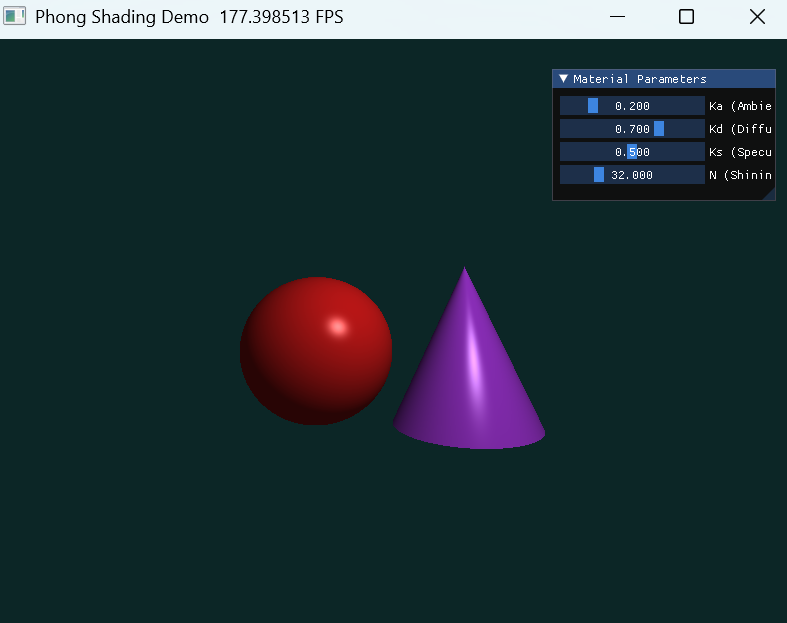
</p>

该图展示参考代码测试版的运行效果。该部分主要用于和自己的实现结果进行对照，观察场景构图、物体大小、光照明暗和高光位置是否合理。

<a id="section-4-2"></a>

### 4.2 基础 Phong 光照效果

<p align="center">
  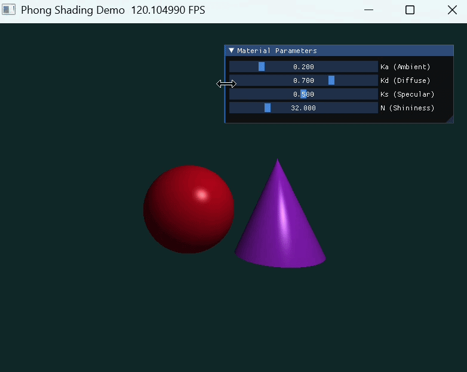
</p>

<p align="center">
  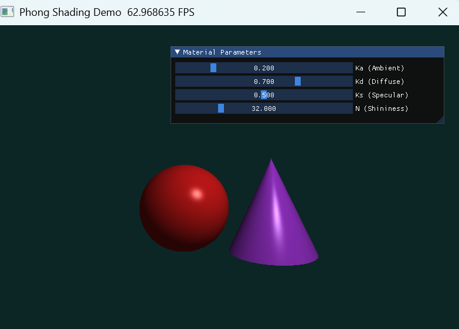
</p>


该组图展示 `Phong.py` 的运行效果。上图用于展示`4个` 参数拖动时画面的动态变化，下图展示一个较稳定的静态结果。可以观察到球体和圆锥都具有较明显的明暗过渡和镜面高光，说明环境光、漫反射和镜面反射三项着色已经正确叠加。

<a id="section-4-3"></a>

### 4.3 UI 参数调节效果

<table align="center">
  <tr>
    <td align="center"><strong>Ka</strong></td>
    <td align="center"><strong>Kd</strong></td>
  </tr>
  <tr>
    <td align="center">
      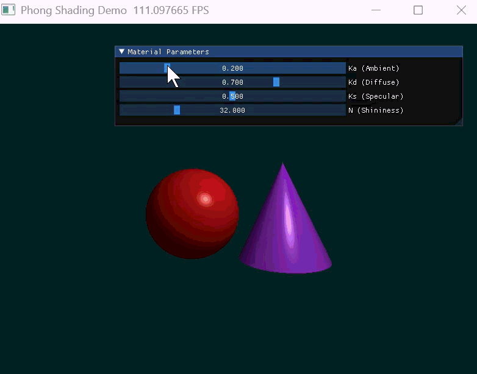
    </td>
    <td align="center">
      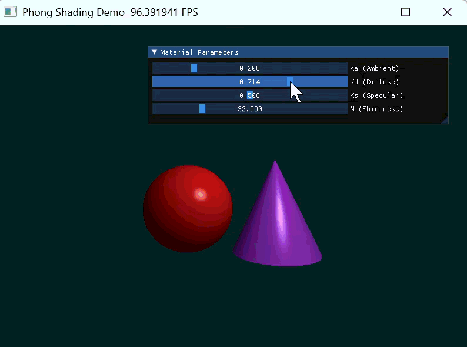
    </td>
  </tr>
  <tr>
    <td align="center"><strong>Ks</strong></td>
    <td align="center"><strong>Shininess</strong></td>
  </tr>
  <tr>
    <td align="center">
      
    </td>
    <td align="center">
      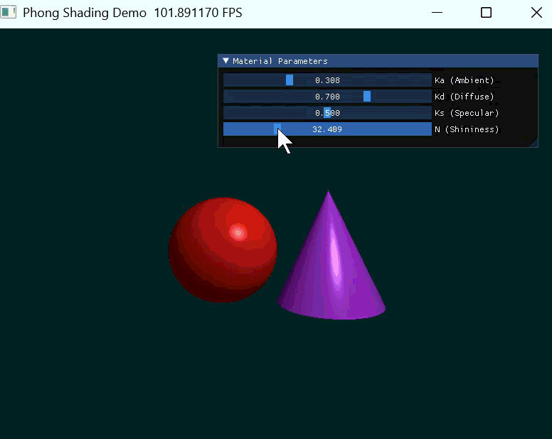
    </td>
  </tr>
</table>

这四个动图分别用于展示四个滑动条的影响。`Ka` 主要控制整体环境亮度，`Kd` 主要影响明暗过渡区域的亮度，`Ks` 决定高光强度，`Shininess` 决定高光斑点的集中程度和锐利程度。把这一组图放进 README 后，交互部分会显得非常完整。

<a id="section-4-4"></a>

### 4.4 Blinn-Phong 对比效果

<table align="center">
  <tr>
    <td align="center"><strong>静态对比图</strong></td>
    <td align="center"><strong>动态对比演示</strong></td>
  </tr>
  <tr>
    <td align="center">
      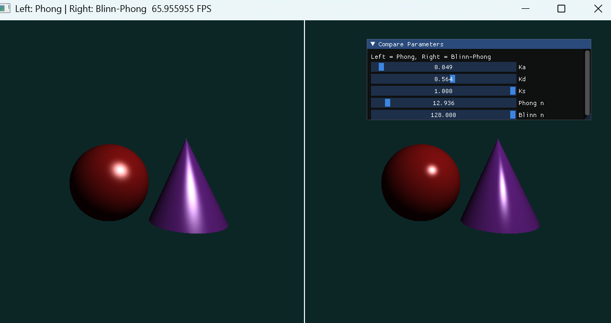
    </td>
    <td align="center">
      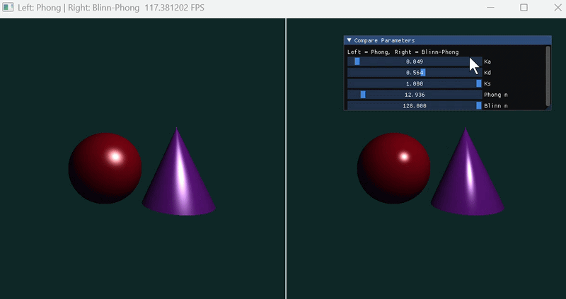
    </td>
  </tr>
</table>

该组图用于比较传统 Phong 模型和 Blinn-Phong 模型在高光区域的差异。可以观察到 Blinn-Phong 在一些角度下高光更稳定，边缘处也更自然，因此在实际图形学系统中经常被用作 Phong 的改进形式。

<a id="section-4-5"></a>

### 4.5 Hard Shadow 对比效果

<table align="center">
  <tr>
    <td align="center"><strong>静态对比图</strong></td>
    <td align="center"><strong>硬阴影静态效果图</strong></td>
  </tr>
  <tr>
    <td align="center">
      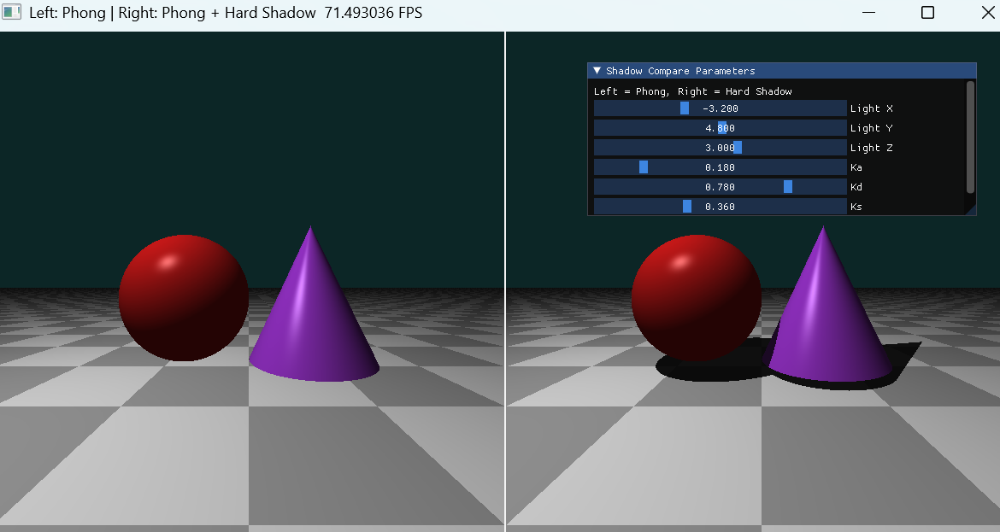
    </td>
    <td align="center">
      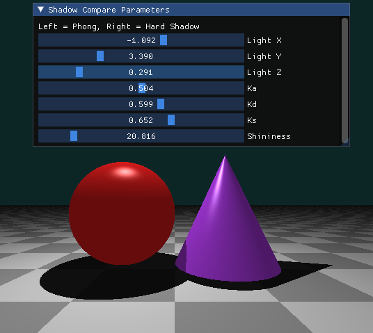
    </td>
  </tr>
</table>

<br>

<p align="center">
  <strong>动态对比演示</strong>
</p>

<p align="center">
  
</p>

该组图用于展示硬阴影效果。与基础光照相比，加入暗影射线之后，物体遮挡光源的区域会明显变暗，从而增强场景中的空间层次感与遮挡关系，也让画面更接近真实的局部光照表现。

<p align="right"><a href="#toc">回到目录 ↑</a></p>
<a id="section-5"></a>

## 五、实验目标

<a id="section-5-1"></a>

### 5.1 理论理解

理解并掌握局部光照的基本原理，区分环境光 `Ambient`、漫反射 `Diffuse` 和镜面高光 `Specular` 三部分在最终颜色中的作用。

<a id="section-5-2"></a>

### 5.2 数学基础

掌握三维空间中的基本向量运算，包括法向量计算、光线方向 `L`、视线方向 `V`、反射向量 `R`，以及后续选做部分中的半程向量 `H`。

<a id="section-5-3"></a>

### 5.3 工程实践

掌握如何利用 Taichi 实现交互式渲染，通过 UI 控件实时调节材质参数，并通过对比版本观察不同着色模型和阴影机制带来的视觉差异。

<p align="right"><a href="#toc">回到目录 ↑</a></p>

<a id="section-6"></a>

## 六、实验原理

<a id="section-6-1"></a>

### 6.1 Phong 光照模型总公式

Phong 光照模型是一种经典的局部光照经验模型，它将表面的反射光分为三个部分，最终叠加得到像素颜色：

$$
I = I_{ambient} + I_{diffuse} + I_{specular}
$$

其中，`I` 表示最终像素颜色。

<a id="section-6-2"></a>

### 6.2 环境光 Ambient

环境光用于模拟场景中经过多次反射后均匀分布的背景光，其表达式为：

$$
I_{ambient} = K_a \, C_{light} \, C_{object}
$$

其中，`K_a` 为环境光系数，`C_light` 为光源颜色，`C_object` 为物体本身颜色。

<a id="section-6-3"></a>

### 6.3 漫反射 Diffuse

漫反射遵循 Lambert 定律，亮度与法向量和光照方向夹角的余弦成正比，其表达式为：

$$
I_{diffuse} = K_d \, \max(0, N \cdot L) \, C_{light} \, C_{object}
$$

其中，`N` 表示单位法向量，`L` 表示从交点指向光源的单位向量，`K_d` 为漫反射系数。

<a id="section-6-4"></a>

### 6.4 镜面高光 Specular

镜面高光用于模拟表面较光滑时出现的强反射区域，其表达式为：

$$
I_{specular} = K_s \, \max(0, R \cdot V)^n \, C_{light}
$$

其中，`R` 为理想反射向量，`V` 为从交点指向摄像机的单位向量，`K_s` 为镜面系数，`n` 为高光指数 `Shininess`。

<a id="section-6-5"></a>

### 6.5 反射向量

在本实验中，反射向量可以写为：

$$
R = 2 (N \cdot L) N - L
$$

该向量表示光线在理想镜面表面上的反射方向。后续镜面高光部分通过比较 `R` 与 `V` 的夹角来判断高光强弱。

<a id="section-6-6"></a>

### 6.6 Blinn-Phong 半程向量

Blinn-Phong 模型使用半程向量 `H` 替代传统的反射向量 `R`。半程向量定义为：

$$
H = \frac{L + V}{\|L + V\|}
$$

此时镜面高光项写为：

$$
I_{specular}^{blinn} = K_s \, \max(0, N \cdot H)^n \, C_{light}
$$

使用 `N · H` 的好处是计算更稳定，且在一些视角下高光边缘更加自然。

<a id="section-6-7"></a>

### 6.7 硬阴影 Hard Shadow

硬阴影的基本思路是在交点处向光源发射一条暗影射线。若这条射线在到达光源之前击中了其他物体，则说明当前点被遮挡，此时不再计算漫反射和镜面高光，只保留环境光：

$$
I_{shadow} = I_{ambient}
$$

若暗影射线未被遮挡，则保留完整光照模型：

$$
I = I_{ambient} + I_{diffuse} + I_{specular}
$$

<a id="section-6-8"></a>

### 6.8 实现注意事项

本实验在实现时需要特别注意三个问题。

1. `N`、`L`、`V`、`R` 和 `H` 都必须是单位向量。如果不归一化，点乘结果会失真，从而导致画面过亮、过暗或出现杂乱高光。

2. 漫反射和镜面高光都必须对点乘结果进行截断。也就是说，程序中应使用：

$$
\max(0, x)
$$

来避免背光区域产生非法负值。

3. 最终颜色在写入像素前需要限制到合法范围。也就是说，若 RGB 分量大于 1，则应进行截断：

$$
color = clamp(color, 0, 1)
$$

这样可以避免颜色过曝发白的问题。

<p align="right"><a href="#toc">回到目录 ↑</a></p>

<a id="section-7"></a>

## 七、基础任务实现

<a id="section-7-1"></a>

## 任务 1：构建代码驱动的三维场景

<a id="section-7-1-1"></a>

### 任务要求

实验要求在不导入外部模型文件的情况下，通过 Taichi Kernel 中的数学隐式定义构建场景。场景中包括左侧红色球体、右侧紫色圆锥，以及固定的摄像机和点光源。

<a id="section-7-1-2"></a>

### 实现方式

本实验使用光线投射 `Ray Casting` 的方式定义场景。程序中直接在代码中描述球体和圆锥的几何参数，不依赖任何 `.obj` 或其他外部模型文件。摄像机固定在 `(0, 0, 5)`，点光源固定在 `(2, 3, 4)`，背景颜色设置为较深的青色，以便突出主体几何体和高光区域。

对应代码位置：

```python
intersect_sphere()
intersect_cone()
render()
```

<a id="section-7-1-3"></a>

### 可视化结果

<p align="center">
  
</p>

该图展示了基础场景构建结果。可以观察到左侧球体和右侧圆锥的位置关系已经清晰建立，说明基础场景定义正确。

<a id="section-7-2"></a>

## 任务 2：实现光线求交与深度测试

<a id="section-7-2-1"></a>

### 任务要求

实验要求对屏幕上的每个像素发射一条射线，分别计算其与球体和圆锥的交点距离 `t`，并实现类似 Z-buffer 的深度竞争逻辑，始终选择距离摄像机最近的正交点进行着色。

<a id="section-7-2-2"></a>

### 实现方式

程序对球体和圆锥分别进行射线求交。若同一条射线同时命中两个物体，则只保留最小的正数 `t`，从而保证遮挡关系正确。交点确定后，程序会进一步计算该点的三维坐标以及对应法向量 `N`，为后续光照计算提供输入。

对应代码位置：

```python
intersect_sphere()
intersect_cone()
get_normal_sphere()
get_normal_cone()
```

<a id="section-7-2-3"></a>

### 可视化结果

<p align="center">
  
</p>

从图中可以看到球体和圆锥之间的遮挡关系是正确的，说明深度竞争逻辑已经正常工作。

<a id="section-7-3"></a>

## 任务 3：编写 Phong 着色器

<a id="section-7-3-1"></a>

### 任务要求

实验要求在交点处计算 `L`、`V` 和 `R`，并根据实验原理中的公式分别计算环境光、漫反射和镜面高光，最终叠加得到像素 RGB 颜色值。

<a id="section-7-3-2"></a>

### 实现方式

程序在最近交点处先求出法向量 `N`，再利用光源位置和摄像机位置分别求出 `L` 和 `V`，随后通过反射公式求出 `R`。之后分别计算三项光照并相加，再将结果限制在 `[0, 1]` 范围内写回像素缓冲区。

对应代码位置：

```python
shade_phong()
compute_ambient()
compute_diffuse()
compute_specular()
```

<a id="section-7-3-3"></a>

### 可视化结果

<table align="center">
  <tr>
    <td align="center"><strong>动态演示</strong></td>
    <td align="center"><strong>静态效果图</strong></td>
  </tr>
  <tr>
    <td align="center">
      
    </td>
    <td align="center">
      
    </td>
  </tr>
</table>

该组图展示 Phong 着色器已经正确工作。画面中可以看到较自然的高光、明暗过渡以及整体环境亮度变化。

<a id="section-7-4"></a>

## 任务 4：完成 UI 交互面板

<a id="section-7-4-1"></a>

### 任务要求

实验要求使用 Taichi 新版界面模块 `ti.ui.Window` 创建交互窗口，并提供 `Ka`、`Kd`、`Ks` 和 `Shininess` 四个滑动条，使画面能够实时更新。

<a id="section-7-4-2"></a>

### 实现方式

本实验在窗口侧边栏中放置四个 Slider，并将其与着色器中的参数变量绑定。每一帧程序都会读取当前参数值并重新渲染，因此用户拖动滑动条时可以立即看到结果变化。

对应代码位置：

```python
window = ti.ui.Window(...)
gui.slider_float(...)
render()
```

<a id="section-7-4-3"></a>

### 可视化结果

<table align="center">
  <tr>
    <td align="center"><strong>Ka</strong></td>
    <td align="center"><strong>Kd</strong></td>
  </tr>
  <tr>
    <td align="center">
      
    </td>
    <td align="center">
      
    </td>
  </tr>
  <tr>
    <td align="center"><strong>Ks</strong></td>
    <td align="center"><strong>Shininess</strong></td>
  </tr>
  <tr>
    <td align="center">
      
    </td>
    <td align="center">
      
    </td>
  </tr>
</table>

这组动图展示交互面板已经正常工作。拖动不同参数时，环境亮度、漫反射强度、高光亮度以及高光形状都能实时变化。

<p align="right"><a href="#toc">回到目录 ↑</a></p>

<a id="section-8"></a>

## 八、选做内容

下图为实验文档中给出的选做内容说明。

<p align="center">
  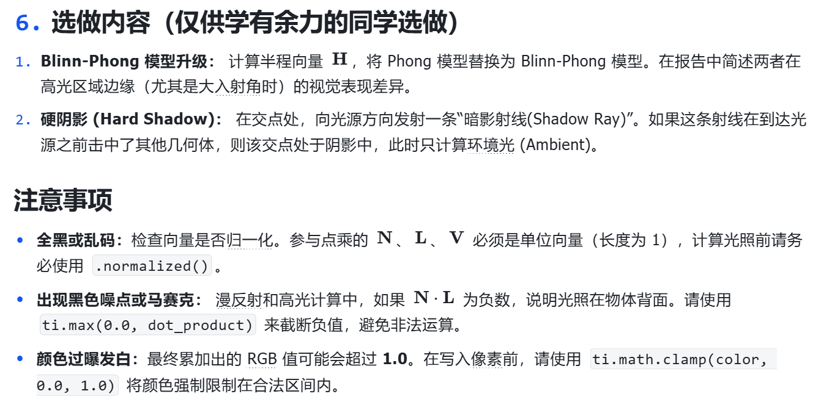
</p>

本实验进一步完成了两个选做内容，分别是 **Blinn-Phong 模型升级** 和 **硬阴影 Hard Shadow**。下面按照实验要求分别说明实现思路与结果。

<a id="section-8-1"></a>

## 8.1 选做一：Blinn-Phong 模型升级

<a id="section-8-1-1"></a>

### 8.1.1 任务要求

实验要求计算半程向量 `H`，将传统的 Phong 镜面高光项替换为 Blinn-Phong 模型，并在报告中简述两者在高光区域边缘，尤其是较大入射角情况下的视觉表现差异。

<a id="section-8-1-2"></a>

### 8.1.2 数学原理

Blinn-Phong 使用半程向量代替传统反射向量，半程向量定义为：

$$
H = \frac{L + V}{\|L + V\|}
$$

镜面高光部分改写为：

$$
I_{specular}^{blinn} = K_s \, \max(0, N \cdot H)^n \, C_{light}
$$

与传统 Phong 的

$$
I_{specular} = K_s \, \max(0, R \cdot V)^n \, C_{light}
$$

相比，Blinn-Phong 在一些视角下更稳定，也更容易得到自然的高光边界。

<a id="section-8-1-3"></a>

### 8.1.3 实现思路

本实验在基础版本上保留环境光和漫反射部分不变，仅替换镜面高光的计算方式。程序在交点处根据 `L` 和 `V` 计算半程向量 `H`，并将 `N · H` 作为新的镜面项输入。为了让差异更容易观察，还额外编写了 `ComparePhongBlinn.py`，用于并排展示两种模型。

<a id="section-8-1-4"></a>

### 8.1.4 可视化结果

<table align="center">
  <tr>
    <td align="center"><strong>静态对比图</strong></td>
    <td align="center"><strong>动态对比演示</strong></td>
  </tr>
  <tr>
    <td align="center">
      
    </td>
    <td align="center">
      
    </td>
  </tr>
</table>

该组图展示了 Phong 与 Blinn-Phong 的高光差异。可以观察到 Blinn-Phong 的高光区域在某些边缘角度下更自然，也更连续。

<a id="section-8-1-5"></a>

### 8.1.5 本部分小结

选做一在基础光照模型的基础上对镜面高光部分进行了升级。通过引入半程向量 `H`，程序不再依赖传统的 `R · V` 计算，而改用 `N · H` 进行高光判断，从而获得了更平滑、更稳定的镜面表现。

<a id="section-8-2"></a>

## 8.2 选做二：硬阴影 Hard Shadow

<a id="section-8-2-1"></a>

### 8.2.1 任务要求

实验要求在交点处向光源方向发射一条暗影射线。如果这条射线在到达光源前击中了其他几何体，则说明该点处于阴影中，此时只计算环境光。

<a id="section-8-2-2"></a>

### 8.2.2 数学原理

设交点为 `P`，光源位置为 `L_pos`，则暗影射线方向为：

$$
D_{shadow} = \frac{L_{pos} - P}{\|L_{pos} - P\|}
$$

如果从 `P` 沿 `D_shadow` 发出的射线在到达光源前再次与其他物体相交，则该点位于阴影中，此时：

$$
I = I_{ambient}
$$

否则：

$$
I = I_{ambient} + I_{diffuse} + I_{specular}
$$

<a id="section-8-2-3"></a>

### 8.2.3 实现思路

本实验在基础版本中增加了暗影测试逻辑。每当射线命中物体表面时，程序会额外生成一条从交点指向光源的暗影射线，并检测该射线是否在到达光源前与场景中其他物体相交。如果相交，则只保留环境光；若不相交，则保留完整的 Phong 着色结果。为了更直观展示差异，还额外编写了 `CompareShadow.py`。

<a id="section-8-2-4"></a>

### 8.2.4 可视化结果

<table align="center">
  <tr>
    <td align="center"><strong>静态对比图</strong></td>
    <td align="center"><strong>动态对比演示</strong></td>
  </tr>
  <tr>
    <td align="center">
      
    </td>
    <td align="center">
      
    </td>
  </tr>
</table>

<p align="center">
  
</p>

该组图展示硬阴影带来的视觉变化。加入阴影后，场景中物体的遮挡关系更加明显，空间层次感也更强。

<a id="section-8-2-5"></a>

### 8.2.5 本部分小结

选做二通过增加暗影射线，使局部光照结果中出现了真实的遮挡效应。虽然这里仍然是简单的硬阴影，但已经明显增强了场景的空间深度和真实感。

<p align="right"><a href="#toc">回到目录 ↑</a></p>


<a id="section-9"></a>

## 九、实验总结

本实验围绕经典的 Phong 光照模型展开，从基础场景构建、光线求交、深度测试，到环境光、漫反射和镜面高光三部分的着色，再到交互面板和选做内容扩展，形成了一个较完整的局部光照实验。

从实验结果来看，基础版本已经能够较稳定地展示球体与圆锥的局部光照效果，并且四个交互参数的变化也能够在画面中立即体现出来。选做部分中的 Blinn-Phong 升级和硬阴影扩展，则进一步丰富了本实验的表现力，使程序不再只是一个“静态着色演示”，而是一个带有模型对比和空间遮挡效果的完整实验项目。

通过本次实验，不仅可以更深入地理解局部光照模型的数学原理，也能更清楚地感受到不同着色模型和阴影机制在视觉结果上的区别。

<p align="right"><a href="#toc">回到目录 ↑</a></p>