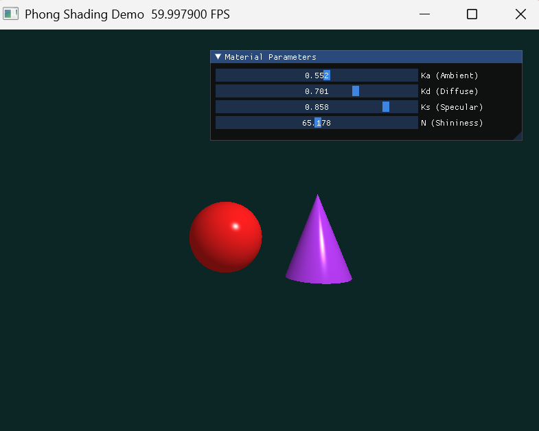

# Work4：Phong 光照模型实验

**基于 Taichi 的隐式几何建模、光线求交、Phong 着色、Blinn-Phong 扩展与硬阴影对比实验**


## 一、结果与可视化展示

### 1. 基础版 Phong 默认效果

<p align="center">
  
</p>

### 2. 基础版参数交互界面

<p align="center">
  
</p>

### 3. Blinn-Phong 单独效果图

<p align="center">
  
</p>

### 4. Phong 与 Blinn-Phong 对比图

<p align="center">
  
</p>

该图建议重点观察：

- 球体高光亮斑的边缘范围
- 圆锥侧面亮带的宽窄变化
- 高光指数变化时两种模型在高光边缘处的差别

### 5. Hard Shadow 单独效果图

<p align="center">
  
</p>

### 6. Phong 与 Hard Shadow 对比图

<p align="center">
  
</p>

### 7. 更明显阴影参数下的对比图

<p align="center">
  
</p>

这一组图建议重点观察：

- 左侧基础 Phong 没有真实投影，只体现表面明暗变化
- 右侧加入 Hard Shadow 后，地面出现明显投影
- 球体和圆锥的阴影形状不同
- 光源位置变化后，阴影方向和长度也会随之变化

### 8. 截图建议

本实验建议至少保留以下 6 张高清截图：

1. `phong_default.png`
2. `phong_ui.png`
3. `blinn_phong_single.png`
4. `compare_phong_blinn.png`
5. `hard_shadow_single.png`
6. `compare_shadow.png`

其中最关键的是两张对比图：

- `compare_phong_blinn.png`
- `compare_shadow.png`

这两张图最能体现选做内容的完成质量。截图时建议尽量避免让参数面板挡住主体物体和阴影区域。

## 二、文件结构

```text
CG-Lab/
├── assets/
│   └── work4/
│       ├── phong_default.png
│       ├── phong_ui.png
│       ├── blinn_phong_single.png
│       ├── compare_phong_blinn.png
│       ├── hard_shadow_single.png
│       ├── compare_shadow.png
│       └── compare_shadow_strong.png
├── src/
│   └── work4/
│       ├── Phong.py
│       ├── BlinnPhong.py
│       ├── HardShadow.py
│       ├── ComparePhongBlinn.py
│       ├── CompareShadow.py
│       ├── test.py
│       └── README.md
└── README.md
```

各文件作用如下：

- `Phong.py`：基础版 Phong 光照模型
- `BlinnPhong.py`：Blinn-Phong 单独版本
- `HardShadow.py`：Hard Shadow 单独版本
- `ComparePhongBlinn.py`：Phong 与 Blinn-Phong 左右对比
- `CompareShadow.py`：基础 Phong 与 Hard Shadow 左右对比，并加入地面接收阴影
- `test.py`：老师提供的基础参考代码
- `assets/work4/`：实验结果图、对比图、界面截图

## 三、任务对应实现：我是怎么完成的


### 任务 1：构建代码驱动的三维场景

老师要求不使用外部模型文件，而是在 Taichi Kernel 中直接定义场景中的球体和圆锥。我采用的是**隐式几何建模**方式：

- 球体通过球面方程定义
- 圆锥通过圆锥侧面隐式方程定义
- 在扩展版本中，还额外加入了底面圆盘与地面平面

基础场景参数与题目要求一致，主要包括：

- 红色球体：左侧，圆心为 `(-1.2, -0.2, 0)`，半径为 `1.2`
- 紫色圆锥：右侧，顶点为 `(1.2, 1.2, 0)`，底面位于 `y = -1.4`，底面半径为 `1.2`
- 摄像机：`(0, 0, 5)`
- 点光源：`(2, 3, 4)`
- 背景：深青色

这样做的好处是：场景完全由公式驱动，不依赖任何外部网格模型，便于直接分析求交、法向量和着色过程。

### 任务 2：实现光线求交与深度测试

我对每个像素发射一条从摄像机出发的射线：

$$
\mathbf{r}(t)=\mathbf{o}+t\mathbf{d}, \quad t>0
$$

其中：

- $\mathbf{o}$ 为摄像机位置
- $\mathbf{d}$ 为像素对应的方向向量

之后分别计算这条射线与球体、圆锥的交点参数 $t$。如果同一条射线同时击中多个物体，则比较所有合法正交点中最小的那个：

$$
t_{\min}=\min\{t_1,t_2,\dots\}, \quad t_i>0
$$

并只对最近交点进行着色。

也就是说，我不是简单地“先画球再画圆锥”，而是通过最近交点选择实现了类似 Z-buffer 的深度竞争逻辑，因此遮挡关系是自动正确的。

### 任务 3：编写 Phong 着色器

在得到最近交点之后，我会继续计算该点的：

- 法向量 $\mathbf{N}$
- 光照方向 $\mathbf{L}$
- 观察方向 $\mathbf{V}$
- 反射方向 $\mathbf{R}$

然后分别计算环境光、漫反射和镜面高光三部分，再叠加得到最终像素颜色。

为了避免出现黑色噪点和非法高光，我在实现中做了三件事：

1. 所有参与点乘的方向向量都做归一化  
2. 对漫反射和镜面高光中的点乘结果都使用 $\max(0,\cdot)$ 截断  
3. 最终输出颜色前使用 clamp 将 RGB 限制在 $[0,1]$ 范围内

因此基础版 Phong 渲染既满足公式要求，也能稳定运行。

### 任务 4：完成 UI 交互面板

我使用 `ti.ui.Window` 创建窗口，再通过 GUI 子面板加入滑动条，实现以下参数的实时调节：

- `Ka`：环境光系数
- `Kd`：漫反射系数
- `Ks`：镜面高光系数
- `Shininess`：高光指数

这样做之后，程序不再是固定参数的静态结果图，而是一个可交互的实验程序。通过拖动参数，可以直接观察：

- `Ka` 增大时，整体亮度上升
- `Kd` 增大时，明暗过渡更明显
- `Ks` 增大时，高光更亮
- `Shininess` 增大时，高光更集中、更尖锐

### 选做 1：Blinn-Phong 模型升级

在 `BlinnPhong.py` 中，我将原始 Phong 高光项中的反射向量 $\mathbf{R}$ 替换成半程向量 $\mathbf{H}$。具体做法是先计算：

$$
\mathbf{H}=\frac{\mathbf{L}+\mathbf{V}}{\|\mathbf{L}+\mathbf{V}\|}
$$

再将镜面高光项改写为：

$$
I_{\text{specular}}^{\text{Blinn}} = K_s \cdot \max(0,\mathbf{N}\cdot\mathbf{H})^n \cdot C_{\text{light}}
$$

为了让这个差异更容易观察，我额外写了 `ComparePhongBlinn.py`，将 Phong 与 Blinn-Phong 左右分屏显示。这样就可以直接比较两者在高光中心和高光边缘区域的差别，而不是靠肉眼记忆两个独立窗口。

### 选做 2：Hard Shadow 硬阴影

在 `HardShadow.py` 和 `CompareShadow.py` 中，我加入了阴影射线逻辑。

对于一个已经命中的表面点 $\mathbf{P}$，我不再只计算表面光照，而是额外向光源发射一条阴影射线。若这条射线在到达光源前先与其他物体相交，则说明该点被遮挡，处于阴影中，此时只保留环境光：

$$
I_{\text{shadow}} = I_{\text{ambient}}
$$

否则：

$$
I_{\text{lit}} = I_{\text{ambient}} + I_{\text{diffuse}} + I_{\text{specular}}
$$

同时，为了让阴影效果真正明显，我还加入了地面平面作为接收阴影的表面。这样球体和圆锥的投影就能直接落到地面上，视觉效果远比“只有悬浮物体”更清楚，也更适合截图展示。

## 四、数学原理与公式

### 1. Phong 光照模型

Phong 光照模型写作：

$$
I = I_{\text{ambient}} + I_{\text{diffuse}} + I_{\text{specular}}
$$

### 2. 环境光

$$
I_{\text{ambient}} = K_a \cdot C_{\text{light}} \cdot C_{\text{object}}
$$

### 3. 漫反射

$$
I_{\text{diffuse}} = K_d \cdot \max(0,\mathbf{N}\cdot\mathbf{L}) \cdot C_{\text{light}} \cdot C_{\text{object}}
$$

### 4. Phong 镜面高光

$$
I_{\text{specular}} = K_s \cdot \max(0,\mathbf{R}\cdot\mathbf{V})^n \cdot C_{\text{light}}
$$

其中反射向量为：

$$
\mathbf{R} = 2(\mathbf{N}\cdot\mathbf{L})\mathbf{N}-\mathbf{L}
$$

### 5. Blinn-Phong 镜面高光

$$
\mathbf{H}=\frac{\mathbf{L}+\mathbf{V}}{\|\mathbf{L}+\mathbf{V}\|}
$$

$$
I_{\text{specular}}^{\text{Blinn}} = K_s \cdot \max(0,\mathbf{N}\cdot\mathbf{H})^n \cdot C_{\text{light}}
$$

### 6. 球体求交

球体满足：

$$
\|\mathbf{P}-\mathbf{C}\|^2 = R^2
$$

将射线方程代入后，可得到一元二次方程，取最小正根作为交点参数。

球体法向量写作：

$$
\mathbf{N}=\frac{\mathbf{P}-\mathbf{C}}{\|\mathbf{P}-\mathbf{C}\|}
$$

### 7. 阴影射线

阴影射线方向为：

$$
\mathbf{d}_{\text{shadow}}=\frac{\mathbf{P}_{\text{light}}-\mathbf{P}}{\|\mathbf{P}_{\text{light}}-\mathbf{P}\|}
$$

若阴影射线在到达光源前先击中其他物体，则该点处于阴影中。

## 五、结果分析

### 1. 基础版 Phong

基础版已经能够正确表现球体与圆锥的明暗变化和镜面高光。其中球体高光分布较平滑，圆锥侧面则表现出沿几何方向展开的亮带。

### 2. Blinn-Phong 对比

在当前场景中，若观察方向和光照方向都较正，则 Phong 与 Blinn-Phong 的高光中心差异不一定很大；但在高光边缘区域，尤其是大入射角时，Blinn-Phong 往往表现得更稳定，高光边界也更容易保留下来。

### 3. Hard Shadow 对比

没有接收阴影的表面时，硬阴影不容易明显表现出来；因此本实验加入地面平面后，阴影差异会直接体现在地面投影上。左右对比图中，右侧的阴影信息明显更多，也更能体现遮挡关系。

## 六、运行方式

在项目根目录下运行：

### 基础版 Phong

```bash
python -u "src/work4/Phong.py"
```

### Blinn-Phong 单独版本

```bash
python -u "src/work4/BlinnPhong.py"
```

### Hard Shadow 单独版本

```bash
python -u "src/work4/HardShadow.py"
```

### Phong 与 Blinn-Phong 对比版

```bash
python -u "src/work4/ComparePhongBlinn.py"
```

### Phong 与 Hard Shadow 对比版

```bash
python -u "src/work4/CompareShadow.py"
```

## 七、实验总结

本实验完整实现了从隐式几何建模、光线求交、深度测试到局部光照着色的渲染流程，并在基础 Phong 模型之上进一步实现了 Blinn-Phong 与 Hard Shadow 两个扩展版本。相比只完成一个基础窗口程序，本实验还加入了左右对比窗口与地面阴影接收平面，使不同模型之间的效果差异能够被直接观察和截图展示。整体上，这个实验不仅完成了题目要求，也形成了一个更完整、更适合汇报与展示的可视化实验版本。