# 计算机图形学 - 实验五

# 实验名称：光线追踪 Ray Tracing

## 一、本次实验任务与收获

本次实验围绕 **Whitted-Style 光线追踪** 展开，主要完成了三个层次的内容。

**第一项任务是完成基础光线追踪系统，对应 `main.py`。** 程序在 Taichi Kernel 中隐式定义场景，不导入任何外部模型，实现了无限大棋盘格地面、红色漫反射球、银色镜面球、硬阴影、镜面反射和 UI 交互控制。通过这一部分，可以直观看到 Ray Casting 与 Ray Tracing 的区别：Ray Casting 只考虑主光线第一次命中的表面，而 Ray Tracing 会继续发射阴影射线和反射射线，从而表现物体之间的遮挡关系和镜面中的环境反射。

**第二项任务是完成玻璃折射材质，对应 `GlassRefraction.py`。** 这一部分在基础场景上将红色漫反射球改为玻璃球，引入斯涅尔定律计算折射方向，并处理玻璃内部可能出现的全反射。同时加入 Fresnel 近似，让玻璃球边缘产生更自然的反射和高光效果。通过这一部分，程序的材质系统从普通漫反射和理想镜面反射扩展到了透明介质。

**第三项任务是完成 MSAA 抗锯齿，对应 `AntiAliasingMSAA.py`。** 基础光线追踪中每个像素只发射一条主光线，因此球体边缘、棋盘格边界和阴影边缘会出现明显锯齿。MSAA 版本在每个像素内部发射多条主光线并取平均，使边缘过渡更加平滑。通过这一部分，可以直观看到采样数量对最终图像质量的影响。

此外，`test.py` 用于运行老师参考代码或测试版本，方便和自己完成的版本进行对比，观察场景大小、相机视角、光照强度和最终渲染效果之间的差异。

## 二、文件结构

```text
CG-Lab/
├── assets/
│   └── work5/
│       ├── optional_tasks.png        # 老师实验文档中的选做内容
│       ├── teacher_test.png          # 老师参考代码运行结果
│       ├── task1_scene.png           # 任务 1：基础三维场景，展示棋盘格地面、红球和镜面球
│       ├── task2_max_bounces.gif     # 任务 2：最大弹射次数变化，展示镜面反射逐渐增强
│       ├── task3_hard_shadow.png     # 任务 3：硬阴影结果，展示 shadow ray 遮挡判断
│       ├── task4_ui.gif              # 任务 4：UI 交互效果，展示光源移动和弹射次数调整
│       ├── raytracing_basic.png      # 基础光线追踪最终效果图
│       ├── glass_refraction.png      # 选做一：玻璃折射整体效果
│       ├── glass_bounces.gif         # 选做一：玻璃材质弹射次数变化
│       ├── glass_highlight.png       # 选做一：玻璃边缘高光与 Fresnel 效果
│       ├── msaa_compare.gif          # 选做二：MSAA 动态对比
│       ├── aa_grid_1.png             # 选做二：AA Grid = 1，单采样结果
│       ├── aa_grid_3.png             # 选做二：AA Grid = 3，多采样结果
│       ├── edge_zoom_noaa.png        # 选做二：未开启 MSAA 的边缘局部放大
│       └── edge_zoom_msaa.png        # 选做二：开启 MSAA 后的边缘局部放大
│
├── src/
│   └── work5/
│       ├── test.py                   # 老师参考代码，用于与自己的实现进行对比
│       ├── main.py                   # 基础任务：场景搭建、硬阴影、镜面反射、UI 交互
│       ├── GlassRefraction.py        # 选做一：玻璃折射、全反射、Fresnel 近似
│       ├── AntiAliasingMSAA.py       # 选做二：MSAA 抗锯齿
│       └── README.md                 # 实验说明文档
```

## 三、运行方式

在项目根目录下运行。

### 3.1 老师参考代码测试版

```bash
python -u "src/work5/test.py"
```

该文件主要用于运行老师参考代码或测试效果，方便观察基础场景、光照强度、物体大小和相机视角，并与自己实现的版本进行比较。

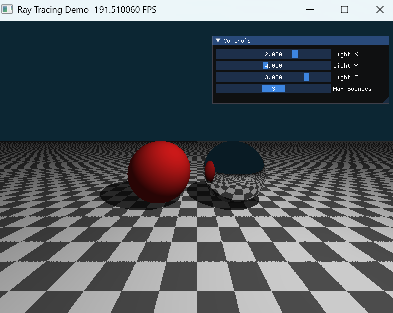

### 3.2 基础光线追踪版本

```bash
python -u "src/work5/main.py"
```

该版本完成实验五基础任务，包括棋盘格地面、红色漫反射球、银色镜面球、硬阴影、镜面反射和 UI 交互控制。

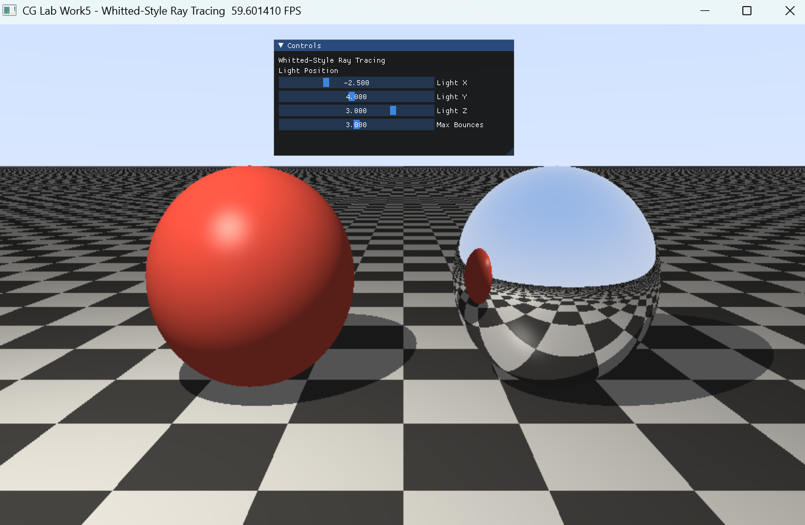

### 3.3 选做一：玻璃折射版本

```bash
python -u "src/work5/GlassRefraction.py"
```

该版本将红色漫反射球替换为玻璃材质球，实现折射、全反射和 Fresnel 边缘反射效果。

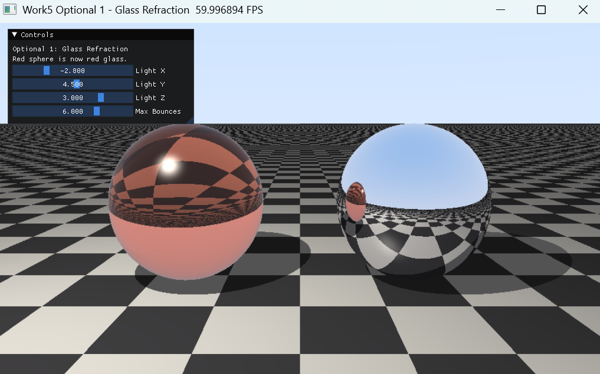

### 3.4 选做二：MSAA 抗锯齿版本

```bash
python -u "src/work5/AntiAliasingMSAA.py"
```

该版本在基础光线追踪流程上增加多重采样抗锯齿，可以通过 `AA Grid` 控制每个像素内部的采样数量。


### 3.5 使用 uv 运行

如果使用 `uv` 管理环境，也可以在项目根目录运行：

```bash
uv run python src/work5/main.py
```

如果运行时出现类似 `nvcuda.dll lib not found` 的提示，但后面显示启动在 `vulkan` 后端，一般不影响程序运行。这说明当前机器没有使用 CUDA，而是自动切换到了 Vulkan 后端。

## 四、实验目标

### 4.1 理论理解

理解光线投射 Ray Casting 与光线追踪 Ray Tracing 的本质区别。Ray Casting 通常只考虑相机主光线与场景的第一次交点，而 Ray Tracing 会在交点处继续发射次级射线，例如阴影射线、反射射线和折射射线，从而得到更加丰富的视觉效果。

### 4.2 全局光照

掌握通过发射 **Secondary Rays** 实现硬阴影和理想镜面反射的方法。阴影射线用于判断光源是否被遮挡，反射射线用于模拟镜面球中的环境反射。选做部分进一步加入折射射线，用于模拟玻璃材质中的透明和折射现象。

### 4.3 GPU 编程思维

传统光线追踪常用递归写法，但 GPU Kernel 中不适合递归。本实验将递归式光线追踪改写为固定次数的循环，通过 `throughput` 记录光线能量衰减，通过 `final_color` 累积最终颜色，从而使算法更适合 GPU 并行执行。

## 五、实验原理

本实验采用经典的 **Whitted-Style 光线追踪模型**。每个像素首先从相机发出一条主光线，主光线进入场景后与球体和平面求交。程序找到距离相机最近的交点后，根据命中的材质类型进入不同分支。

当主光线命中漫反射物体时，程序计算局部 Phong 光照，并额外发射一条阴影射线判断该点是否处于阴影中。当光线命中镜面物体时，程序根据反射定律生成新的反射射线，并继续追踪。当光线命中玻璃物体时，程序根据斯涅尔定律生成折射光线，并在发生全反射时切换为反射方向。

### 5.1 光线表示

一条光线可以表示为：

$$
\mathbf{P}(t)=\mathbf{O}+t\mathbf{D}
$$

其中，`O` 表示光线起点，`D` 表示单位方向向量，`t` 表示光线沿方向前进的距离。只有当 `t > 0` 时，交点才位于光线前方。

### 5.2 球体求交

球体由球心 `C` 和半径 `r` 定义，球面上任意一点满足：

$$
\left\|\mathbf{P}-\mathbf{C}\right\|^2=r^2
$$

将光线方程代入球体方程：

$$
\left\|\mathbf{O}+t\mathbf{D}-\mathbf{C}\right\|^2=r^2
$$

令：

$$
\mathbf{oc}=\mathbf{O}-\mathbf{C}
$$

可得到关于 `t` 的二次方程：

$$
t^2+2(\mathbf{oc}\cdot\mathbf{D})t+(\mathbf{oc}\cdot\mathbf{oc}-r^2)=0
$$

程序通过判别式判断光线是否与球体相交。如果有两个交点，则选取距离相机最近且大于 `EPS` 的交点。

命中球体后，表面法线为：

$$
\mathbf{N}=\frac{\mathbf{P}-\mathbf{C}}{\left\|\mathbf{P}-\mathbf{C}\right\|}
$$

对应代码位置：

```python
intersect_sphere()
intersect_scene()
```

### 5.3 平面求交

本实验中的地面是无限大平面，位置为：

$$
y=-1.0
$$

光线的 y 分量为：

$$
P_y(t)=O_y+tD_y
$$

令交点落在地面上：

$$
O_y+tD_y=-1.0
$$

得到：

$$
t=\frac{-1.0-O_y}{D_y}
$$

当地面交点满足 `t > 0` 时，说明交点位于光线前方。地面法线固定为：

$$
\mathbf{N}=(0,1,0)
$$

对应代码位置：

```python
intersect_scene()
```

### 5.4 棋盘格纹理

地面的棋盘格纹理由交点的 x 坐标和 z 坐标决定。设交点为：

$$
\mathbf{P}=(P_x,P_y,P_z)
$$

程序对 `P_x` 和 `P_z` 向下取整，并判断二者之和的奇偶性：

$$
k=\left\lfloor P_x\right\rfloor+\left\lfloor P_z\right\rfloor
$$

当 `k` 为偶数时使用浅色格子，当 `k` 为奇数时使用深色格子。

对应代码位置：

```python
get_checker_color()
```

### 5.5 Phong 局部光照

漫反射物体和地面使用 Phong 光照模型计算颜色。局部光照由环境光、漫反射光和高光组成：

$$
\mathbf{I}=\mathbf{I}_{ambient}+\mathbf{I}_{diffuse}+\mathbf{I}_{specular}
$$

环境光为：

$$
\mathbf{I}_{ambient}=k_a\mathbf{C}_{base}
$$

漫反射项为：

$$
\mathbf{I}_{diffuse}=k_d\max(0,\mathbf{N}\cdot\mathbf{L})\mathbf{C}_{base}\mathbf{C}_{light}
$$

其中，`L` 表示从交点指向光源的单位方向。

高光项使用 Blinn-Phong 半程向量计算：

$$
\mathbf{H}=\frac{\mathbf{L}+\mathbf{V}}{\left\|\mathbf{L}+\mathbf{V}\right\|}
$$

$$
\mathbf{I}_{specular}=k_s\max(0,\mathbf{N}\cdot\mathbf{H})^s\mathbf{C}_{light}
$$

其中，`V` 表示从交点指向相机的视线方向，`s` 表示高光指数。

对应代码位置：

```python
phong_shading()
```

### 5.6 硬阴影


对于已经命中的表面点 `P`，程序从该点向光源位置 `L_pos` 发射阴影射线：

$$
\mathbf{D}_{shadow}=\frac{\mathbf{L}_{pos}-\mathbf{P}}{\left\|\mathbf{L}_{pos}-\mathbf{P}\right\|}
$$

如果阴影射线在到达光源之前命中其他物体：

$$
0<t_{hit}<\left\|\mathbf{L}_{pos}-\mathbf{P}\right\|
$$

则说明该点处于阴影中，只保留环境光。

对应代码位置：

```python
is_in_shadow()
phong_shading()
```

### 5.7 镜面反射

当光线命中镜面球时，程序根据反射定律计算新的反射方向：

$$
\mathbf{R}=\mathbf{D}-2(\mathbf{D}\cdot\mathbf{N})\mathbf{N}
$$

其中，`D` 是入射光线方向，`N` 是表面单位法线，`R` 是反射光线方向。

对应代码位置：

```python
reflect()
trace_ray()
```

### 5.8 迭代式光线弹射

传统光线追踪可以用递归描述：光线击中镜面后再次调用追踪函数，继续追踪反射光线。但 GPU Kernel 中不适合递归，因此本实验使用固定次数的循环完成光线弹射。

程序维护两个核心变量。第一个是当前像素已经累积的最终颜色：

$$
\mathbf{C}_{final}
$$

第二个是光线吞吐量，也就是光线经过多次反射或折射后的能量衰减：

$$
\mathbf{T}
$$

初始状态为：

$$
\mathbf{C}_{final}=(0,0,0)
$$

$$
\mathbf{T}=(1,1,1)
$$

当光线击中漫反射物体时：

$$
\mathbf{C}_{final}\leftarrow\mathbf{C}_{final}+\mathbf{T}\mathbf{C}_{local}
$$

随后终止该条光线。

当光线击中镜面物体时：

$$
\mathbf{T}\leftarrow\mathbf{T}\mathbf{R}_{material}
$$

并更新光线起点和方向，进入下一次弹射。

对应代码位置：

```python
trace_ray()
```

### 5.9 Shadow Acne 处理

如果阴影射线或反射射线直接从交点出发，浮点误差可能导致射线立刻再次命中自身所在表面，产生错误阴影或黑色噪点。为避免这个问题，新的射线起点需要沿法线方向偏移一个很小的距离：

$$
\mathbf{P}_{new}=\mathbf{P}+\epsilon\mathbf{N}
$$

本实验中取：

$$
\epsilon=10^{-4}
$$

对应代码写法：

```python
shadow_origin = hit_pos + normal * EPS
current_origin = hit_pos + normal * EPS
```

## 六、基础任务实现

## 任务 1：搭建包含平面的三维场景

### 任务要求

不导入外部模型，在 Taichi Kernel 中隐式定义三个几何体，并建立材质 ID 系统：

**1. 无限大平面 Ground Plane**  
位于 `y = -1.0`，法线朝上，实现黑白棋盘格纹理，设为漫反射材质。

**2. 红色漫反射球 Red Diffuse Sphere**  
位于左侧，球心为 `(-1.5, 0.0, 0.0)`，半径为 `1.0`。

**3. 银色镜面球 Silver Mirror Sphere**  
位于右侧，球心为 `(1.5, 0.0, 0.0)`，半径为 `1.0`，设为纯镜面反射材质。

### 实现方式

本实验在 `intersect_scene()` 中统一完成场景求交。程序依次检测红色球、银色镜面球和无限大地面，并始终保留距离相机最近的交点。

材质系统通过 `material_id` 区分：

| material_id | 对应物体 | 材质类型 |
| --- | --- | --- |
| `1` | 棋盘格地面 | 漫反射 |
| `2` | 红色球 | 漫反射 |
| `3` | 银色球 | 理想镜面反射 |

红色球和银色球使用球体方程求交，地面使用平面方程求交。棋盘格颜色由地面交点的 x、z 坐标计算得到。

对应代码位置：

```python
intersect_sphere()
get_checker_color()
intersect_scene()
```

### 可视化结果

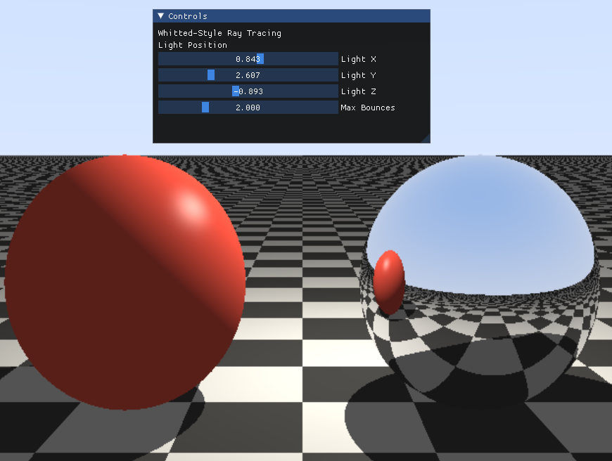

图中可以看到实验要求的三个几何体：下方为无限大棋盘格平面，左侧为红色漫反射球，右侧为银色镜面球。所有物体均由程序中的数学方程直接定义，没有导入外部模型。

## 任务 2：实现基于迭代的光线弹射

### 任务要求

由于 GPU 不擅长处理递归，程序需要在每个像素的计算中使用 `for` 循环追踪光线路径。每条光线维护两个变量：

**`throughput`**  
光线吞吐量，表示当前光线携带的能量衰减，初始为 1。

**`final_color`**  
最终颜色，用于累积当前像素的结果，初始为 0。

当光线击中镜面物体时，更新光线起点和方向，并让 `throughput` 乘以反射率继续传播；当光线击中漫反射物体时，计算局部光照颜色并终止当前光线。

### 实现方式

本实验在 `trace_ray()` 中使用固定次数循环实现光线追踪。初始时：

$$
\mathbf{C}_{final}=(0,0,0)
$$

$$
\mathbf{T}=(1,1,1)
$$

其中，`C_final` 对应程序中的 `final_color`，`T` 对应程序中的 `throughput`。

当光线击中漫反射物体时：

$$
\mathbf{C}_{final}\leftarrow\mathbf{C}_{final}+\mathbf{T}\mathbf{C}_{local}
$$

随后结束循环。

当光线击中镜面物体时：

$$
\mathbf{T}\leftarrow\mathbf{T}\mathbf{R}_{material}
$$

并根据反射方向更新光线，进入下一次弹射。

对应代码位置：

```python
trace_ray()
reflect()
```

核心流程如下：

```python
for bounce in range(MAX_BOUNCES_LIMIT):
    hit, t, normal, material_id, base_color = intersect_scene(current_origin, current_dir)

    if hit == 0:
        final_color += throughput * sky_color(current_dir)
        break

    if material_id == 1 or material_id == 2:
        final_color += throughput * phong_shading(...)
        break

    if material_id == 3:
        current_dir = reflect(current_dir, normal).normalized()
        current_origin = hit_pos + normal * EPS
        throughput *= mirror_reflectance
```

### 可视化结果


该动图展示了 `Max Bounces` 从 1 增加到 5 的过程。当弹射次数较小时，镜面球中的反射内容不明显；当弹射次数增加后，镜面球可以反射棋盘格地面、天空背景和场景物体，说明反射光线被继续追踪。

## 任务 3：实现硬阴影与解决浮点数精度 Bug

### 任务要求

在计算漫反射物体着色时，从交点向光源发射暗影射线。如果暗影射线在到达光源前被遮挡，则该点处于阴影中，只保留环境光。

同时，需要解决 Shadow Acne 问题。反射射线和阴影射线的起点不能直接使用交点，而应沿法线方向偏移一个很小的距离：

$$
\mathbf{P}_{new}=\mathbf{P}+\epsilon\mathbf{N}
$$

### 实现方式

阴影检测在 `is_in_shadow()` 中完成。程序首先计算从交点到光源的方向和距离，然后发射 shadow ray。如果 shadow ray 命中了场景中的其他物体，并且命中距离小于光源距离，就判定为被遮挡。

对应代码位置：

```python
is_in_shadow()
phong_shading()
```

关键判断逻辑：

```python
shadow_origin = hit_pos + normal * EPS
to_light = light_pos - shadow_origin
light_distance = to_light.norm()
shadow_dir = to_light / light_distance

hit, t, _, _, _ = intersect_scene(shadow_origin, shadow_dir)

if hit == 1 and t < light_distance - EPS:
    shadow = 1
```

在 `phong_shading()` 中，如果 `shadow == 1`，则只保留环境光；如果没有阴影，则继续计算漫反射和高光。

### 可视化结果

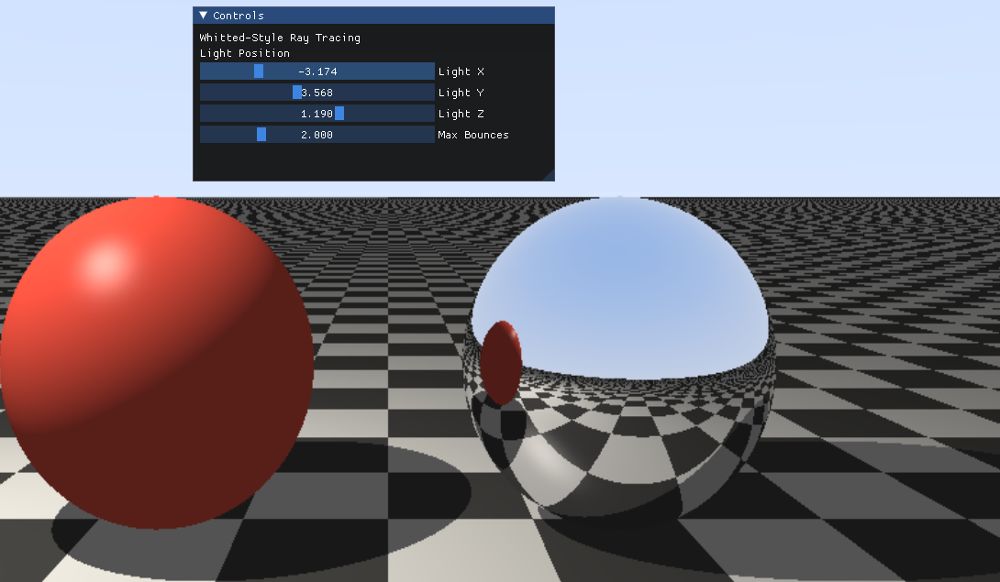

图中可以看到红色球和银色球在棋盘格地面上产生了清晰的硬阴影。阴影边界较锐利，这是因为本实验使用的是点光源。程序中对 shadow ray 起点进行了 `EPS` 偏移，因此画面中没有出现由自相交导致的大面积黑色噪点。

## 任务 4：完成 UI 交互面板

### 任务要求

使用 `ti.ui.Window` 创建交互窗口，提供滑动条控件并实时更新画面：

**1. `Light X / Light Y / Light Z`**  
动态改变点光源的三维坐标，观察阴影实时移动。

**2. `Max Bounces`**  
控制最大弹射次数，范围为 1 到 5，默认值为 3。观察弹射次数为 1 时和弹射次数大于 1 时镜面反射效果的区别。

### 实现方式

本实验使用 `ti.ui.Window` 创建窗口，使用 `window.get_gui()` 创建 GUI 控制面板。由于 Taichi 1.7.4 的 `Gui` 不支持 `with window.get_gui() as gui` 写法，因此程序中使用 `gui.begin()` 和 `gui.end()` 绘制控制面板。

对应代码位置：

```python
main()
render()
```

控制面板中的参数会在每一帧传入 `render()`，从而实时更新画面。

核心代码如下：

```python
gui.begin("Controls", 0.02, 0.02, 0.30, 0.28)

light_x = gui.slider_float("Light X", light_x, -6.0, 6.0)
light_y = gui.slider_float("Light Y", light_y, 0.5, 8.0)
light_z = gui.slider_float("Light Z", light_z, -6.0, 6.0)

max_bounces_float = gui.slider_float(
    "Max Bounces",
    float(max_bounces),
    1.0,
    float(MAX_BOUNCES_LIMIT)
)

max_bounces = int(max_bounces_float + 0.5)

gui.end()
```

### 可视化结果


该动图展示了通过 UI 面板实时调节光源位置和最大弹射次数的过程。拖动 `Light X / Light Y / Light Z` 时，地面阴影会随光源位置变化；调节 `Max Bounces` 时，镜面球中的反射内容会发生明显变化。

## 七、选做内容（仅供学有余力的同学选做）

下图为老师在实验文档中给出的选做内容说明。

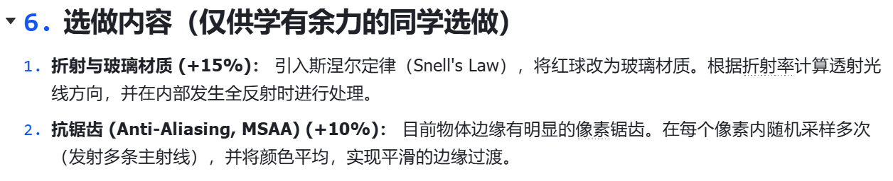

本实验进一步完成了两个选做内容，分别是 **折射与玻璃材质** 和 **抗锯齿（MSAA）**。下面按照实验要求分别说明实现思路与结果。

## 7.1 选做一：折射与玻璃材质（+15%）

### 7.1.1 任务要求

在基础场景的基础上，引入 **斯涅尔定律（Snell's Law）**，将原来的红球改为玻璃材质。程序需要根据折射率计算透射光线方向，并在玻璃内部发生 **全反射（Total Internal Reflection）** 时进行处理。

### 7.1.2 数学原理

#### （1）斯涅尔定律

光线从一种介质进入另一种介质时，会发生折射，其角度关系满足：

$$
n_1 \sin \theta_1 = n_2 \sin \theta_2
$$

其中：

- `n_1` 表示入射介质折射率；
- `n_2` 表示折射介质折射率；
- `theta_1` 表示入射角；
- `theta_2` 表示折射角。

在本实验中，空气折射率通常取：

$$
n_{air}=1.0
$$

玻璃折射率取：

$$
n_{glass}=1.5
$$

#### （2）折射方向的向量形式

程序中并不直接通过角度求折射方向，而是采用向量形式。设入射方向为 `D`，表面法线为 `N`，折射率比为：

$$
\eta=\frac{n_1}{n_2}
$$

则折射方向可分解为垂直于法线和平行于法线的两部分：

$$
\mathbf{T}_{\perp}=\eta(\mathbf{D}+\cos\theta\,\mathbf{N})
$$

$$
\mathbf{T}_{\parallel}=-\sqrt{1-\left\|\mathbf{T}_{\perp}\right\|^2}\,\mathbf{N}
$$

最终折射方向为：

$$
\mathbf{T}=\mathbf{T}_{\perp}+\mathbf{T}_{\parallel}
$$

#### （3）全反射

当光线从玻璃内部射向空气，并且入射角过大时，可能不存在有效折射方向，此时会发生全反射。其判断条件可以写成：

$$
\eta \sin\theta > 1
$$

如果满足这一条件，则程序不再生成折射光线，而是退化为镜面反射：

$$
\mathbf{R}=\mathbf{D}-2(\mathbf{D}\cdot\mathbf{N})\mathbf{N}
$$

#### （4）Fresnel 近似

为了让玻璃边缘的视觉效果更加自然，本实验还使用了 Schlick 近似来近似 Fresnel 反射率：

$$
R(\theta)=R_0+(1-R_0)(1-\cos\theta)^5
$$

其中：

$$
R_0=\left(\frac{1-n}{1+n}\right)^2
$$

该公式表示：当视线更接近掠射方向时，玻璃表面的反射更强；当视线更接近正视方向时，折射更明显。这样可以让玻璃球边缘产生更自然的亮边和高光。

### 7.1.3 实现思路

本实验在基础版本场景上，将左侧红色漫反射球替换为玻璃材质球，场景中的右侧银色球和棋盘格地面保持不变。程序实现逻辑如下：

1. 当主光线或次级光线命中玻璃球时，首先判断当前光线是从空气进入玻璃，还是从玻璃离开玻璃表面进入空气；
2. 根据当前的入射方向和法线方向，确定折射率比 `eta`；
3. 尝试根据折射公式生成新的折射光线方向；
4. 如果可以折射，则继续沿折射方向传播，并对光线吞吐量 `throughput` 乘以一个带颜色的衰减系数，使玻璃带有轻微的红色调；
5. 如果不能折射，则说明发生了全反射，此时改为生成反射光线；
6. 为了让玻璃表面既有透射感又有边缘反光效果，程序还叠加了基于 Fresnel 的反射高光；
7. 与基础任务相同，新的折射射线或反射射线起点也需要进行 `EPS` 偏移，以避免自相交。

在整体流程上，玻璃材质仍然遵循“光线命中物体后继续发射次级光线”的 Whitted-Style 思路，只不过镜面球只生成反射光线，而玻璃球会优先尝试生成折射光线，并在特殊情况下切换为反射光线。

对应代码位置：

```python
GlassRefraction.py
refract()
schlick()
glass_highlight()
trace_ray()
```

### 7.1.4 可视化结果

#### （1）玻璃折射整体效果


图中左侧球体已经由红色漫反射球替换为玻璃球。可以看到球体具有透明感，背景中的棋盘格和环境会在球体内部发生一定的折射变形。

#### （2）玻璃材质弹射次数变化


该动图展示了 `Max Bounces` 增大时玻璃材质的变化过程。随着最大弹射次数增加，折射路径更加完整，玻璃球的透明感和内部光线路径更加明显。

#### （3）全反射或边缘高光效果

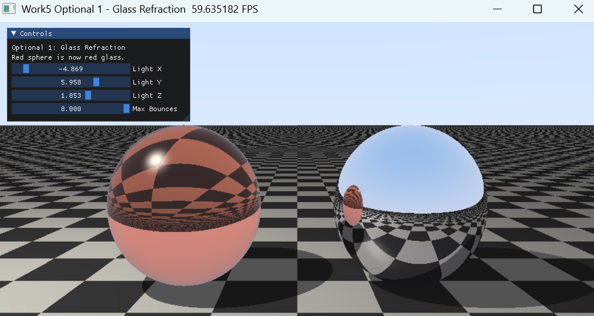

该图展示玻璃球边缘区域更强的反射效果。由于 Fresnel 近似的引入，球体边缘区域会出现更亮的高光和反射边界，使玻璃材质看起来更加自然。

### 7.1.5 本部分小结

选做一在基础镜面反射的基础上进一步加入了折射机制，使程序不再局限于“反射型材质”，而能够表达更复杂的透明介质效果。通过斯涅尔定律计算折射方向、通过全反射条件处理特殊情况、再结合 Fresnel 近似增强边缘反射，最终实现了比较完整的玻璃材质渲染效果。

## 7.2 选做二：抗锯齿（Anti-Aliasing, MSAA）（+10%）

### 7.2.1 任务要求

基础光线追踪程序中，每个像素只发射一条主光线，因此在球体边缘、棋盘格边界和阴影边缘处会出现明显锯齿。选做二要求在每个像素内部进行多次采样，并将结果取平均，从而实现更加平滑的边缘过渡。

### 7.2.2 数学原理

在普通单采样情况下，一个像素颜色可以写成：

$$
\mathbf{C}(i,j)=\mathrm{trace}(\mathbf{r}_{i,j})
$$

其中，`r_{i,j}` 表示像素 `(i,j)` 对应的一条主光线。

而在多重采样抗锯齿中，一个像素内部会发射多条主光线，并对结果求平均：

$$
\mathbf{C}(i,j)=\frac{1}{N}\sum_{k=1}^{N}\mathbf{C}_k(i,j)
$$

其中：

- `N` 表示该像素内的采样数量；
- `C_k(i,j)` 表示第 `k` 次子采样得到的颜色。

如果每个像素内部采用 `m × m` 的规则采样网格，则总采样数为：

$$
N=m^2
$$

例如：

- 当 `AA Grid = 1` 时，`N = 1`；
- 当 `AA Grid = 2` 时，`N = 4`；
- 当 `AA Grid = 3` 时，`N = 9`。

采样点分布在像素内部不同的子区域中，因此边缘附近的像素不再只是“命中”或“未命中”的二元结果，而是多个子采样结果的平均值，从而产生更平滑的视觉过渡。

### 7.2.3 实现思路

本实验在基础版本 `main.py` 的基础上，额外编写了 `AntiAliasingMSAA.py`。实现逻辑如下：

1. 仍然保持整体光线追踪流程不变，仍然是相机发射主光线、场景求交、根据材质进行着色；
2. 不同之处在于，每个像素不再只发射一条主光线，而是在像素内部划分为一个小网格；
3. 对于网格中的每一个子采样点，分别计算该位置对应的主光线方向，并调用同样的 `trace_ray()` 流程获得颜色；
4. 将同一像素内的所有子采样颜色累加，再除以采样数，得到最终像素颜色；
5. 程序中提供 `AA Grid` 滑动条，可以在运行时动态切换采样密度，直观比较抗锯齿效果。

这种实现方式没有改变原有的光线追踪结构，而是在“相机生成主光线”这一步进行了扩展，因此逻辑清晰，也便于与基础版本进行对比。

对应代码位置：

```python
AntiAliasingMSAA.py
generate_camera_ray()
render()
trace_ray()
```

### 7.2.4 可视化结果

#### （1）MSAA 动态对比


该动图展示了 `AA Grid` 从 1 提升到 3 的过程。可以看到球体轮廓、棋盘格边界和阴影边缘逐渐由锯齿状变得平滑。

#### （2）单采样结果

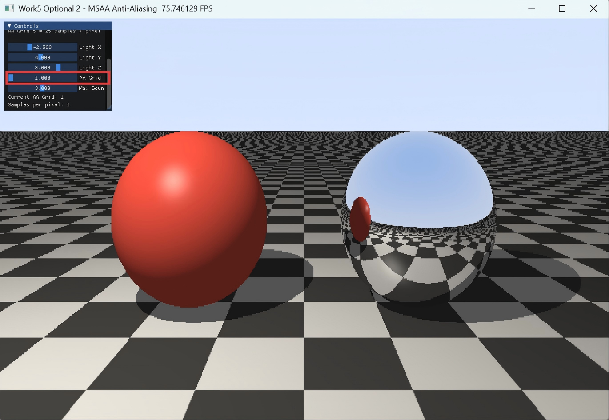

在 `AA Grid = 1` 时，每个像素仅发射一条主光线。此时画面中的物体边缘存在较明显的台阶状锯齿，尤其在球体外轮廓处更加明显。

#### （3）多采样结果

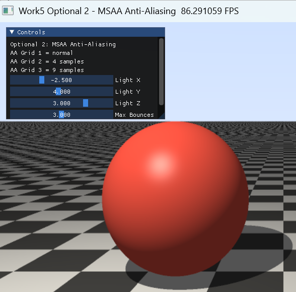

在 `AA Grid = 3` 时，每个像素内部发射 `3 × 3 = 9` 条主光线。与单采样相比，球体边缘和棋盘格边界更加平滑，整体观感明显提升。

#### （4）局部边缘放大对比

| 单采样边缘 | MSAA 边缘 |
| --- | --- |
| 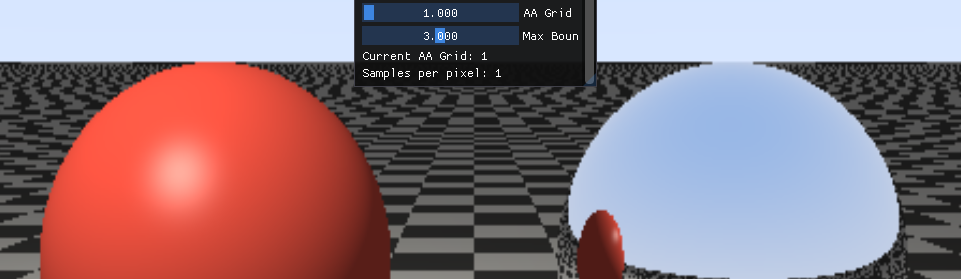 | 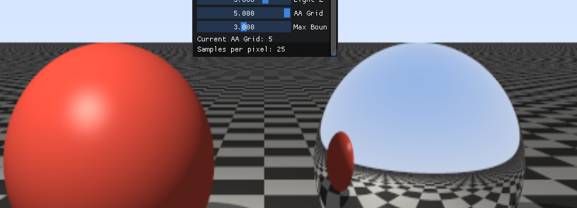 |

该组图对边缘局部进行了放大。可以明显看到，MSAA 通过对同一像素内部多个子采样结果求平均，使边缘附近像素形成更自然的灰度过渡，而不是突兀的锯齿跳变。

### 7.2.5 本部分小结

选做二在不改变场景结构和材质系统的前提下，对“每个像素如何采样”进行了扩展。通过多重采样，程序能够更准确地估计边缘像素的真实颜色，从而有效缓解锯齿问题。虽然采样数增加会提高计算开销，但换来了更好的画面质量，这也是渲染中常见的质量与效率权衡。

## 八、实验总结

本实验完成了老师文档中要求的基础光线追踪任务，并进一步实现了两个选做功能。基础部分在 Taichi Kernel 中隐式定义了无限大棋盘格地面、红色漫反射球和银色镜面球，通过材质 ID 区分不同物体，并根据命中的材质类型执行局部光照、镜面反射或继续追踪。

在光线传播方式上，程序没有采用递归，而是使用固定次数的循环实现光线弹射。通过 `throughput` 记录光线能量衰减，通过 `final_color` 累积像素颜色，使算法更加适合 GPU 并行执行。硬阴影由从交点发出的 shadow ray 实现，镜面反射由反射射线实现，Shadow Acne 问题则通过对新射线起点进行 `EPS` 偏移解决。

选做部分中，玻璃折射材质扩展了原有材质系统，使程序能够处理折射、全反射和 Fresnel 边缘反射；MSAA 抗锯齿则从像素采样角度提升了图像质量，使球体轮廓和棋盘格边界更加平滑。整体来看，本实验从几何求交、局部光照、阴影测试、镜面反射、玻璃折射和抗锯齿多个方面构成了一个较完整的基础光线追踪渲染流程。