# 计算机图形学实验六：可微渲染 / Differentiable Rendering

<br>

<p align="center">
  
  
  
  
  
  
</p>

<br>

<p align="center">
  使用 PyTorch3D 构建可微渲染管线，通过多视角剪影、RGB 图像与纹理监督，将初始球体优化为目标奶牛网格。
</p>

<p align="center">
  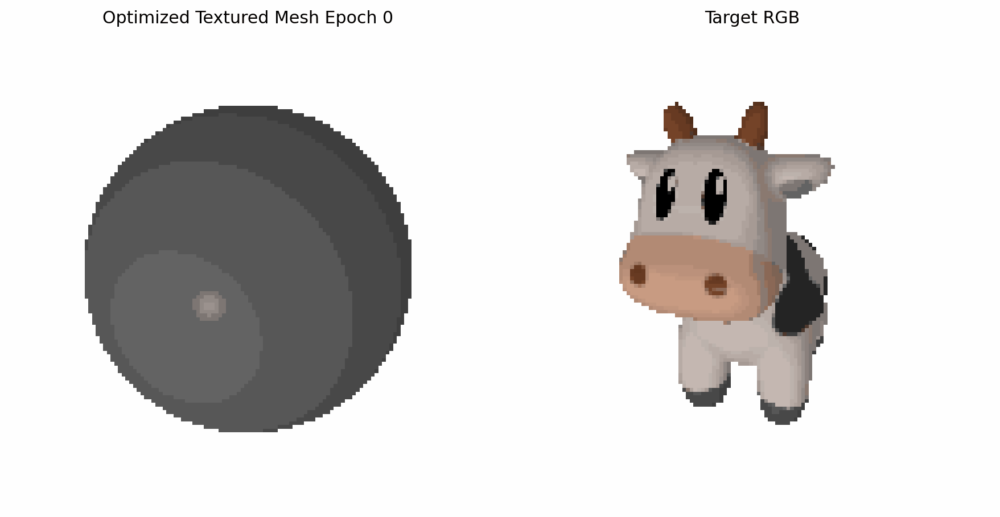
</p>

<p align="center">
  <sub>从初始球体出发，通过可微渲染反向传播，同时优化顶点坐标与顶点颜色。</sub>
</p>

<br>

<a id="toc"></a>

## 目录

<details open>
<summary><strong>一、本次实验任务与收获</strong></summary>

- [一、本次实验任务与收获](#section-1)

</details>

<details open>
<summary><strong>二、文件结构</strong></summary>

- [二、文件结构](#section-2)

</details>

<details open>
<summary><strong>三、运行方式</strong></summary>

- [三、运行方式](#section-3)
  - [3.1 ModelScope / DSW GPU Notebook 环境](#section-3-1)
  - [3.2 阿里云账号认证与 GPU 实例准备](#section-3-2)
  - [3.3 Notebook 运行过程记录](#section-3-3)
  - [3.4 低难度版本：剪影驱动形状优化](#section-3-4)
  - [3.5 高难度版本一：RGB + Silhouette 联合优化](#section-3-5)
  - [3.6 高难度版本二：真实纹理牛拟合](#section-3-6)
  - [3.7 消融实验：无正则化对比](#section-3-7)
  - [3.8 输出文件整理](#section-3-8)

</details>

<details open>
<summary><strong>四、可视化结果</strong></summary>

- [四、可视化结果](#section-4)
  - [4.1 云端环境与运行记录](#section-4-1)
  - [4.2 低难度剪影优化效果](#section-4-2)
  - [4.3 多视角剪影对比](#section-4-3)
  - [4.4 RGB + Silhouette 联合优化效果](#section-4-4)
  - [4.5 真实纹理牛拟合效果](#section-4-5)
  - [4.6 正则化消融实验效果](#section-4-6)

</details>

<details open>
<summary><strong>五、实验目标</strong></summary>

- [五、实验目标](#section-5)
  - [5.1 理论理解](#section-5-1)
  - [5.2 数学基础](#section-5-2)
  - [5.3 工程实践](#section-5-3)

</details>

<details open>
<summary><strong>六、实验原理</strong></summary>

- [六、实验原理](#section-6)
  - [6.1 可微渲染基本思想](#section-6-1)
  - [6.2 Soft Rasterization](#section-6-2)
  - [6.3 Silhouette Loss](#section-6-3)
  - [6.4 Mesh Regularization](#section-6-4)
  - [6.5 RGB 与顶点颜色联合优化](#section-6-5)
  - [6.6 真实纹理拟合](#section-6-6)

</details>

<details open>
<summary><strong>七、基础任务实现</strong></summary>

- [七、基础任务实现](#section-7)
  - [任务 1：环境配置与模型读取](#section-7-1)
    - [任务要求](#section-7-1-1)
    - [实现方式](#section-7-1-2)
  - [任务 2：构建多视角软剪影渲染管线](#section-7-2)
    - [任务要求](#section-7-2-1)
    - [实现方式](#section-7-2-2)
  - [任务 3：初始化源模型与可微参数](#section-7-3)
    - [任务要求](#section-7-3-1)
    - [实现方式](#section-7-3-2)
  - [任务 4：编写可微优化循环](#section-7-4)
    - [任务要求](#section-7-4-1)
    - [实现方式](#section-7-4-2)
  - [任务 5：保存结果与可视化输出](#section-7-5)
    - [任务要求](#section-7-5-1)
    - [实现方式](#section-7-5-2)
  - [基础任务可视化结果](#section-7-6)

</details>

<details open>
<summary><strong>八、选做内容</strong></summary>

- [八、选做内容](#section-8)
  - [8.1 选做一：RGB + Silhouette 联合优化](#section-8-1)
    - [8.1.1 任务要求](#section-8-1-1)
    - [8.1.2 数学原理](#section-8-1-2)
    - [8.1.3 实现思路](#section-8-1-3)
    - [8.1.4 可视化结果](#section-8-1-4)
    - [8.1.5 本部分小结](#section-8-1-5)
  - [8.2 选做二：真实纹理牛拟合](#section-8-2)
    - [8.2.1 任务要求](#section-8-2-1)
    - [8.2.2 数学原理](#section-8-2-2)
    - [8.2.3 实现思路](#section-8-2-3)
    - [8.2.4 可视化结果](#section-8-2-4)
    - [8.2.5 本部分小结](#section-8-2-5)
  - [8.3 选做三：正则化消融实验](#section-8-3)
    - [8.3.1 任务要求](#section-8-3-1)
    - [8.3.2 数学原理](#section-8-3-2)
    - [8.3.3 实现思路](#section-8-3-3)
    - [8.3.4 可视化结果](#section-8-3-4)
    - [8.3.5 本部分小结](#section-8-3-5)

</details>

<details open>
<summary><strong>九、实验总结</strong></summary>

- [九、实验总结](#section-9)

</details>

## 效果图目录

| 实验部分 | 动态演示 | 静态效果图 / 曲线 |
| :-- | :-- | :-- |
| 云端实验环境 | [查看 Notebook 运行记录](#section-4-1) | [查看环境准备与输出目录](#section-4-1) |
| 低难度剪影优化 | [查看动态演示](#section-4-2) | [查看初末对比与 Loss](#section-4-2) |
| 多视角剪影监督 | [查看多视角结果](#section-4-3) | [查看多视角结果](#section-4-3) |
| RGB + Silhouette 联合优化 | [查看动态演示](#section-4-4) | [查看 RGB 对比与 Loss](#section-4-4) |
| 真实纹理牛拟合 | [查看动态演示](#section-4-5) | [查看纹理对比与 Loss](#section-4-5) |
| 正则化消融实验 | [查看动态演示](#section-4-6) | [查看消融对比与 Loss](#section-4-6) |

<a id="section-1"></a>

## 一、本次实验任务与收获

本次实验围绕 **可微渲染 Differentiable Rendering** 展开，主要完成了四个层次的内容。

**第一项任务是完成低难度版本的剪影驱动形状优化，对应 `work6_differentiable_rendering.ipynb` 与 `work6_low_silhouette.ipynb`。** 程序首先读取目标奶牛模型 `cow.obj`，在多视角相机下渲染目标剪影；随后初始化一个 `ico_sphere` 球体网格，将顶点偏移量 `deform_verts` 设置为可微参数，通过剪影损失和网格正则化损失反向优化三维顶点坐标，使球体逐渐变形为奶牛轮廓。

**第二项任务是完成 RGB + Silhouette 联合优化。** 在剪影监督之外，程序进一步加入 RGB 图像监督，并使用 `SoftPhongShader` 渲染彩色图像，使优化目标从单纯的外轮廓拟合扩展到表面颜色拟合。该部分同时优化顶点坐标和顶点颜色，用于验证 RGB 可微渲染链路。

**第三项任务是完成真实纹理牛拟合，对应 `work6_true_textured_fit.ipynb`。** 该版本使用 PyTorch3D 官方 textured cow 数据，包括 `cow.obj`、`cow.mtl` 和 `cow_texture.png`，从球体出发同时优化几何形状和顶点颜色，最终得到更接近目标纹理牛的彩色渲染效果。

**第四项任务是完成正则化消融实验。** 程序额外实现了无网格正则化版本，只保留剪影损失进行优化，并与加入 Laplacian、Edge Length、Normal Consistency 的版本进行对比，从而观察正则化对网格平滑性、边界稳定性和形变合理性的影响。

此外，本实验完整记录了在 ModelScope DSW GPU Notebook 中配置环境、启动 GPU 实例、进行账号认证、运行长时间优化任务以及整理输出文件的全过程。实验不仅关注最终渲染效果，也保留了可复现实验环境和运行过程记录，便于说明本次实验是在真实云端 GPU 环境中完成的。

通过本次实验，可以直观理解可微渲染如何将二维图像误差反向传播到三维网格参数，也能够观察剪影监督、RGB 监督、纹理监督和网格正则化在三维重建过程中的不同作用。

<p align="right"><a href="#toc">回到目录 ↑</a></p>

<a id="section-2"></a>

## 二、文件结构

```text
CG-Lab/
├── assets/
│   └── work6/
│       ├── modelscope_gpu_instance.png                    # ModelScope DSW GPU 实例准备界面
│       ├── aliyun_account_authentication.png              # 阿里云账号认证界面记录
│       ├── texture_notebook_training_process.gif          # 真实纹理牛拟合 Notebook 运行过程记录
│       ├── modelscope_workspace_outputs.png               # 云端 workspace 输出目录记录
│       ├── target_silhouette_view0.png                    # 目标奶牛剪影
│       ├── low_compare_epoch_000.png                      # 低难度版本初始状态
│       ├── low_compare_epoch_299.png                      # 低难度版本最终状态
│       ├── low_silhouette_optimization.gif                # 低难度剪影优化动态演示
│       ├── low_loss_curve.png                             # 低难度优化 Loss 曲线
│       ├── high_multiview_silhouette_compare.png          # 多视角目标剪影与预测剪影对比
│       ├── high_target_rgb_view0.png                      # 程序化 RGB 目标图
│       ├── high_final_rgb_compare.png                     # RGB 联合优化最终对比图
│       ├── high_rgb_texture_optimization.gif              # RGB 联合优化动态演示
│       ├── high_rgb_loss_curve.png                        # RGB 联合优化 Loss 曲线
│       ├── regularization_ablation_compare.png            # 正则化消融最终对比图
│       ├── ablation_no_regularization.gif                 # 无正则化版本动态演示
│       ├── ablation_no_regularization_loss_curve.png      # 无正则化版本 Loss 曲线
│       ├── texture_target_cow.png                         # 真实纹理目标牛
│       ├── texture_final_compare.png                      # 真实纹理拟合最终对比图
│       ├── texture_fit_optimization.gif                   # 真实纹理拟合动态演示
│       └── texture_fit_loss_curve.png                     # 真实纹理拟合 Loss 曲线
│
├── src/
│   └── work6/
│       ├── README.md                                      # 实验六说明文档
│       ├── cow.obj                                        # 低难度剪影优化使用的目标模型
│       ├── work6_differentiable_rendering.ipynb           # 主实验 Notebook，包含低难度、高难度与消融实验
│       ├── work6_low_silhouette.ipynb                     # 低难度剪影优化备份版本
│       ├── work6_true_textured_fit.ipynb                  # 真实纹理牛拟合版本
│       ├── data/
│       │   └── cow_mesh/
│       │       ├── cow.obj                                # 官方 textured cow 几何模型
│       │       ├── cow.mtl                                # 官方材质文件
│       │       └── cow_texture.png                        # 官方纹理贴图
│       └── output_meshes/
│           ├── final_low_silhouette_mesh.obj              # 低难度剪影优化最终模型
│           ├── final_high_rgb_colored_mesh.obj            # RGB 联合优化最终彩色模型
│           ├── final_ablation_no_regularization.obj       # 无正则化消融实验最终模型
│           └── final_texture_fit_model.obj                # 真实纹理拟合最终模型
│
├── .gitignore                                             # Git 忽略规则
├── pyproject.toml                                         # 项目配置文件
├── uv.lock                                                # 依赖锁定文件
└── README.md                                              # 仓库总说明文档
```

<p align="right"><a href="#toc">回到目录 ↑</a></p>

<a id="section-3"></a>

## 三、运行方式

本实验涉及 PyTorch3D、CUDA 与底层扩展编译，推荐在 ModelScope DSW GPU Notebook 或 Linux CUDA 环境运行。本次实验实际运行环境为：

| 项目 | 配置 |
| :-- | :-- |
| Platform | ModelScope DSW GPU Notebook |
| GPU | NVIDIA A10 |
| Python | 3.11 |
| PyTorch | 2.9.1 + CUDA 12.8 |
| PyTorch3D | 0.7.9 |

<a id="section-3-1"></a>

### 3.1 ModelScope / DSW GPU Notebook 环境

本实验使用 ModelScope 社区提供的 DSW GPU Notebook 作为主要运行环境。该环境内置 JupyterLab / WebIDE / Terminal，适合运行 PyTorch3D 这类需要 CUDA 支持的图形学实验。

<p align="center">
  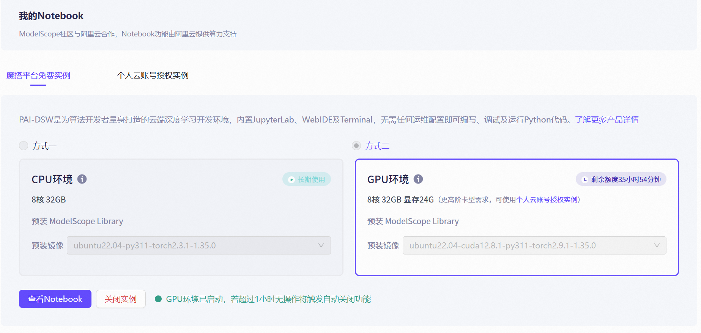
</p>

在 Notebook 中首先安装依赖：

```bash
pip install --upgrade pip
pip install fvcore iopath matplotlib ninja imageio trimesh tqdm pandas
pip install "git+https://gitee.com/hongwenzhang/pytorch3d.git" --no-build-isolation
```

确认 GPU 与 PyTorch3D 可用：

```python
import torch
import pytorch3d

print(torch.__version__)
print(torch.cuda.is_available())
print(torch.cuda.get_device_name(0))
print(pytorch3d.__version__)
```

本次运行结果中，CUDA 能够正常识别 NVIDIA A10，PyTorch3D 也成功安装并运行。

<a id="section-3-2"></a>

### 3.2 阿里云账号认证与 GPU 实例准备

由于 ModelScope Notebook 与阿里云 DSW 算力环境关联，首次启动免费 GPU 实例时需要完成账号认证。认证完成后即可在 ModelScope 中启动 GPU Notebook，并进入 `/mnt/workspace` 工作目录进行实验。

<p align="center">
  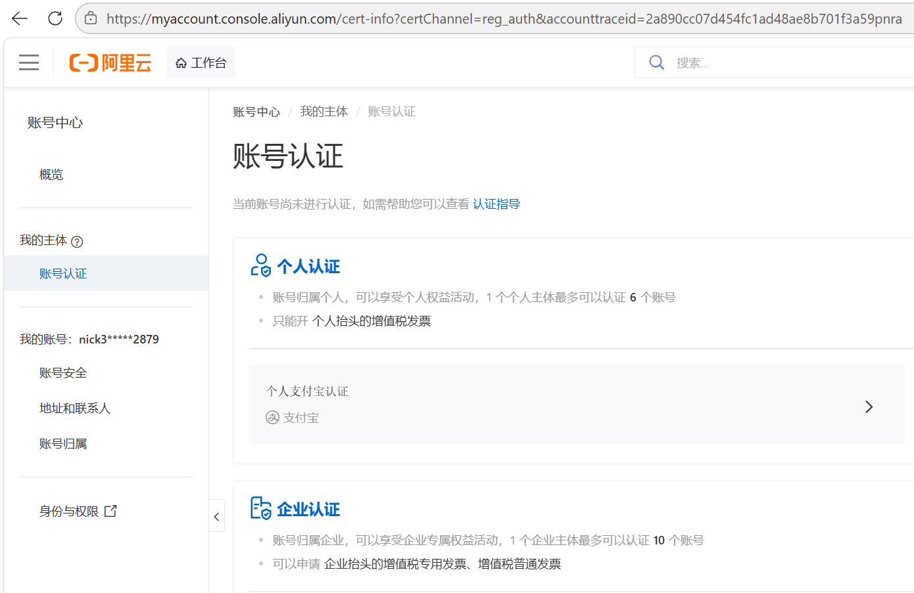
</p>

本实验中，`cow.obj`、Notebook 文件和后续输出目录均放置在 `/mnt/workspace` 下，保证代码中相对路径可以直接访问模型文件和保存结果。

<a id="section-3-3"></a>

### 3.3 Notebook 运行过程记录

真实纹理牛拟合部分运行时间较长，因此单独记录了 Notebook 中的优化过程。训练过程中会持续输出当前 epoch、Total Loss、RGB Loss、Silhouette Loss 以及 Edge、Normal、Laplacian 等正则化项，便于观察模型是否稳定收敛。

<p align="center">
  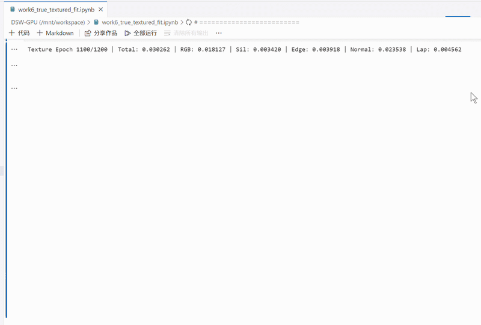
</p>

该运行记录说明真实纹理版本不是静态截图拼接，而是在 GPU Notebook 中完成了完整的长时间优化流程。

<a id="section-3-4"></a>

### 3.4 低难度版本：剪影驱动形状优化

打开：

```text
src/work6/work6_low_silhouette.ipynb
```

或打开主 Notebook：

```text
src/work6/work6_differentiable_rendering.ipynb
```

按顺序运行低难度剪影优化部分。该部分会读取 `cow.obj`，生成目标剪影，并从球体开始优化三维形状。

主要输出包括：

```text
assets/work6/low_silhouette_optimization.gif
assets/work6/low_loss_curve.png
src/work6/output_meshes/final_low_silhouette_mesh.obj
```

<a id="section-3-5"></a>

### 3.5 高难度版本一：RGB + Silhouette 联合优化

继续运行 `work6_differentiable_rendering.ipynb` 中的高难度 RGB 联合优化部分。

该部分会使用 `SoftPhongShader` 渲染 RGB 图像，在剪影监督之外加入颜色监督，同时优化顶点位置和顶点颜色。

主要输出包括：

```text
assets/work6/high_rgb_texture_optimization.gif
assets/work6/high_final_rgb_compare.png
assets/work6/high_rgb_loss_curve.png
src/work6/output_meshes/final_high_rgb_colored_mesh.obj
```

<a id="section-3-6"></a>

### 3.6 高难度版本二：真实纹理牛拟合

打开：

```text
src/work6/work6_true_textured_fit.ipynb
```

该 Notebook 使用 `src/work6/data/cow_mesh/` 中的官方 textured cow 数据：

```text
cow.obj
cow.mtl
cow_texture.png
```

运行后可以得到更接近真实奶牛纹理的优化结果。

主要输出包括：

```text
assets/work6/texture_fit_optimization.gif
assets/work6/texture_final_compare.png
assets/work6/texture_fit_loss_curve.png
src/work6/output_meshes/final_texture_fit_model.obj
```

<a id="section-3-7"></a>

### 3.7 消融实验：无正则化对比

在主 Notebook 中运行正则化消融实验部分。该版本只保留剪影损失，去除 Laplacian、Edge Length 和 Normal Consistency 三类正则化约束。

主要输出包括：

```text
assets/work6/regularization_ablation_compare.png
assets/work6/ablation_no_regularization.gif
assets/work6/ablation_no_regularization_loss_curve.png
src/work6/output_meshes/final_ablation_no_regularization.obj
```

<a id="section-3-8"></a>

### 3.8 输出文件整理

实验完成后，ModelScope 工作区会生成多个结果目录，包括低难度输出、高难度 RGB 输出、消融实验输出和真实纹理拟合输出。最终将这些文件统一整理到 `assets/work6/` 和 `src/work6/output_meshes/` 中，方便 GitHub 展示和提交。

<p align="center">
  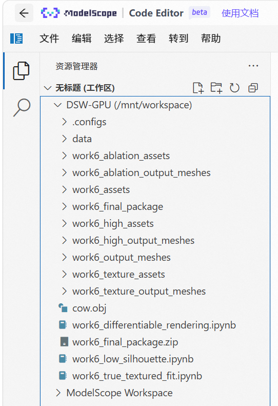
</p>

该组图记录了实验准备、GPU Notebook 运行和结果文件整理过程。相比只展示最终渲染结果，这部分可以说明实验完整运行于云端 GPU 环境，并且所有中间结果、最终模型和展示资源均已保存。

<p align="right"><a href="#toc">回到目录 ↑</a></p>

<a id="section-4"></a>

## 四、可视化结果

<a id="section-4-1"></a>

### 4.1 云端环境与运行记录

<table align="center">
  <tr>
    <td align="center"><strong>GPU 实例准备</strong></td>
    <td align="center"><strong>账号认证记录</strong></td>
  </tr>
  <tr>
    <td align="center">
      
    </td>
    <td align="center">
      
    </td>
  </tr>
</table>

<p align="center">
  <strong>Notebook 训练过程记录</strong>
</p>

<p align="center">
  
</p>

<p align="center">
  <strong>Workspace 输出目录记录</strong>
</p>

<p align="center">
  
</p>

该组图记录了实验准备、GPU Notebook 运行和结果文件整理过程。相比只展示最终渲染结果，这部分可以说明实验完整运行于云端 GPU 环境，并且所有中间结果、最终模型和展示资源均已保存。

<a id="section-4-2"></a>

### 4.2 低难度剪影优化效果

<p align="center">
  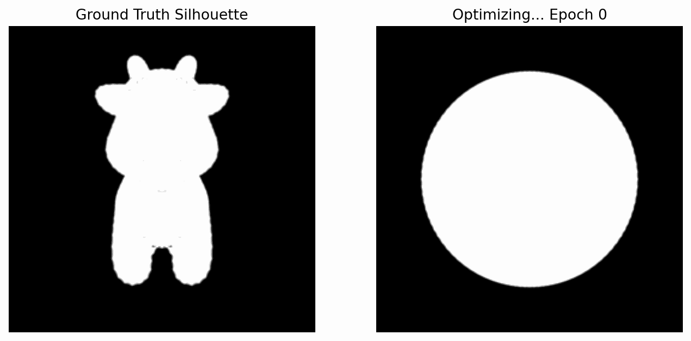
</p>

该动图展示了低难度版本的优化过程。初始模型为规则球体，随着梯度下降进行，球体逐渐被拉伸出头部、耳朵、身体和腿部轮廓，最终形成接近目标奶牛剪影的三维网格。

<table align="center">
  <tr>
    <td align="center"><strong>初始球体</strong></td>
    <td align="center"><strong>最终优化结果</strong></td>
  </tr>
  <tr>
    <td align="center">
      
    </td>
    <td align="center">
      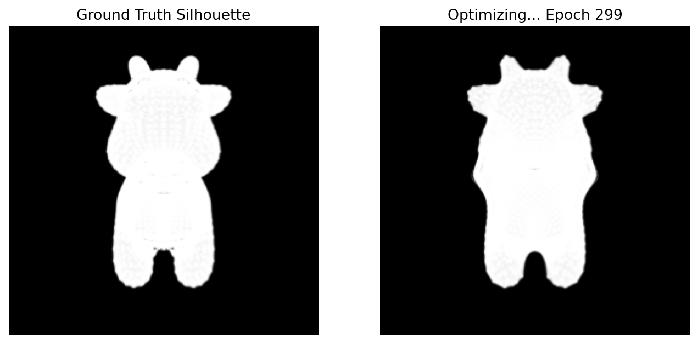
    </td>
  </tr>
</table>

<p align="center">
  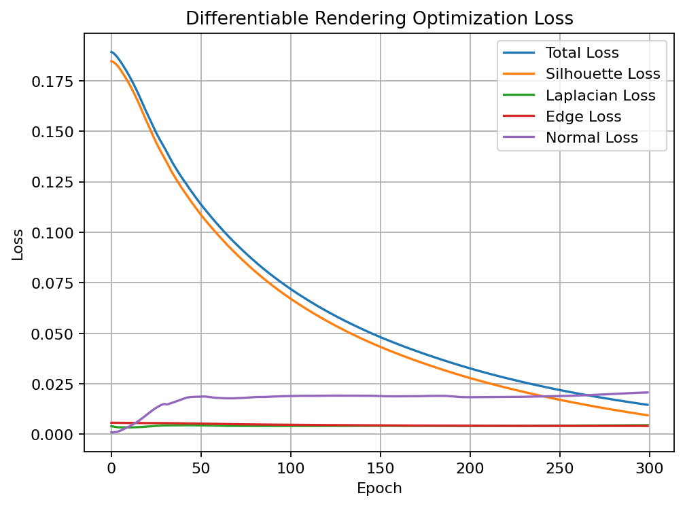
</p>

从 Loss 曲线可以看出，Total Loss 与 Silhouette Loss 在训练过程中持续下降，说明二维剪影误差能够通过可微渲染管线稳定反传到三维顶点坐标。

<a id="section-4-3"></a>

### 4.3 多视角剪影对比

<p align="center">
  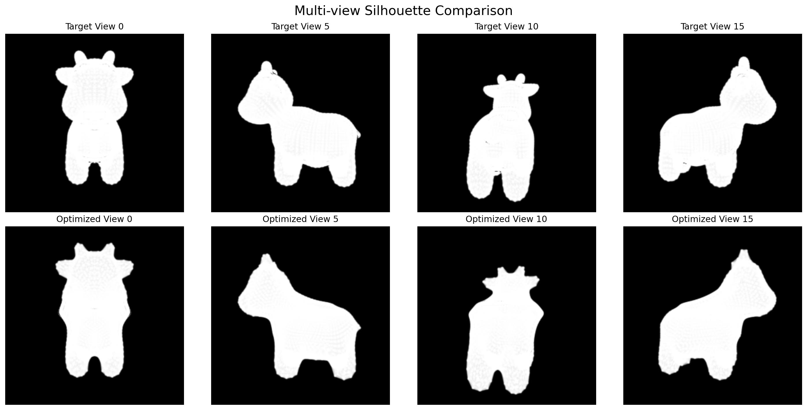
</p>

该图展示了多个视角下的目标剪影与优化结果。相比单视角监督，多视角监督可以从不同方向约束三维形状，减少只在某一个观察方向上拟合正确、但三维结构不合理的问题。

<a id="section-4-4"></a>

### 4.4 RGB + Silhouette 联合优化效果

<p align="center">
  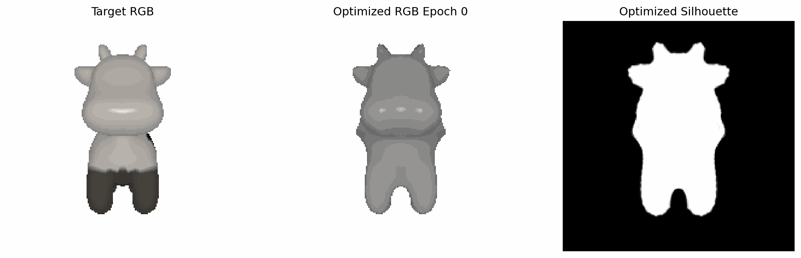
</p>

该动图展示了 RGB + Silhouette 联合优化过程。与低难度版本相比，该部分不仅关注外轮廓，还引入了 RGB 图像监督，使模型表面颜色也参与优化。

<p align="center">
  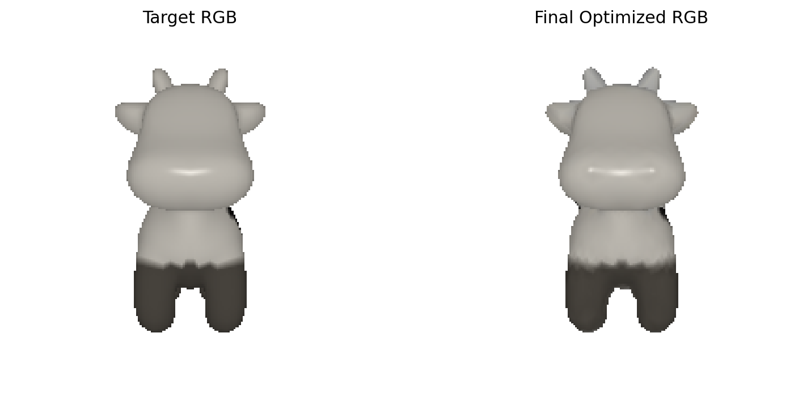
</p>

<p align="center">
  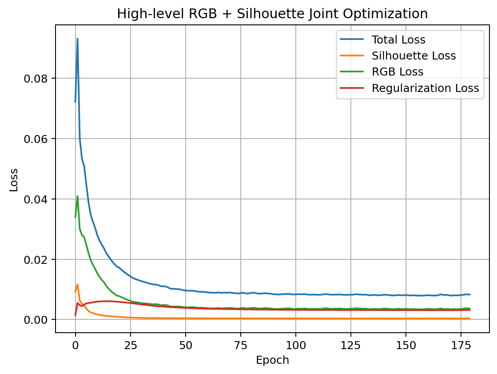
</p>

RGB Loss 和 Silhouette Loss 均出现明显下降，说明 SoftPhongShader 渲染出的颜色图像可以作为可微监督信号，用于同时优化几何形状和表面颜色。

<a id="section-4-5"></a>

### 4.5 真实纹理牛拟合效果

<p align="center">
  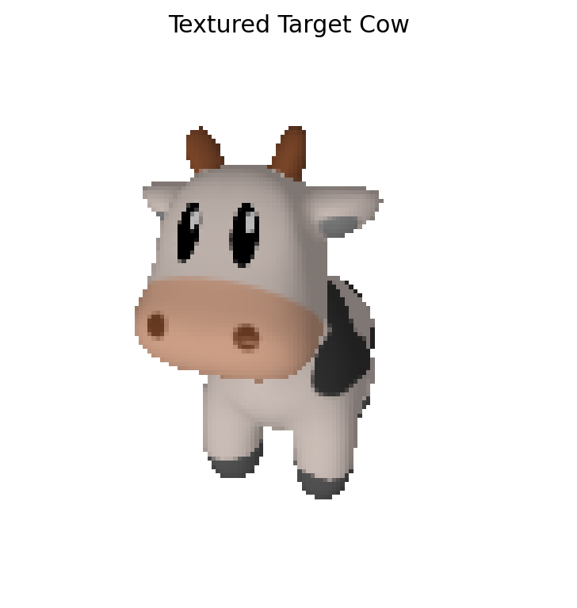
</p>

上图为官方 textured cow 数据渲染出的目标图像。该目标包含更丰富的外观信息，例如牛角颜色、鼻子区域、眼部深色区域和整体灰白材质变化。

<p align="center">
  
</p>

<p align="center">
  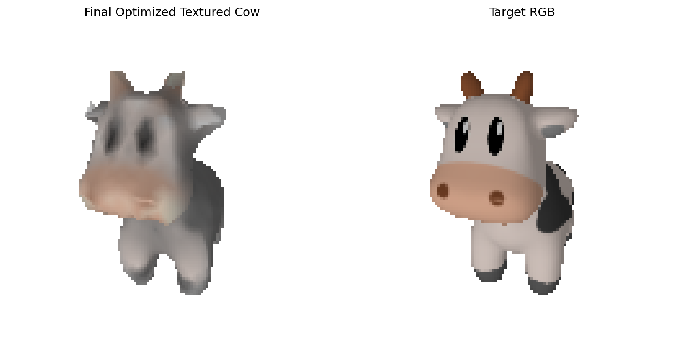
</p>

<p align="center">
  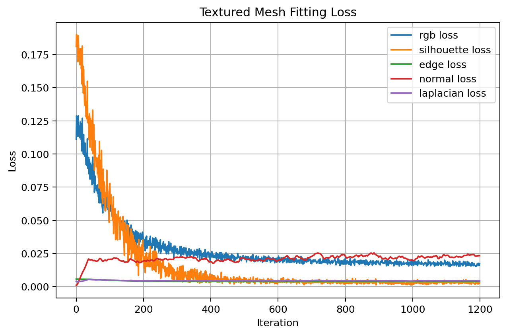
</p>

真实纹理拟合版本进一步体现了可微渲染的优势。相比只使用剪影监督，该版本能够在优化几何形状的同时拟合表面颜色，使最终结果更接近完整的目标奶牛外观。

<a id="section-4-6"></a>

### 4.6 正则化消融实验效果

<p align="center">
  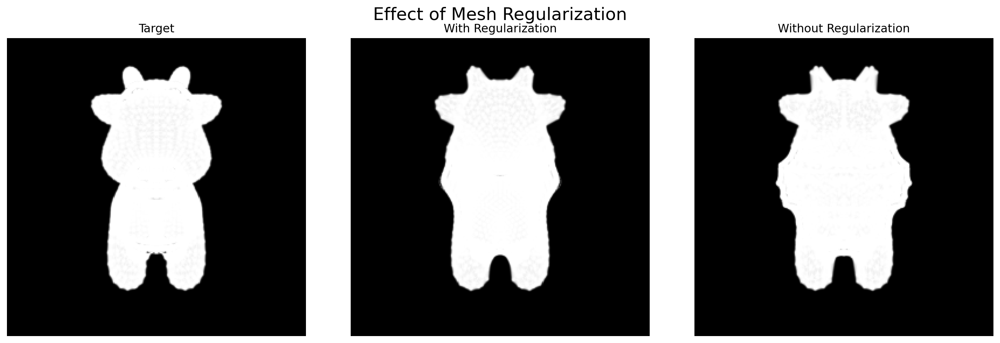
</p>

该图比较了目标剪影、加入正则化的优化结果和无正则化的优化结果。可以看到，只使用剪影损失时，模型仍能朝目标轮廓靠近，但边界和局部形变更容易出现不规则抖动。

<p align="center">
  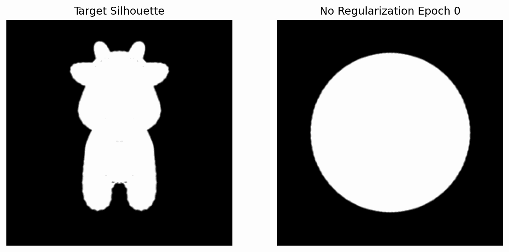
</p>

<p align="center">
  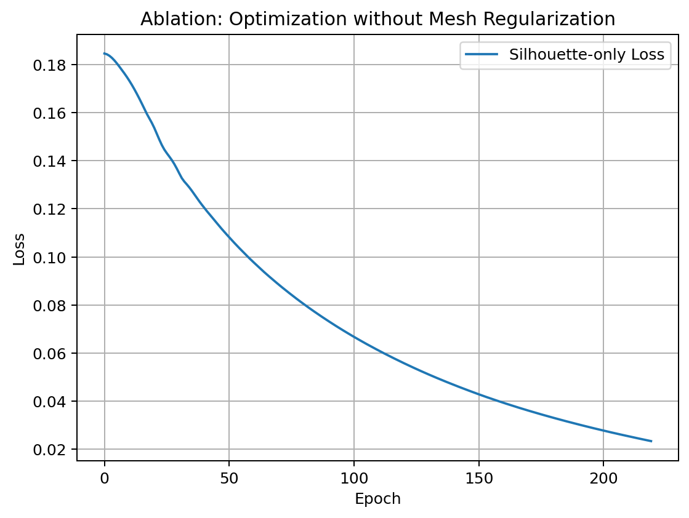
</p>

该消融实验说明，网格正则化并不是单纯为了降低 Loss，而是为了约束三维形状的平滑性和物理合理性。加入正则化后，网格在拟合目标剪影的同时能够保持更加稳定的表面结构。

<p align="right"><a href="#toc">回到目录 ↑</a></p>

<a id="section-5"></a>

## 五、实验目标

<a id="section-5-1"></a>

### 5.1 理论理解

理解可微渲染的基本思想，掌握传统渲染与可微渲染之间的区别。传统渲染从三维模型生成二维图像，而可微渲染进一步要求渲染过程能够参与自动求导，使二维图像误差可以反向传播到三维模型参数。

<a id="section-5-2"></a>

### 5.2 数学基础

掌握软光栅化、剪影损失、RGB 损失和网格正则化的数学表达。重点理解为什么硬光栅化的离散边界会导致梯度传播困难，以及为什么需要使用 Laplacian、Edge Length 和 Normal Consistency 约束网格形变。

<a id="section-5-3"></a>

### 5.3 工程实践

掌握 PyTorch3D 中 `Meshes`、`FoVPerspectiveCameras`、`MeshRasterizer`、`SoftSilhouetteShader`、`SoftPhongShader` 和 `TexturesVertex` 的基本使用方式。能够搭建从模型读取、相机设置、目标图像渲染、可微优化到结果保存的完整实验流程。

<p align="right"><a href="#toc">回到目录 ↑</a></p>

<a id="section-6"></a>

## 六、实验原理

<a id="section-6-1"></a>

### 6.1 可微渲染基本思想

传统渲染流程可以表示为：

$$\text{Mesh} \longrightarrow \text{Renderer} \longrightarrow \text{Image}$$

可微渲染要求渲染结果对三维参数可导，使图像误差能够反向传播到顶点坐标、顶点颜色或纹理参数。对于第 $i$ 个顶点，有：

$$\frac{\partial L}{\partial \mathbf{v}_i} \neq 0$$

本实验中，基础版本主要优化顶点偏移量 $\Delta \mathbf{V}$，高难度版本进一步优化顶点颜色 $\mathbf{C}$。整体优化目标可以写成：

$$\{\Delta \mathbf{V}, \mathbf{C}\} = \arg\min L$$

也就是说，程序通过不断调整顶点位置和颜色，使当前渲染结果尽可能接近目标图像。

<a id="section-6-2"></a>

### 6.2 Soft Rasterization

在硬光栅化中，像素要么位于三角形内部，要么位于三角形外部。这种判断是离散的，边界处很难获得稳定梯度。为了解决这个问题，本实验使用软光栅化思想，在边界附近引入平滑概率过渡。

设像素到三角形边界的距离为 $d$，则像素属于前景区域的软概率可以写成：

$$A(d) = \operatorname{sigmoid}\left(\frac{d}{\sigma}\right)$$

其中：

| 符号 | 含义 |
| :-- | :-- |
| $d$ | 像素到三角形边界的距离 |
| $\sigma$ | 控制边界软化程度的参数 |
| $A(d)$ | 像素属于目标区域的软概率 |

当 $\sigma$ 较小时，边界更接近硬光栅化；当 $\sigma$ 较大时，边界更平滑，梯度传播更稳定。软光栅化的核心意义在于，即使顶点当前没有准确覆盖目标像素，边界附近仍然能够产生非零梯度，从而引导顶点继续向正确方向移动。

<a id="section-6-3"></a>

### 6.3 Silhouette Loss

低难度版本使用多视角剪影作为监督信号。对于预测剪影 $S_{\text{pred}}$ 和目标剪影 $S_{\text{target}}$，使用均方误差作为图像损失：

$$L_{\text{silhouette}} = \frac{1}{HW}\sum_{u=1}^{H}\sum_{v=1}^{W}\left(S_{\text{pred}}(u,v) - S_{\text{target}}(u,v)\right)^2$$

其中 $H$ 和 $W$ 分别表示图像高度和宽度。剪影损失主要约束物体外轮廓，因此能够恢复头部、耳朵、身体和腿部等大尺度几何结构，但无法单独恢复眼睛、鼻子、花纹等内部细节。

<a id="section-6-4"></a>

### 6.4 Mesh Regularization

仅依赖图像损失可能导致顶点为了迎合某个视角而发生过度拉伸、局部尖刺或表面不稳定。为此，本实验加入三类网格正则化项。

**Laplacian Smoothing** 约束每个顶点接近邻域顶点的平均位置：

$$L_{\text{lap}} = \sum_i \left\|\mathbf{v}_i - \frac{1}{|\mathcal{N}(i)|}\sum_{j \in \mathcal{N}(i)} \mathbf{v}_j\right\|_2^2$$

**Edge Length Penalty** 约束边长，防止三角形被严重拉伸：

$$L_{\text{edge}} = \sum_{(i,j)\in\mathcal{E}} \left\|\mathbf{v}_i - \mathbf{v}_j\right\|_2^2$$

**Normal Consistency** 约束相邻面片法线方向接近：

$$L_{\text{normal}} = \sum_{(f_a,f_b)} \left(1 - \mathbf{n}_{f_a}\cdot\mathbf{n}_{f_b}\right)$$

低难度版本总损失函数为：

$$L_{\text{low}} = L_{\text{silhouette}} + \lambda_{\text{lap}}L_{\text{lap}} + \lambda_{\text{edge}}L_{\text{edge}} + \lambda_{\text{normal}}L_{\text{normal}}$$

这三类正则化共同作用，使网格在贴合目标轮廓的同时保持更平滑、更稳定的三维结构。

<a id="section-6-5"></a>

### 6.5 RGB 与顶点颜色联合优化

高难度版本在剪影监督之外加入 RGB 图像监督。对于预测图像 $I_{\text{pred}}$ 和目标图像 $I_{\text{target}}$，RGB 损失定义为：

$$L_{\text{rgb}} = \frac{1}{HWC}\sum_{u=1}^{H}\sum_{v=1}^{W}\sum_{c=1}^{C}\left(I_{\text{pred}}(u,v,c) - I_{\text{target}}(u,v,c)\right)^2$$

联合优化时，总损失可以写成：

$$L_{\text{high}} = \lambda_{\text{sil}}L_{\text{silhouette}} + \lambda_{\text{rgb}}L_{\text{rgb}} + \lambda_{\text{reg}}L_{\text{regularization}}$$

相比单纯剪影优化，RGB 优化不仅约束外轮廓，也约束模型表面的颜色分布，因此能够恢复更多外观信息。

<a id="section-6-6"></a>

### 6.6 真实纹理拟合

真实纹理牛拟合使用带材质文件的目标模型：

```text
cow.obj
cow.mtl
cow_texture.png
```

PyTorch3D 在读取模型时会加载几何、材质和纹理信息，并通过 `SoftPhongShader` 渲染目标 RGB 图像。优化过程中，程序从一个球体开始，同时更新顶点偏移和顶点颜色，使渲染结果逼近目标纹理牛。

该过程可以理解为：

$$\text{Sphere} + \Delta \mathbf{V} + \mathbf{C} \longrightarrow \text{Rendered RGB Image}$$

最终通过 RGB Loss、Silhouette Loss 和几何正则化共同驱动，使模型逐渐获得目标奶牛的形状和外观。

<p align="right"><a href="#toc">回到目录 ↑</a></p>

<a id="section-7"></a>

## 七、基础任务实现

<a id="section-7-1"></a>

## 任务 1：环境配置与模型读取

<a id="section-7-1-1"></a>

### 任务要求

实验要求配置可运行 PyTorch3D 的深度学习环境，并读取目标奶牛模型文件。低难度版本需要读取 `cow.obj`，真实纹理版本需要读取 `cow.obj`、`cow.mtl` 和 `cow_texture.png`。

<a id="section-7-1-2"></a>

### 实现方式

本实验使用 ModelScope DSW GPU Notebook 作为主要运行环境。低难度版本通过 `load_obj` 读取 `cow.obj` 的顶点和面片，并对顶点进行居中和归一化处理，使模型适合后续相机观察和优化。

对应代码位置：

```python
load_obj(obj_path)
faces.verts_idx
verts = verts - verts.mean(dim=0)
verts = verts / verts.abs().max()
Meshes(verts=[verts], faces=[faces_idx])
```

真实纹理版本使用 `load_objs_as_meshes` 读取官方 textured cow 数据，自动加载 `.mtl` 和纹理贴图。

对应代码位置：

```python
load_objs_as_meshes([tex_obj_path], device=device)
```

<a id="section-7-2"></a>

## 任务 2：构建多视角软剪影渲染管线

<a id="section-7-2-1"></a>

### 任务要求

实验要求在空间中设置多个摄像机视角，并渲染目标模型的剪影图像，作为后续形状优化的监督信号。

<a id="section-7-2-2"></a>

### 实现方式

程序使用 `look_at_view_transform` 生成一圈多视角相机，并通过 `FoVPerspectiveCameras` 构造透视相机。随后使用 `MeshRasterizer` 和 `SoftSilhouetteShader` 构建软剪影渲染管线，将目标奶牛渲染为多视角剪影。

对应代码位置：

```python
look_at_view_transform(...)
FoVPerspectiveCameras(...)
RasterizationSettings(...)
MeshRasterizer(...)
SoftSilhouetteShader(...)
```

目标剪影生成后被保存为 `target_silhouette_view0.png`，并作为低难度版本的优化目标。

<a id="section-7-3"></a>

## 任务 3：初始化源模型与可微参数

<a id="section-7-3-1"></a>

### 任务要求

实验要求初始化一个球体网格作为源模型，并将其顶点偏移量设置为可微参数，使优化器可以通过梯度下降改变三维形状。

<a id="section-7-3-2"></a>

### 实现方式

本实验使用 PyTorch3D 提供的 `ico_sphere` 初始化源模型。程序创建与球体顶点数量相同的 `deform_verts`，并设置 `requires_grad=True`，使其成为可优化变量。

对应代码位置：

```python
src_mesh = ico_sphere(4, device=device)

deform_verts = torch.zeros_like(
    src_mesh.verts_packed(),
    requires_grad=True
)
```

每次迭代时，通过 `offset_verts` 得到当前变形后的网格：

```python
new_src_mesh = src_mesh.offset_verts(deform_verts)
```

<a id="section-7-4"></a>

## 任务 4：编写可微优化循环

<a id="section-7-4-1"></a>

### 任务要求

实验要求在循环中渲染当前模型剪影，与目标剪影计算误差，并加入网格正则化项，最后通过反向传播更新顶点偏移量。

<a id="section-7-4-2"></a>

### 实现方式

程序每一轮先渲染当前网格的多视角预测剪影，再计算剪影损失、Laplacian 平滑损失、边长损失和法线一致性损失。总损失反向传播后，优化器更新 `deform_verts`。

对应代码位置：

```python
pred_silhouette = shader(
    rasterizer(new_src_mesh.extend(num_views)),
    new_src_mesh.extend(num_views)
)[..., 3]

loss_silhouette = ((pred_silhouette - target_silhouette) ** 2).mean()

loss = (
    loss_silhouette
    + w_lap * mesh_laplacian_smoothing(new_src_mesh)
    + w_edge * mesh_edge_loss(new_src_mesh)
    + w_normal * mesh_normal_consistency(new_src_mesh)
)

loss.backward()
optimizer.step()
```

该过程是本实验的核心：二维图像误差通过可微渲染器反向传播到三维顶点坐标，从而实现由图像监督驱动的网格形变。

<a id="section-7-5"></a>

## 任务 5：保存结果与可视化输出

<a id="section-7-5-1"></a>

### 任务要求

实验要求展示球体逐渐变为奶牛的过程，并保存最终模型结果。为了便于 README 展示，本项目进一步保存中间图片、GIF 动图和 Loss 曲线。

<a id="section-7-5-2"></a>

### 实现方式

程序每隔若干 epoch 保存一次目标剪影与当前预测剪影的对比图，同时保存当前 `.obj` 网格。训练结束后，使用 `imageio` 将中间帧合成为 GIF，并使用 Matplotlib 绘制 Loss 曲线。

对应代码位置：

```python
save_obj(...)
imageio.mimsave(...)
plt.plot(...)
plt.savefig(...)
```

最终输出包括：

```text
low_silhouette_optimization.gif
low_loss_curve.png
final_low_silhouette_mesh.obj
```

<a id="section-7-6"></a>

## 基础任务可视化结果

<table align="center">
  <tr>
    <td align="center"><strong>剪影优化动态演示</strong></td>
    <td align="center"><strong>Loss 曲线</strong></td>
  </tr>
  <tr>
    <td align="center">
      
    </td>
    <td align="center">
      
    </td>
  </tr>
</table>

该组图展示了基础任务已经完成。左图中，球体逐渐形成奶牛外轮廓；右图中，剪影误差和总损失持续下降，说明优化过程有效。

<p align="right"><a href="#toc">回到目录 ↑</a></p>

<a id="section-8"></a>

## 八、选做内容

本实验进一步完成了三个扩展部分：**RGB + Silhouette 联合优化**、**真实纹理牛拟合** 和 **正则化消融实验**。这些内容对应实验文档中关于加入 `SoftPhongShader`、拟合 RGB 图像、同时优化网格顶点坐标与顶点颜色的选做要求。

<a id="section-8-1"></a>

## 8.1 选做一：RGB + Silhouette 联合优化

<a id="section-8-1-1"></a>

### 8.1.1 任务要求

实验选做要求在剪影优化基础上加入 `SoftPhongShader`，不仅拟合黑白剪影，还要拟合 RGB 图像，同时优化网格顶点坐标和顶点颜色。

<a id="section-8-1-2"></a>

### 8.1.2 数学原理

该部分总损失由剪影损失、RGB 损失和正则化损失组成：

$$L_{\text{joint}} = \lambda_{\text{sil}}L_{\text{silhouette}} + \lambda_{\text{rgb}}L_{\text{rgb}} + \lambda_{\text{reg}}L_{\text{regularization}}$$

其中 RGB 损失衡量预测图像与目标图像之间的颜色差异：

$$L_{\text{rgb}} = \frac{1}{HWC}\sum_{u=1}^{H}\sum_{v=1}^{W}\sum_{c=1}^{C}\left(I_{\text{pred}}(u,v,c) - I_{\text{target}}(u,v,c)\right)^2$$

<a id="section-8-1-3"></a>

### 8.1.3 实现思路

由于低难度提供的 `cow.obj` 不包含 `.mtl` 材质文件，本实验先构造程序化顶点颜色作为 RGB 监督目标。程序在低难度最终模型基础上继续优化，一方面通过软剪影保持外轮廓，另一方面通过 RGB Loss 优化顶点颜色分布。

对应代码位置：

```python
SoftPhongShader(...)
TexturesVertex(...)
high_deform_verts
high_color_logits
```

<a id="section-8-1-4"></a>

### 8.1.4 可视化结果

<table align="center">
  <tr>
    <td align="center"><strong>RGB 优化动态演示</strong></td>
    <td align="center"><strong>最终 RGB 对比</strong></td>
  </tr>
  <tr>
    <td align="center">
      
    </td>
    <td align="center">
      
    </td>
  </tr>
</table>

<p align="center">
  
</p>

<a id="section-8-1-5"></a>

### 8.1.5 本部分小结

选做一验证了 RGB 可微渲染链路。相比只使用剪影监督，该版本能够进一步约束模型表面颜色，使优化目标从轮廓拟合扩展到外观拟合。

<a id="section-8-2"></a>

## 8.2 选做二：真实纹理牛拟合

<a id="section-8-2-1"></a>

### 8.2.1 任务要求

实验要求尝试加入纹理或 RGB 图像监督，使模型不仅拟合形状，还能拟合目标外观。本部分使用官方 textured cow 数据完成更完整的纹理拟合实验。

<a id="section-8-2-2"></a>

### 8.2.2 数学原理

真实纹理拟合仍然基于 RGB Loss 和几何正则化。优化变量包括顶点偏移量 $\Delta \mathbf{V}$ 和顶点颜色 $\mathbf{C}$。优化目标为：

$$\{\Delta \mathbf{V}, \mathbf{C}\} = \arg\min \left(L_{\text{rgb}} + L_{\text{silhouette}} + L_{\text{regularization}}\right)$$

<a id="section-8-2-3"></a>

### 8.2.3 实现思路

程序读取 `data/cow_mesh/` 下的官方 textured cow 数据，先渲染目标 RGB 图像，再从 `ico_sphere` 初始化源模型。训练过程中，每轮随机选择若干视角进行监督，并通过 `SoftPhongShader` 渲染预测图像。最终模型逐渐获得目标奶牛的整体形状和表面颜色。

对应代码位置：

```python
load_objs_as_meshes(...)
SoftPhongShader(...)
TexturesVertex(...)
tex_deform_verts
tex_sphere_verts_rgb
```

<a id="section-8-2-4"></a>

### 8.2.4 可视化结果

<table align="center">
  <tr>
    <td align="center"><strong>目标纹理牛</strong></td>
    <td align="center"><strong>最终拟合结果</strong></td>
  </tr>
  <tr>
    <td align="center">
      
    </td>
    <td align="center">
      
    </td>
  </tr>
</table>

<p align="center">
  
</p>

<p align="center">
  
</p>

<a id="section-8-2-5"></a>

### 8.2.5 本部分小结

选做二完成了更接近真实目标的彩色奶牛拟合。该版本能够恢复牛角、鼻子、眼部深色区域和整体灰白材质变化，展示效果明显优于单纯剪影优化。

<a id="section-8-3"></a>

## 8.3 选做三：正则化消融实验

<a id="section-8-3-1"></a>

### 8.3.1 任务要求

实验要求理解正则化对于防止拓扑崩坏和局部最优的重要作用。本部分通过去除网格正则化项，观察只使用剪影损失时的优化结果。

<a id="section-8-3-2"></a>

### 8.3.2 数学原理

无正则化版本只保留剪影损失：

$$L_{\text{ablation}} = L_{\text{silhouette}}$$

相比完整版本：

$$L_{\text{full}} = L_{\text{silhouette}} + \lambda_{\text{lap}}L_{\text{lap}} + \lambda_{\text{edge}}L_{\text{edge}} + \lambda_{\text{normal}}L_{\text{normal}}$$

无正则化版本缺少对局部表面平滑、边长一致性和法线连续性的约束，因此更容易产生局部抖动和不规则形变。

<a id="section-8-3-3"></a>

### 8.3.3 实现思路

程序重新初始化一个球体，只使用剪影损失进行优化，并保存无正则化版本的中间过程、最终模型和 Loss 曲线。随后将目标剪影、有正则化版本和无正则化版本放在同一图中比较。

对应代码位置：

```python
ablation_src_mesh = ico_sphere(4, device=device)
ablation_loss = ((ablation_pred_silhouette - target_silhouette) ** 2).mean()
```

<a id="section-8-3-4"></a>

### 8.3.4 可视化结果

<table align="center">
  <tr>
    <td align="center"><strong>消融对比图</strong></td>
    <td align="center"><strong>无正则化动态演示</strong></td>
  </tr>
  <tr>
    <td align="center">
      
    </td>
    <td align="center">
      
    </td>
  </tr>
</table>

<p align="center">
  
</p>

<a id="section-8-3-5"></a>

### 8.3.5 本部分小结

消融实验表明，仅使用剪影损失也可以推动球体接近目标外轮廓，但缺少正则化约束时，局部边界更容易出现不规则抖动。加入 Laplacian、Edge Length 和 Normal Consistency 后，模型在保持拟合能力的同时拥有更平滑、更稳定的几何结构。

<p align="right"><a href="#toc">回到目录 ↑</a></p>

<a id="section-9"></a>

## 九、实验总结

本实验围绕可微渲染展开，从低难度剪影优化到 RGB 联合优化，再到真实纹理牛拟合和正则化消融实验，形成了一个较完整的三维网格反演实验流程。

在基础部分，程序通过 SoftSilhouetteShader 将目标奶牛渲染为多视角剪影，并从球体出发优化顶点偏移量，使源网格逐渐接近目标轮廓。该部分验证了可微渲染能够将二维剪影误差反向传播到三维顶点坐标。

在高难度部分，程序进一步加入 SoftPhongShader 和 RGB 图像监督，同时优化网格几何和顶点颜色。真实纹理牛拟合版本使用带材质的官方数据，最终能够呈现更加完整的彩色奶牛外观，说明可微渲染不仅可以用于形状拟合，也可以用于外观拟合。

在消融实验部分，通过去除网格正则化项，可以观察到仅使用剪影损失时模型仍能接近目标轮廓，但局部形变更不稳定。该对比说明 Laplacian、Edge Length 和 Normal Consistency 对保持网格平滑性和几何合理性具有重要作用。

此外，本实验完整记录了云端 GPU 环境准备、Notebook 长时间训练过程和输出目录整理过程。最终结果不仅包括渲染图和 GIF，也保存了 `.obj` 模型文件，便于后续使用 MeshLab 等工具继续查看和分析。

整体来看，本实验较完整地体现了可微渲染“从二维监督反推三维结构”的核心思想，也展示了剪影监督、RGB 监督、纹理监督和网格正则化在三维优化中的不同作用。

<p align="right"><a href="#toc">回到目录 ↑</a></p>