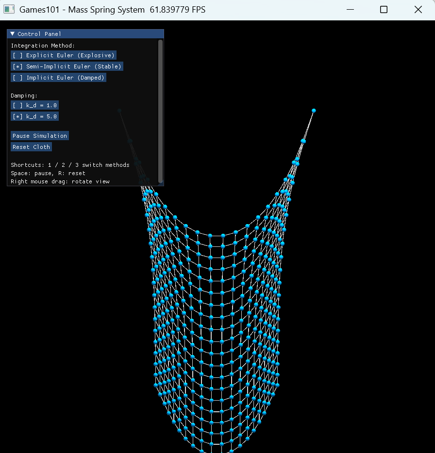
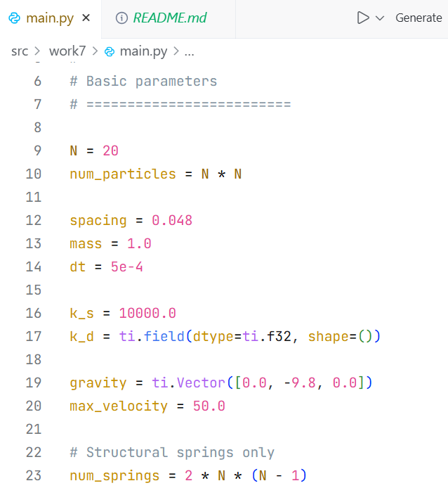
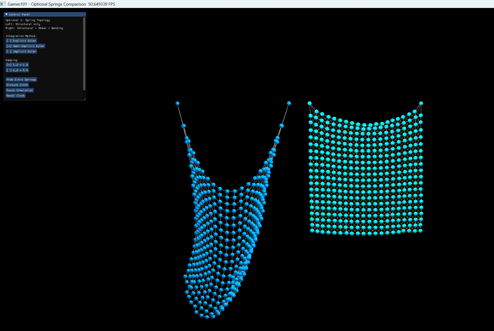
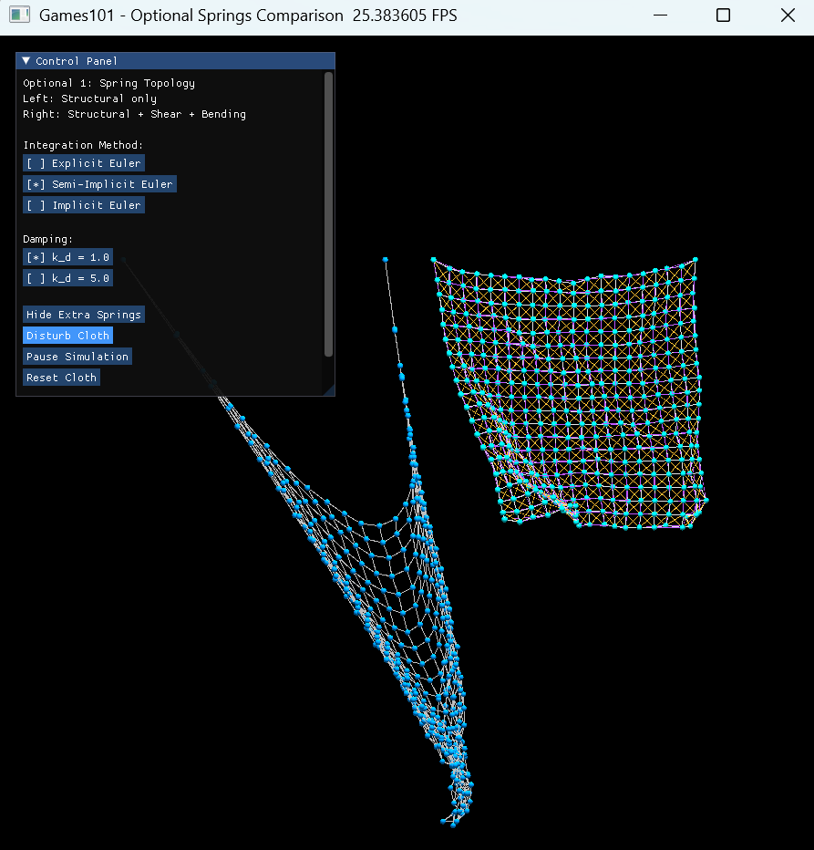
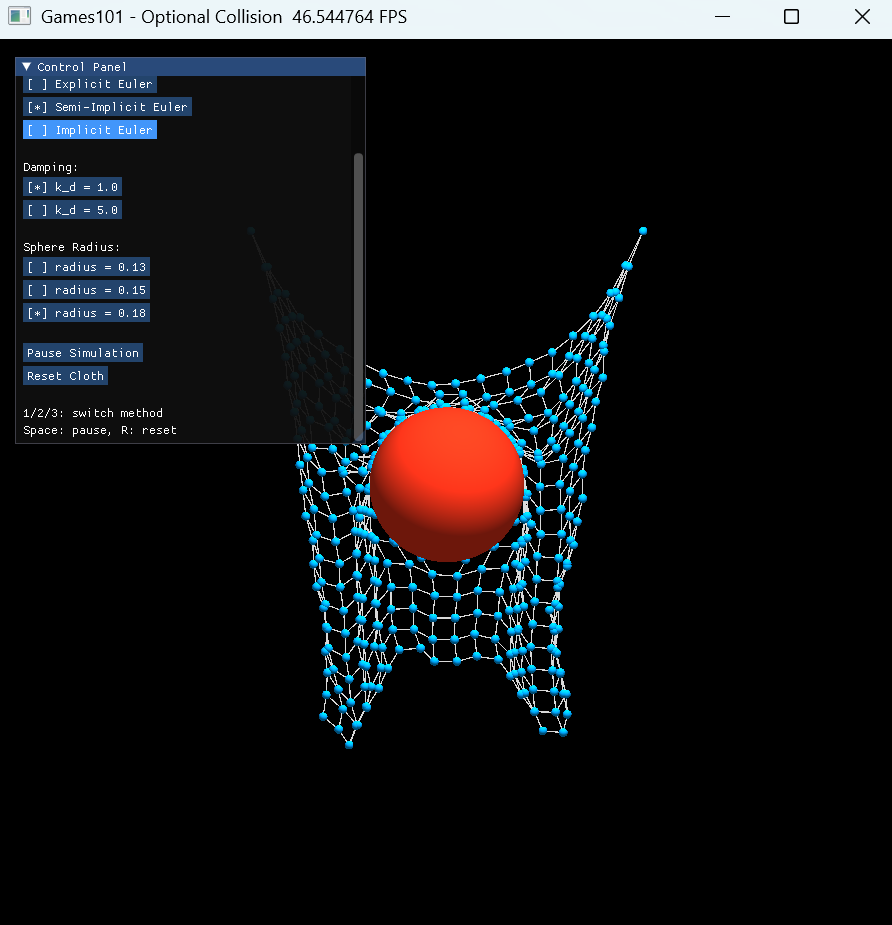

# 计算机图形学实验七：质点弹簧模型 / Mass-Spring System

<br>

<p align="center">
  
  
  
  
  
</p>

<br>

<p align="center">
  使用 Taichi GGUI 实现三维质点弹簧布料仿真，对比显式欧拉、半隐式欧拉和隐式欧拉三种积分方法，并完成弹簧拓扑增强与球体碰撞选做内容。
</p>

<p align="center">
  
</p>

<p align="center">
  <sub>蓝色质点表示离散布料节点，白色线段表示弹簧约束；左侧控制面板支持积分方法、阻尼参数、暂停与重置切换。</sub>
</p>

<br>

<a id="toc"></a>

## 目录

<details open>
<summary><strong>一、本次实验任务与收获</strong></summary>

- [一、本次实验任务与收获](#section-1)

</details>

<details open>
<summary><strong>二、文件结构</strong></summary>

- [二、文件结构](#section-2)

</details>

<details open>
<summary><strong>三、运行方式</strong></summary>

- [三、运行方式](#section-3)
  - [3.1 老师教程参考实现](#section-3-1)
  - [3.2 基础质点弹簧系统](#section-3-2)
  - [3.3 选做一：弹簧拓扑增强](#section-3-3)
  - [3.4 选做二：球体碰撞](#section-3-4)
  - [3.5 交互操作说明](#section-3-5)

</details>

<details open>
<summary><strong>四、基础任务可视化结果</strong></summary>

- [四、基础任务可视化结果](#section-4)
  - [4.1 基础布料动态总览](#section-4-1)
  - [4.2 三种积分方法动态对比](#section-4-2)
  - [4.3 显式欧拉数值爆炸](#section-4-3)
  - [4.4 半隐式欧拉稳定效果](#section-4-4)
  - [4.5 阻尼参数对比](#section-4-5)

</details>

<details open>
<summary><strong>五、选做内容可视化结果</strong></summary>

- [五、选做内容可视化结果](#section-5)
  - [5.1 选做一总览：结构弹簧与增强弹簧拓扑](#section-5-1)
  - [5.2 选做一动态对比：扰动后的形变差异](#section-5-2)
  - [5.3 选做二总览：球体碰撞场景](#section-5-3)
  - [5.4 选做二动态对比：稳定碰撞与显式欧拉反例](#section-5-4)

</details>

<details open>
<summary><strong>六、实验目标</strong></summary>

- [六、实验目标](#section-6)
  - [6.1 理论理解](#section-6-1)
  - [6.2 数值积分](#section-6-2)
  - [6.3 工程实践](#section-6-3)

</details>

<details open>
<summary><strong>七、实验原理</strong></summary>

- [七、实验原理](#section-7)
  - [7.1 质点弹簧模型](#section-7-1)
  - [7.2 弹簧力](#section-7-2)
  - [7.3 阻尼力与速度钳制](#section-7-3)
  - [7.4 三种积分方法](#section-7-4)
  - [7.5 剪切弹簧与弯曲弹簧](#section-7-5)
  - [7.6 球体碰撞约束](#section-7-6)

</details>

<details open>
<summary><strong>八、任务实现说明</strong></summary>

- [八、任务实现说明](#section-8)
  - [8.1 任务 1：场景初始化与 GPU 同步](#section-8-1)
  - [8.2 任务 2：力学计算与防爆处理](#section-8-2)
  - [8.3 任务 3：三种积分求解器](#section-8-3)
  - [8.4 任务 4：渲染与 GGUI 交互](#section-8-4)
  - [8.5 选做一：补充剪切弹簧与弯曲弹簧](#section-8-5)
  - [8.6 选做二：空间球体碰撞](#section-8-6)

</details>

<details open>
<summary><strong>九、实验总结</strong></summary>

- [九、实验总结](#section-9)

</details>

## 效果图目录

### 基础任务效果图

| 基础任务部分 | 动态演示 / 效果图 | 对应位置 |
| :-- | :-- | :-- |
| 基础界面总览 | 布料在半隐式欧拉下自然下垂，展示 GGUI 控制面板 | [查看基础布料动态总览](#section-4-1) |
| 积分方法对比 | 显式欧拉、半隐式欧拉、隐式欧拉切换对比 | [查看三种积分方法动态对比](#section-4-2) |
| 显式欧拉发散 | 显式欧拉在高刚度弹簧系统中的数值爆炸 | [查看显式欧拉数值爆炸](#section-4-3) |
| 半隐式欧拉稳定 | `k_d = 1.0` 时布料保持较稳定网格结构 | [查看半隐式欧拉稳定效果](#section-4-4) |
| 阻尼参数对比 | `k_d = 1.0` 与 `k_d = 5.0` 的稳定效果差异 | [查看阻尼参数对比](#section-4-5) |

### 选做内容效果图

| 选做部分 | 动态演示 / 效果图 | 对应位置 |
| :-- | :-- | :-- |
| 选做一总览 | 左侧结构弹簧，右侧结构弹簧 + 剪切弹簧 + 弯曲弹簧 | [查看选做一总览](#section-5-1) |
| 选做一动态对比 | 扰动后观察增强拓扑对布料形变的约束 | [查看选做一动态对比](#section-5-2) |
| 选做二总览 | 布料质点与红色球体碰撞的静态总览 | [查看选做二总览](#section-5-3) |
| 选做二稳定碰撞 | 半隐式欧拉与隐式欧拉下的球体碰撞动态效果 | [查看选做二稳定碰撞](#section-5-4) |
| 选做二反例 | 显式欧拉在碰撞场景中的不稳定发散现象 | [查看显式欧拉碰撞反例](#section-5-4) |

<a id="section-1"></a>

## 一、本次实验任务与收获

本次实验围绕 **Mass-Spring System 质点弹簧模型** 展开，目标是使用 Taichi 构建一个可交互的三维布料仿真程序。程序将布料离散为规则网格质点，并使用弹簧连接相邻质点，在重力、弹簧力、阻尼力和数值积分的共同作用下生成动态布料形变。

基础任务主要完成四部分内容。首先，程序构建 `20 × 20` 的布料质点网格，并固定上边两个角点，使布料能够在重力作用下自然下垂。其次，程序实现重力、弹簧力、阻尼力和速度钳制，其中弹簧力计算使用 `ti.atomic_add` 处理并行累加问题。第三，程序分别实现显式欧拉、半隐式欧拉和隐式欧拉三种积分方法，并通过交互按钮观察它们在稳定性上的差异。最后，程序使用 Taichi GGUI 编写控制面板，支持积分方法切换、阻尼参数切换、暂停模拟、重置布料和鼠标旋转视角。

选做内容进一步扩展了布料系统。一方面，在结构弹簧基础上补充剪切弹簧和弯曲弹簧，使布料对剪切和弯折变形具有更强约束；另一方面，在场景中加入球体碰撞，通过判断每个布料质点到球心的距离，将进入球体内部的质点投影回球面，从而实现简单的空间碰撞处理。

| 类型 | 内容 | 完成情况 |
| :-- | :-- | :-- |
| 基础任务 | 场景初始化与 GPU 同步 | 已完成 |
| 基础任务 | 重力、弹簧力、阻尼力与速度钳制 | 已完成 |
| 基础任务 | 显式欧拉、半隐式欧拉、隐式欧拉 | 已完成 |
| 基础任务 | Taichi GGUI 控制面板 | 已完成 |
| 参数实验 | 阻尼参数 `k_d = 1.0 / 5.0` 对比 | 已完成 |
| 选做一 | 结构弹簧、剪切弹簧、弯曲弹簧对比 | 已完成 |
| 选做二 | 球体碰撞与质点投影约束 | 已完成 |

通过本次实验，可以直观理解布料仿真中“建模—受力—积分—渲染—交互”的完整流程，也能观察到不同数值积分方法对物理系统稳定性的显著影响。

<p align="right"><a href="#toc">回到目录 ↑</a></p>

<a id="section-2"></a>

## 二、文件结构

```text
CG-Lab/
├── assets/
│   └── work7/
│       ├── work7_overview.gif                         # 基础布料动态封面
│       ├── integration_methods_compare.gif            # 三种积分方法动态对比
│       ├── explicit_euler_explosive.gif               # 显式欧拉数值爆炸动态演示
│       ├── semi_implicit_stable_kd1.gif               # 半隐式欧拉稳定效果，阻尼 1.0
│       ├── semi_implicit_kd5.png                      # 半隐式欧拉稳定效果，阻尼 5.0
│       ├── parameter_kd5_code.png                     # 阻尼参数设置代码截图
│       ├── optional_springs_overview.png              # 选做一：弹簧拓扑总览
│       ├── optional_springs_compare.gif               # 选做一：弹簧拓扑动态对比
│       ├── optional_springs_disturb.gif               # 选做一：扰动后动态对比
│       ├── optional_springs_disturb.png               # 选做一：扰动后静态图
│       ├── optional_collision_overview.png            # 选做二：球体碰撞总览
│       ├── optional_collision_main.gif                # 选做二：半隐式欧拉碰撞主动态演示
│       ├── optional_collision_implicit_soft.gif       # 选做二：隐式欧拉柔和稳定版
│       └── optional_collision_explicit_explosive.gif  # 选做二：显式欧拉碰撞反例演示
│
├── src/
│   └── Work7/
│       ├── README.md                                  # 实验七说明文档
│       ├── test.py                                    # 老师教程参考实现，用于环境验证与基础效果复现
│       ├── main.py                                    # 基础任务：三种积分方法与阻尼对比
│       ├── optional_springs.py                        # 选做一：剪切弹簧与弯曲弹簧
│       └── optional_collision.py                      # 选做二：球体碰撞
│
├── .gitignore                                         # Git 忽略规则
├── pyproject.toml                                     # uv 项目配置文件
├── uv.lock                                            # uv 依赖锁定文件
└── README.md                                          # 仓库总说明文档
```

其中，`test.py` 保存老师教程中的参考实现，主要用于验证 Taichi 环境、GGUI 窗口、三种积分方法和基础质点弹簧系统是否能够正常运行。正式展示与扩展实现主要放在 `main.py`、`optional_springs.py` 和 `optional_collision.py` 中。

本次实验将基础任务与两个选做内容拆分为三个独立 Python 文件。这样既能保持基础任务结构清晰，也便于分别展示“弹簧拓扑增强”和“球体碰撞”两类扩展效果。

<p align="right"><a href="#toc">回到目录 ↑</a></p>

<a id="section-3"></a>

## 三、运行方式

在项目根目录下运行。

| 项目 | 配置 |
| :-- | :-- |
| 操作系统 | Windows |
| 编程语言 | Python |
| 图形框架 | Taichi GGUI |
| 推荐运行方式 | `uv run python ...` |
| 教程参考入口 | `src/Work7/test.py` |
| 基础任务入口 | `src/Work7/main.py` |
| 选做一入口 | `src/Work7/optional_springs.py` |
| 选做二入口 | `src/Work7/optional_collision.py` |

<a id="section-3-1"></a>

### 3.1 老师教程参考实现

```bash
uv run python src/Work7/test.py
```

如果不使用 `uv`，也可以运行：

```bash
python src/Work7/test.py
```

该文件对应老师教程中的参考实现，用于确认环境配置、Taichi GGUI 窗口和基础质点弹簧系统能够正常启动。正式展示与扩展效果主要通过后续三个文件完成。

<a id="section-3-2"></a>

### 3.2 基础质点弹簧系统

```bash
uv run python src/Work7/main.py
```

该版本完成实验七基础任务，包括结构弹簧布料、显式欧拉、半隐式欧拉、隐式欧拉、阻尼参数切换、暂停和重置等交互功能。

<a id="section-3-3"></a>

### 3.3 选做一：弹簧拓扑增强

```bash
uv run python src/Work7/optional_springs.py
```

该版本用于对比两类弹簧拓扑：

```text
左侧：仅结构弹簧 Structural Springs
右侧：结构弹簧 + 剪切弹簧 + 弯曲弹簧
```

运行后可以点击 `Disturb Cloth` 或按键盘 `D` 给左右两块布料施加扰动，从而观察增强弹簧拓扑对形变的约束效果。

<a id="section-3-4"></a>

### 3.4 选做二：球体碰撞

```bash
uv run python src/Work7/optional_collision.py
```

该版本在布料场景中加入红色球体，并在每次物理更新时检查蓝色布料质点与球体之间的碰撞关系。

<a id="section-3-5"></a>

### 3.5 交互操作说明

| 操作 | 功能 |
| :-- | :-- |
| `1` | 切换到显式欧拉 Explicit Euler |
| `2` | 切换到半隐式欧拉 Semi-Implicit Euler |
| `3` | 切换到隐式欧拉 Implicit Euler |
| `Space` | 暂停或恢复模拟 |
| `R` | 重置布料 |
| 鼠标右键拖拽 | 旋转观察视角 |
| `k_d = 1.0` | 设置阻尼系数为 1.0 |
| `k_d = 5.0` | 设置阻尼系数为 5.0 |
| `radius = 0.13 / 0.15 / 0.18` | 在球体碰撞选做中切换球体半径 |
| `Disturb Cloth` / `D` | 在弹簧拓扑选做中给布料施加扰动 |

<p align="right"><a href="#toc">回到目录 ↑</a></p>

<a id="section-4"></a>

## 四、基础任务可视化结果

<a id="section-4-1"></a>

### 4.1 基础布料动态总览

<p align="center">
  
</p>

<p align="center">
  <strong>图 1：基础质点弹簧布料动态演示</strong>
</p>

基础界面左侧为 GGUI 控制面板，右侧为三维布料仿真场景。蓝色小球表示布料质点，白色线段表示质点之间的弹簧连接。布料上方两个角点被固定，因此整体会在重力作用下自然下垂。

<a id="section-4-2"></a>

### 4.2 三种积分方法动态对比

<p align="center">
  
</p>

<p align="center">
  <strong>图 2：显式欧拉、半隐式欧拉与隐式欧拉动态对比</strong>
</p>

显式欧拉使用当前速度更新位置，并使用当前加速度更新速度，方法简单但容易放大误差。在高刚度弹簧系统中，显式欧拉更容易出现剧烈振荡甚至数值爆炸。半隐式欧拉先更新速度，再用更新后的速度更新位置，稳定性明显优于显式欧拉。隐式欧拉使用未来状态近似更新，阻尼效果更明显，布料运动更加平缓。

<a id="section-4-3"></a>

### 4.3 显式欧拉数值爆炸

<p align="center">
  
</p>

<p align="center">
  <strong>图 3：显式欧拉数值爆炸动态演示</strong>
</p>

显式欧拉的更新完全依赖当前时刻状态，当弹簧劲度较高、时间步长较大或系统能量累积较快时，误差会被逐步放大，最终表现为质点剧烈飞散、弹簧线段大幅拉伸和布料结构发散。该现象体现了显式欧拉在刚性弹簧系统中的不稳定性。

<a id="section-4-4"></a>

### 4.4 半隐式欧拉稳定效果

<p align="center">
  
</p>

<p align="center">
  <strong>图 4：半隐式欧拉稳定布料效果，阻尼系数 k_d = 1.0</strong>
</p>

半隐式欧拉先更新速度，再使用更新后的速度更新位置。虽然它与显式欧拉只在更新顺序上存在差异，但对能量增长的控制更好，因此布料整体能保持较完整的网格结构。

<a id="section-4-5"></a>

### 4.5 阻尼参数对比

<table align="center">
  <tr>
    <td align="center"><strong>k_d = 1.0：半隐式欧拉动态稳定效果</strong></td>
    <td align="center"><strong>k_d = 5.0：阻尼增强后更快趋稳</strong></td>
  </tr>
  <tr>
    <td align="center">
      
    </td>
    <td align="center">
      
    </td>
  </tr>
</table>

阻尼系数较小时，布料振荡更加明显；阻尼系数增大后，质点速度会被更快削弱，系统能量衰减更快，布料更容易趋于稳定。需要注意的是，阻尼可以缓解振荡，但不能完全替代稳定的积分方法。

<p align="center">
  
</p>

<p align="center">
  <strong>图 5：实验参数设置截图</strong>
</p>

<p align="right"><a href="#toc">回到目录 ↑</a></p>

<a id="section-5"></a>

## 五、选做内容可视化结果

<a id="section-5-1"></a>

### 5.1 选做一总览：结构弹簧与增强弹簧拓扑

<p align="center">
  
</p>

<p align="center">
  <strong>图 6：选做一总览，左侧为结构弹簧，右侧为增强弹簧拓扑</strong>
</p>

选做一对比了两种弹簧拓扑。左侧布料只包含结构弹簧，即水平方向和竖直方向相邻质点之间的连接；右侧布料在结构弹簧基础上加入剪切弹簧和弯曲弹簧。

<a id="section-5-2"></a>

### 5.2 选做一动态对比：扰动后的形变差异

<p align="center">
  
</p>

<p align="center">
  <strong>图 7：结构弹簧与增强弹簧拓扑动态对比</strong>
</p>

<p align="center">
  
</p>

<p align="center">
  <strong>图 8：扰动后左右布料形变差异</strong>
</p>

加入扰动后，左右两侧布料的差异更加明显。只包含结构弹簧的布料更容易发生剪切形变；加入剪切弹簧和弯曲弹簧后，布料的网格结构更完整，对斜向拉扯和过度弯折具有更强约束。

<p align="center">
  
</p>

<a id="section-5-3"></a>

### 5.3 选做二总览：球体碰撞场景

<p align="center">
  
</p>

<p align="center">
  <strong>图 9：选做二总览，布料质点与红色球体碰撞</strong>
</p>

选做二中，红色球体表示碰撞物体，蓝色小球表示布料质点。程序在每次物理更新后计算每个布料质点到球心的距离。如果距离小于球半径，说明该质点进入球体内部，程序会将质点投影回球面，并去除朝向球体内部的速度分量，从而实现简单的布料-球体碰撞效果。

<a id="section-5-4"></a>

### 5.4 选做二动态对比：稳定碰撞与显式欧拉反例

<p align="center">
  
</p>

<p align="center">
  <strong>图 10：半隐式欧拉下的球体碰撞主动态演示</strong>
</p>

<p align="center">
  
</p>

<p align="center">
  <strong>图 11：隐式欧拉下更平缓的碰撞稳定效果</strong>
</p>

<p align="center">
  
</p>

<p align="center">
  <strong>图 12：显式欧拉在碰撞场景中的不稳定反例</strong>
</p>

半隐式欧拉和隐式欧拉能够较好地维持布料结构，并使布料质点在球体碰撞约束下形成较稳定的下垂形态。相比之下，显式欧拉在碰撞场景中更容易出现剧烈拉伸和结构发散，因此该结果作为反例展示。

<p align="right"><a href="#toc">回到目录 ↑</a></p>

<a id="section-6"></a>

## 六、实验目标

<a id="section-6-1"></a>

### 6.1 理论理解

理解质点弹簧模型的基本思想。布料不再被看作连续曲面，而是被离散为有限数量的质点；质点之间通过弹簧建立约束。通过弹簧恢复力、阻尼力和重力，可以近似模拟布料在三维空间中的动态运动。

<a id="section-6-2"></a>

### 6.2 数值积分

掌握显式欧拉、半隐式欧拉和隐式欧拉三种积分方法的更新方式，并通过实验观察它们对模拟稳定性的影响。重点理解为什么显式欧拉容易出现数值爆炸，为什么半隐式欧拉在实时仿真中更常用，以及隐式欧拉为什么具有更强阻尼效果。

<a id="section-6-3"></a>

### 6.3 工程实践

熟悉 Taichi 中 `ti.kernel`、`ti.func`、并行 field、GGUI 控制面板和三维场景渲染的使用方式。通过拆分初始化 Kernel、合并物理更新逻辑、使用 `ti.atomic_add` 处理并行累加，使程序能够稳定运行并实时展示布料动态。

<p align="right"><a href="#toc">回到目录 ↑</a></p>

<a id="section-7"></a>

## 七、实验原理

<a id="section-7-1"></a>

### 7.1 质点弹簧模型

质点弹簧模型将布料离散为规则网格。设布料分辨率为 `N × N`，则共有：

$$
N^2
$$

个质点。本实验基础版本中：

$$
N = 20
$$

因此共有：

$$
20 \times 20 = 400
$$

个布料质点。

每个质点保存以下状态：

| 变量 | 含义 |
| :-- | :-- |
| `x` | 质点位置 |
| `v` | 质点速度 |
| `f` | 质点当前受力 |
| `is_fixed` | 是否为固定点 |
| `x_next` | 隐式欧拉预测位置 |
| `v_next` | 隐式欧拉预测速度 |

蓝色小球就是布料质点。白色线段就是弹簧。整个蓝色点阵和白色线网共同组成离散化后的布料。

<a id="section-7-2"></a>

### 7.2 弹簧力

设两个相连质点分别为 `a` 和 `b`，位置分别为：

$$
\mathbf{x}_a,\ \mathbf{x}_b
$$

当前弹簧长度为：

$$
\left\|
\mathbf{x}_a-\mathbf{x}_b
\right\|
$$

弹簧原长为：

$$
l
$$

根据胡克定律，弹簧施加在质点 `a` 上的力为：

$$
\mathbf{f}_{a}
=
-k_s
\left(
\left\|
\mathbf{x}_a-\mathbf{x}_b
\right\|
-
l
\right)
\frac{
\mathbf{x}_a-\mathbf{x}_b
}{
\left\|
\mathbf{x}_a-\mathbf{x}_b
\right\|
}
$$

其中：

| 符号 | 含义 |
| :-- | :-- |
| `k_s` | 弹簧劲度系数 |
| `l` | 弹簧原长 |
| `x_a, x_b` | 两个质点的位置 |
| `f_a` | 弹簧对质点 `a` 的作用力 |

当弹簧被拉长时，弹簧力会将质点拉回；当弹簧被压缩时，弹簧力会将质点推开。因此弹簧力本质上是恢复力。

<a id="section-7-3"></a>

### 7.3 阻尼力与速度钳制

仅有弹簧力时，系统容易持续振荡，数值误差也可能导致能量不断增加。为了让系统逐渐稳定，本实验加入阻尼力：

$$
\mathbf{f}_{d}
=
-k_d\mathbf{v}
$$

其中 `k_d` 是阻尼系数，`v` 是质点速度。阻尼力方向与速度方向相反，因此可以削弱运动速度并消耗系统能量。

此外，程序还使用速度钳制：

```python
max_velocity = 50.0
```

当质点速度过大时，将速度限制在最大值内，防止显式欧拉等不稳定方法导致严重数值爆炸。

<a id="section-7-4"></a>

### 7.4 三种积分方法

质点加速度由牛顿第二定律得到：

$$
\mathbf{a}
=
\frac{\mathbf{F}}{m}
$$

在离散时间步长：

$$
\Delta t
$$

内，需要通过数值积分更新质点速度与位置。

**显式欧拉** 使用当前时刻速度和加速度更新下一时刻状态：

$$
\mathbf{x}_{t+1}
=
\mathbf{x}_{t}
+
\mathbf{v}_{t}\Delta t
$$

$$
\mathbf{v}_{t+1}
=
\mathbf{v}_{t}
+
\mathbf{a}_{t}\Delta t
$$

显式欧拉计算简单，但在弹簧刚度较大时容易不稳定。

**半隐式欧拉** 先更新速度，再用更新后的速度更新位置：

$$
\mathbf{v}_{t+1}
=
\mathbf{v}_{t}
+
\mathbf{a}_{t}\Delta t
$$

$$
\mathbf{x}_{t+1}
=
\mathbf{x}_{t}
+
\mathbf{v}_{t+1}\Delta t
$$

半隐式欧拉在物理模拟中更稳定，是实时布料仿真的常用方法。

**隐式欧拉** 使用未来时刻的状态进行更新：

$$
\mathbf{v}_{t+1}
=
\mathbf{v}_{t}
+
\mathbf{a}_{t+1}\Delta t
$$

$$
\mathbf{x}_{t+1}
=
\mathbf{x}_{t}
+
\mathbf{v}_{t+1}\Delta t
$$

本实验通过多次定点迭代近似求解隐式欧拉，使模拟更具阻尼效果。

<a id="section-7-5"></a>

### 7.5 剪切弹簧与弯曲弹簧

基础版本只包含结构弹簧，即水平方向和竖直方向相邻质点之间的连接。选做一进一步加入剪切弹簧和弯曲弹簧。

| 弹簧类型 | 连接方式 | 主要作用 |
| :-- | :-- | :-- |
| Structural Springs | 水平、竖直相邻质点 | 维持基本长度约束 |
| Shear Springs | 对角线相邻质点 | 抵抗剪切变形 |
| Bending Springs | 间隔一个质点的远邻连接 | 抵抗过度弯折 |

剪切弹簧可以抑制布料在斜向上的错位变形；弯曲弹簧可以限制相隔较远质点之间的过度弯折，从而使布料整体更接近连续面片。

<a id="section-7-6"></a>

### 7.6 球体碰撞约束

球体碰撞选做中，每个布料质点都会与球体进行距离检测。设质点位置为：

$$
\mathbf{x}_i
$$

球心为：

$$
\mathbf{c}
$$

球半径为：

$$
r
$$

则质点到球心的距离为：

$$
d_i
=
\left\|
\mathbf{x}_i-\mathbf{c}
\right\|
$$

当：

$$
d_i < r
$$

说明质点进入球体内部，需要将其投影回球面：

$$
\mathbf{x}_i
=
\mathbf{c}
+
r
\frac{
\mathbf{x}_i-\mathbf{c}
}{
\left\|
\mathbf{x}_i-\mathbf{c}
\right\|
}
$$

同时，程序会计算速度在球面法线方向上的分量。如果该分量朝向球体内部，则将其去除，避免质点下一步继续穿入球体。

<p align="right"><a href="#toc">回到目录 ↑</a></p>

<a id="section-8"></a>

## 八、任务实现说明

<a id="section-8-1"></a>

### 8.1 任务 1：场景初始化与 GPU 同步

实验要求定义布料的网格大小，初始化质点的位置、速度、受力和弹簧拓扑结构。为了保证 GPU 并行计算状态同步，需要将初始化操作拆分为多个 `@ti.kernel`，并在 Python 侧按顺序调用。

程序使用：

```python
N = 20
num_particles = N * N
num_springs = 2 * N * (N - 1)
```

构建 `20 × 20` 布料网格。初始化分为三个 Kernel：

```python
init_particles()
init_springs()
init_render_indices()
```

其中 `init_particles()` 负责初始化质点位置和速度，`init_springs()` 负责建立水平和竖直结构弹簧，`init_render_indices()` 负责生成渲染线段索引。布料上边两个角点被固定，因此布料不会整体自由下落，而是会像悬挂布料一样自然下垂。

<a id="section-8-2"></a>

### 8.2 任务 2：力学计算与防爆处理

实验要求编写力学计算逻辑，计算重力、阻尼力和弹簧力，并处理数值爆炸问题。弹簧力累加时需要注意多线程写入冲突。

程序在每个积分 Kernel 中先清空并计算重力和阻尼力：

```python
f[i] = mass * gravity - k_d[None] * v[i]
```

然后遍历弹簧，调用 `add_spring_force()` 累加弹簧力。由于多个弹簧可能同时连接到同一个质点，因此程序使用：

```python
ti.atomic_add(force[a], spring_force)
ti.atomic_add(force[b], -spring_force)
```

保证并行累加安全。

防爆处理使用速度钳制。当速度超过上限时，将速度缩放回最大速度范围内，避免质点飞出场景。

<a id="section-8-3"></a>

### 8.3 任务 3：三种积分求解器

实验要求分别实现显式欧拉、半隐式欧拉和隐式欧拉三种积分方法，并观察它们的稳定性差异。

程序分别实现了三个 Kernel：

```python
step_explicit()
step_semi_implicit()
step_implicit()
```

显式欧拉先用旧速度更新位置，再用当前加速度更新速度；半隐式欧拉先更新速度，再使用新速度更新位置；隐式欧拉使用 `x_next`、`v_next` 和 `f_next` 进行多次定点迭代，近似未来状态。

控制面板中可以实时切换三种方法。实验现象表明，显式欧拉更容易爆炸，半隐式欧拉稳定性较好，隐式欧拉整体运动更平缓。

<a id="section-8-4"></a>

### 8.4 任务 4：渲染与 GGUI 交互

实验要求使用 Taichi GGUI 构建三维场景，并编写控制面板，实现积分方法切换、暂停、重置等交互功能。

程序使用：

```python
window = ti.ui.Window(...)
canvas = window.get_canvas()
scene = ti.ui.Scene()
camera = ti.ui.Camera()
```

构建三维窗口与相机，并使用：

```python
scene.lines(...)
scene.particles(...)
```

分别绘制弹簧线段和布料质点。

左侧 GGUI 控制面板包含三种积分方法按钮、阻尼按钮、暂停按钮和重置按钮。通过 `method` 变量控制当前积分方式，通过 `current_damping` 控制阻尼参数。

<a id="section-8-5"></a>

### 8.5 选做一：补充剪切弹簧与弯曲弹簧

选做一要求在当前结构弹簧基础上补充剪切弹簧和弯曲弹簧，观察布料形态的改变。程序在结构弹簧之外增加了两类额外连接：对角线方向的剪切弹簧，以及间隔一个质点的弯曲弹簧。

`optional_springs.py` 使用左右对比方式展示差异：左侧只包含结构弹簧，右侧包含结构弹簧、剪切弹簧和弯曲弹簧。通过 `Disturb Cloth` 对两块布料施加相同扰动后，可以观察到增强拓扑对剪切和弯折形变的抑制作用。

<a id="section-8-6"></a>

### 8.6 选做二：空间球体碰撞

选做二要求在场景中放置一个球体，在物理更新时判断布料质点与球体的距离，实现简单的碰撞处理。

布料质点就是画面中的蓝色小球。程序在每次物理更新后，对每个质点计算它到球心的距离。如果距离小于球体半径，说明质点进入了球体内部。此时程序将质点沿球心到质点的方向投影回球面，并去除朝向球体内部的速度分量。

核心逻辑如下：

```python
normal = offset / dist
result_pos = sphere_center[0] + normal * radius

normal_speed = result_vel.dot(normal)

if normal_speed < 0.0:
    result_vel = result_vel - normal_speed * normal
```

这种方法属于简单的粒子-球碰撞约束，虽然没有加入复杂摩擦和连续碰撞检测，但足以展示布料被球体支撑的效果。

<p align="right"><a href="#toc">回到目录 ↑</a></p>

<a id="section-9"></a>

## 九、实验总结

本次实验实现了一个完整的三维质点弹簧布料仿真系统。通过将布料离散为质点网格，并使用弹簧连接质点，可以用较简单的模型模拟布料下垂、振荡、发散和碰撞等动态现象。

在基础任务中，我完成了场景初始化、力学计算、三种积分方法和 GGUI 交互控制。实验结果表明，显式欧拉虽然实现最简单，但在高刚度弹簧系统中更容易出现数值爆炸；半隐式欧拉只调整了速度和位置的更新顺序，却能显著提升稳定性；隐式欧拉通过近似未来状态，使布料运动更具阻尼效果。

在选做内容中，我分别实现了弹簧拓扑增强和球体碰撞。剪切弹簧与弯曲弹簧可以增强布料对剪切和弯折的抵抗能力，使网格结构更完整；球体碰撞则通过距离检测和位置投影实现，使布料质点能够被球面约束。

通过本次实验，我进一步理解了计算机图形学中物理建模、数值积分、GPU 并行计算和实时渲染之间的关系，也对布料仿真的基本工程流程有了更完整的认识。

<p align="right"><a href="#toc">回到目录 ↑</a></p>