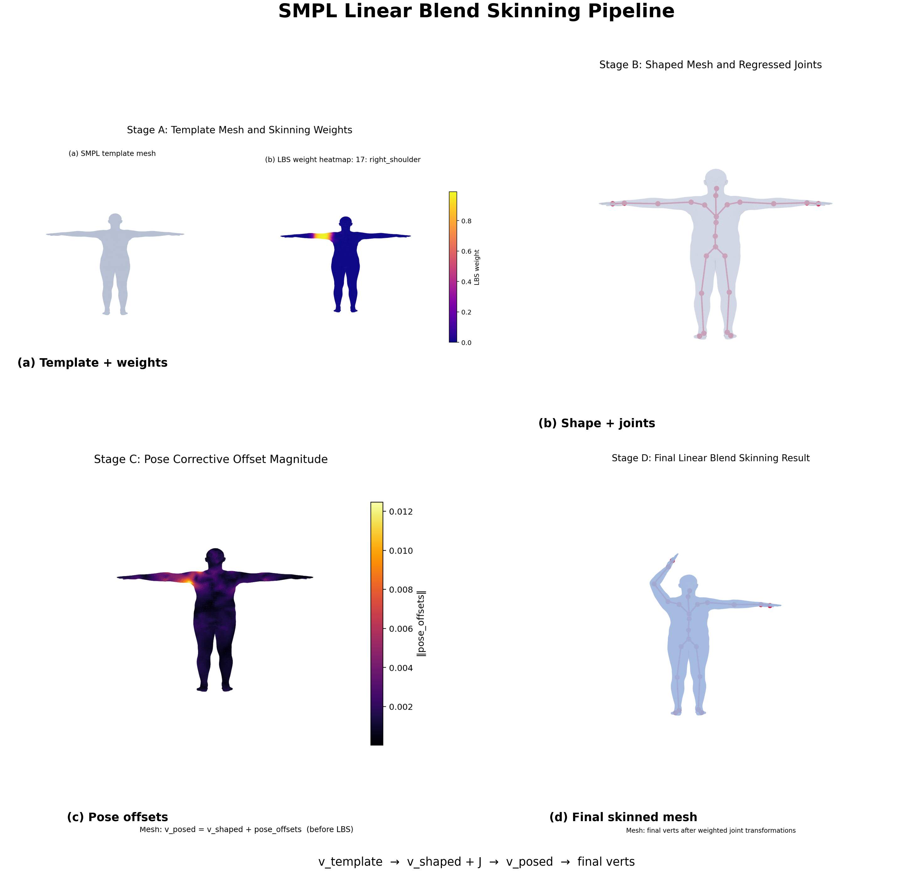
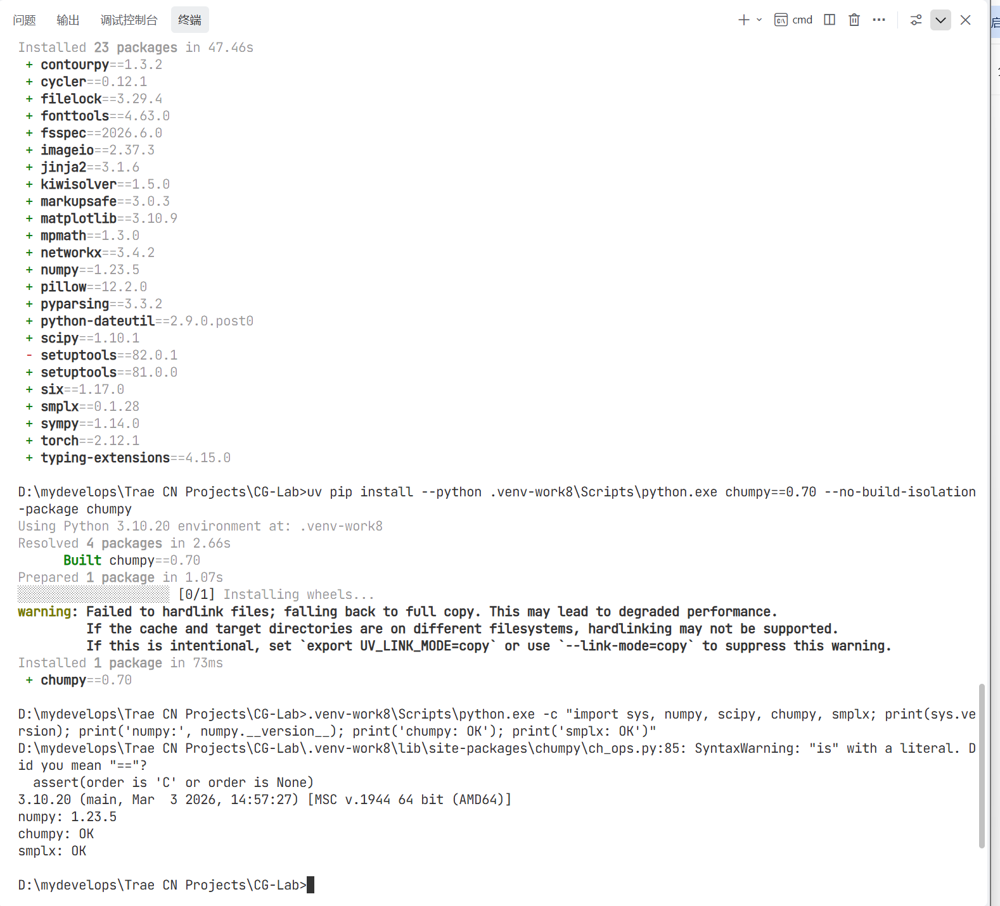
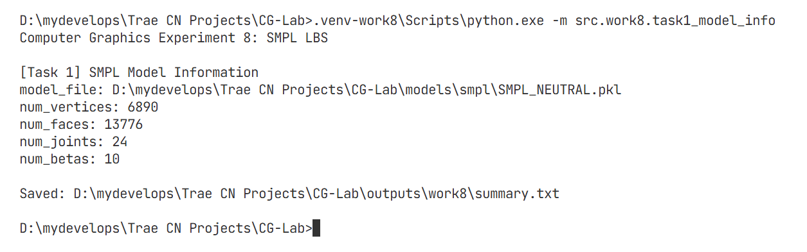
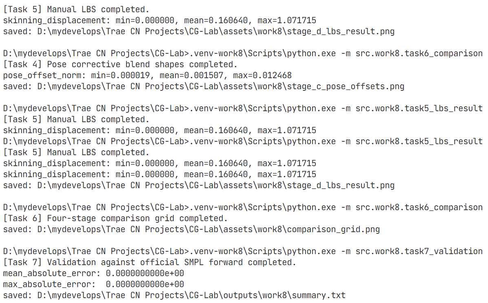
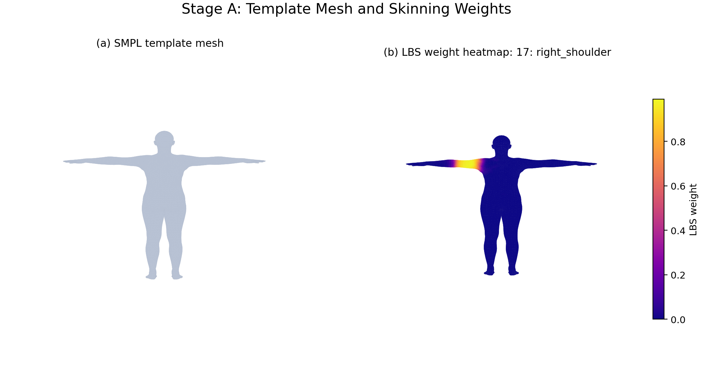
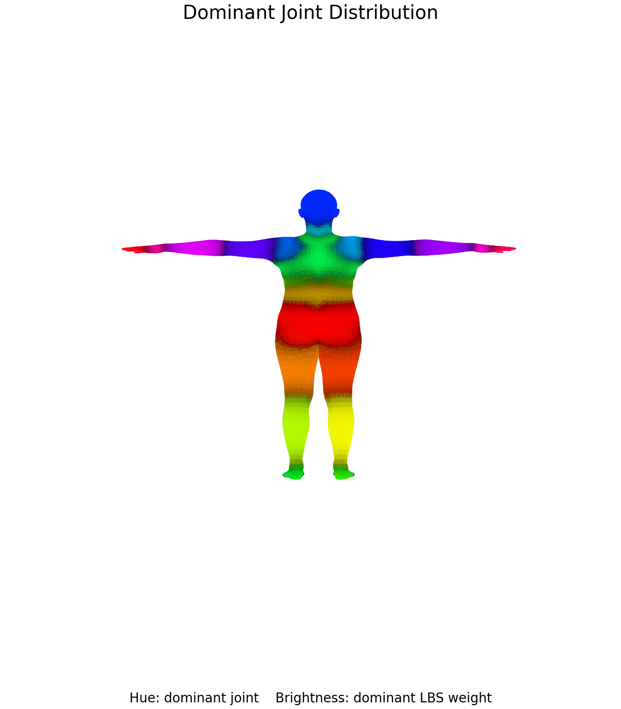
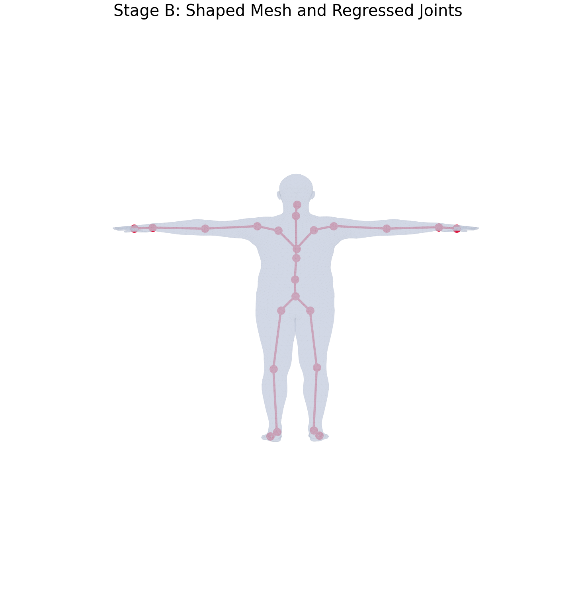
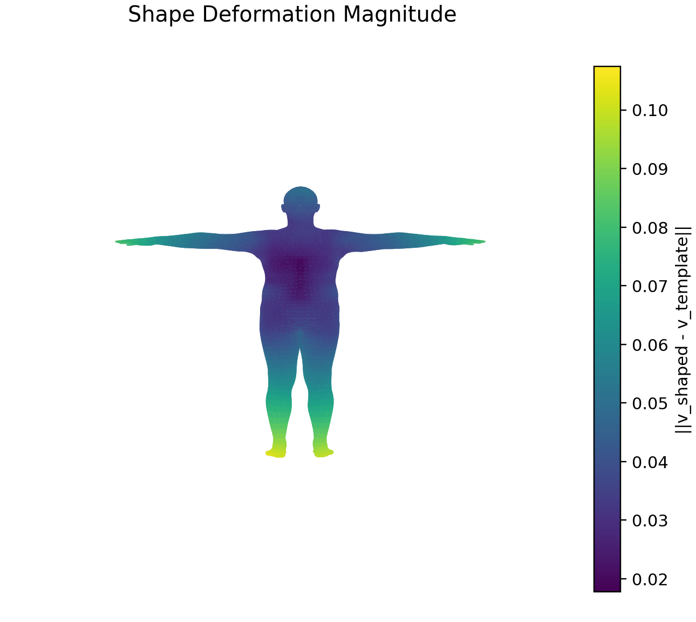
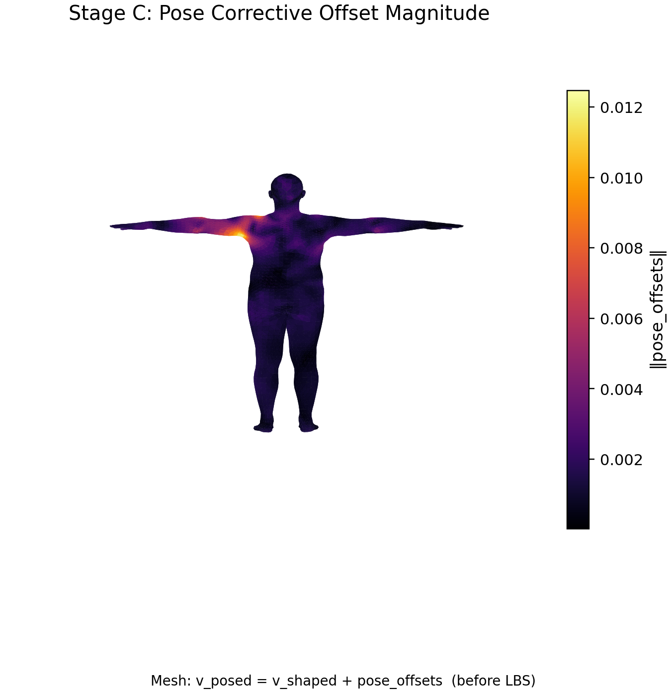
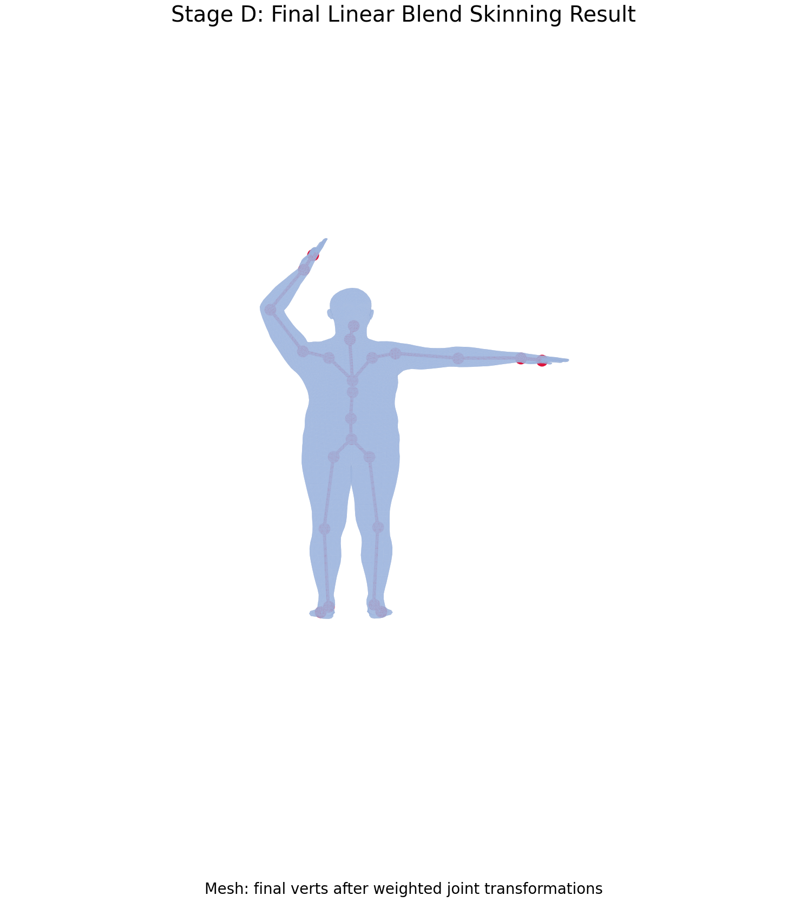

# 计算机图形学实验八：LBS 蒙皮 / Linear Blend Skinning

<br>

<p align="center">
  
  
  
  
  
</p>

<p align="center">
  <b>基于 SMPL 参数化人体模型，拆解并可视化从模板网格、形状校正、姿态校正到最终 Linear Blend Skinning 的完整前向过程。</b>
</p>

<br>

<p align="center">
  
</p>

<p align="center">
  <sub>v_template → v_shaped + J → v_posed → final verts</sub>
</p>

<br>

<a id="toc"></a>

## 目录

<details open>
<summary><strong>一、本次实验任务与收获</strong></summary>

- [一、本次实验任务与收获](#section-1)

</details>

<details open>
<summary><strong>二、文件结构</strong></summary>

- [二、文件结构](#section-2)

</details>

<details open>
<summary><strong>三、运行方式</strong></summary>

- [三、运行方式](#section-3)
  - [3.1 SMPL 模型文件准备](#section-3-1)
  - [3.2 Python 兼容环境](#section-3-2)
  - [3.3 环境验证记录](#section-3-3)
  - [3.4 分任务运行命令](#section-3-4)
  - [3.5 输出文件说明](#section-3-5)

</details>

<details open>
<summary><strong>四、可视化结果</strong></summary>

- [四、可视化结果](#section-4)
  - [4.1 环境、模型加载与运行记录](#section-4-1)
  - [4.2 LBS 四阶段总览](#section-4-2)
  - [4.3 Stage A：模板网格与单关节权重](#section-4-3)
  - [4.4 Stage A 辅助图：主导关节分布](#section-4-4)
  - [4.5 Stage B：形状校正与关节回归](#section-4-5)
  - [4.6 Stage B 辅助图：形状变化幅度](#section-4-6)
  - [4.7 Stage C：姿态相关校正](#section-4-7)
  - [4.8 Stage D：最终 LBS 蒙皮结果](#section-4-8)
  - [4.9 手写 LBS 与官方前向验证](#section-4-9)

</details>

<details open>
<summary><strong>五、实验目标</strong></summary>

- [五、实验目标](#section-5)
  - [5.1 理论理解](#section-5-1)
  - [5.2 数学与算法理解](#section-5-2)
  - [5.3 工程实践](#section-5-3)

</details>

<details open>
<summary><strong>六、实验原理</strong></summary>

- [六、实验原理](#section-6)
  - [6.1 SMPL 参数化人体模型](#section-6-1)
  - [6.2 模板网格与蒙皮权重](#section-6-2)
  - [6.3 Shape Blend Shapes](#section-6-3)
  - [6.4 关节回归器](#section-6-4)
  - [6.5 Pose Corrective Blend Shapes](#section-6-5)
  - [6.6 Forward Kinematics 与关节变换](#section-6-6)
  - [6.7 Linear Blend Skinning](#section-6-7)
  - [6.8 手写实现与官方前向验证](#section-6-8)

</details>

<details open>
<summary><strong>七、基础任务实现</strong></summary>

- [七、基础任务实现](#section-7)
  - [任务 1：加载 SMPL 并输出基础信息](#section-7-1)
  - [任务 2：模板网格与蒙皮权重可视化](#section-7-2)
  - [任务 3：形状校正与关节回归](#section-7-3)
  - [任务 4：姿态相关校正可视化](#section-7-4)
  - [任务 5：手写 LBS 与最终姿态网格](#section-7-5)
  - [任务 6：四阶段总对比图](#section-7-6)
  - [任务 7：手写 LBS 与官方结果验证](#section-7-7)

</details>

<details open>
<summary><strong>八、思考题与分析</strong></summary>

- [八、思考题与分析](#section-8)
  - [8.1 为什么一个顶点受多个关节影响？](#section-8-1)
  - [8.2 单关节权重过高会怎样？](#section-8-2)
  - [8.3 权重过于平均会怎样？](#section-8-3)
  - [8.4 为什么关节从形状后网格回归？](#section-8-4)
  - [8.5 为什么 LBS 前需要 pose corrective？](#section-8-5)
  - [8.6 J 与 J_transformed 的区别](#section-8-6)
  - [8.7 为什么最终顶点是加权和？](#section-8-7)

</details>

<details open>
<summary><strong>九、实验总结</strong></summary>

- [九、实验总结](#section-9)

</details>

---

## 效果图目录

### 基础任务效果图

| 基础任务部分 | 动态演示 / 效果图 | 对应位置 |
| :-- | :-- | :-- |
| 运行环境验证 | Python 3.10、NumPy 1.23.5、`chumpy` 与 `smplx` 的兼容性验证 | [查看环境配置与兼容性验证](#section-4-1) |
| 模型加载与信息读取 | 成功加载 `SMPL_NEUTRAL.pkl`，输出 6890 个顶点、13776 个三角面片、24 个关节和 10 维 shape 参数 | [查看 Task 1 模型信息](#section-4-1) |
| 模板网格与单关节权重 | 标准 T-pose 模板网格，以及 `right_shoulder` 对应的 LBS 权重热力图 | [查看模板网格与右肩权重](#section-4-3) |
| 主导关节分布 | 以顶点最大权重对应的关节为主导关节，展示头部、躯干、四肢的骨骼控制区域 | [查看主导关节分布图](#section-4-4) |
| 形状校正与关节回归 | 非零 `betas` 下的 `v_shaped`，以及由 `J_regressor` 回归得到的 24 个关节 | [查看形状网格与回归关节](#section-4-5) |
| 形状变化幅度 | 展示 `v_shaped - v_template` 的逐顶点位移大小，观察不同身体区域的 shape deformation | [查看形状变化热力图](#section-4-6) |
| 姿态相关校正 | 展示 `pose_offsets` 的大小，重点观察右肩、上臂与右肘附近的局部修正 | [查看 pose corrective 热力图](#section-4-7) |
| 手写 LBS 最终结果 | 根据 24 个关节变换和顶点权重，得到抬臂、弯肘后的最终 `verts` 与 `J_transformed` | [查看最终蒙皮结果](#section-4-8) |
| 四阶段流程总览 | 将模板网格、形状校正、姿态校正、最终蒙皮排成 2 × 2 对比图 | [查看 LBS 四阶段总览](#section-4-2) |
| 官方前向一致性验证 | 手写 LBS 与官方 SMPL 前向结果逐顶点比较，MAE 与最大误差均为 0 | [查看运行记录与误差验证](#section-4-9) |

### 运行记录与验证截图

| 记录部分 | 截图内容 | 对应位置 |
| :-- | :-- | :-- |
| 独立环境记录 | `Python 3.10.20`、`numpy 1.23.5`、`chumpy: OK`、`smplx: OK` | [查看环境验证截图](#section-4-1) |
| Task 1 运行记录 | 模型路径、顶点数、面片数、关节数、betas 维度与 `summary.txt` 保存路径 | [查看模型加载截图](#section-4-1) |
| Task 4 至 Task 7 记录 | pose corrective、手写 LBS、四阶段对比图、官方前向验证的完整终端输出 | [查看任务执行与最终验证截图](#section-4-9) |

---

<a id="section-1"></a>

# 一、本次实验任务与收获

本次实验围绕 **SMPL 参数化人体模型与 Linear Blend Skinning（LBS）** 展开，完整实现了从模板人体、个体化体型、姿态修正到最终骨骼蒙皮的七项任务。

实验并没有把 SMPL 看作一个只输入姿态和体型参数、直接输出人体模型的黑盒，而是显式拆解了官方前向计算中的关键变量：

~~~text
v_template → v_shaped → J → v_posed → verts
~~~

**第一项任务是加载 SMPL neutral 模型并读取基础信息。**  
程序使用 `smplx.create(...)` 加载本地 `SMPL_NEUTRAL.pkl`，成功读取模板顶点、三角面片、关节回归器、shape 参数空间和蒙皮权重。最终确认该模型包含 6890 个顶点、13776 个三角面片、24 个关节和 10 维 shape 参数。

**第二项任务是可视化模板网格与蒙皮权重。**  
程序将 `v_template` 绘制为标准 T-pose 人体，并选取 `right_shoulder` 关节，把该关节对全部顶点的 LBS 权重映射为热力颜色。结果显示，高权重区域集中在右肩和右上臂附近，说明模板人体即使尚未产生动作，也已经保存了完整的骨骼绑定关系。

**第三项任务是实现形状校正与关节回归。**  
程序设置非零 shape 参数 `betas`，计算形状校正后的顶点 `v_shaped`。随后通过 `J_regressor` 从 `v_shaped` 中回归出关节位置 `J`。这一过程说明关节位置不是固定不变的，而是会随人体的高矮、胖瘦、肩宽、腿长等比例变化而调整。

**第四项任务是可视化姿态相关校正。**  
程序设置躯干轻微扭转、右肩抬起和右肘弯曲等姿态，先将轴角姿态转换为旋转矩阵，再构造姿态特征 `pose_feature = R - I`，最终得到 `pose_offsets`。热力图显示，姿态修正主要集中在肩、上臂和肘部等动作变化明显的区域。

**第五项任务是手写完整 LBS。**  
程序使用 `batch_rigid_transform(...)` 沿运动学树计算每个关节的姿态变换，再根据每个顶点的 `lbs_weights` 混合 24 个关节变换，最终得到 `verts`。结果中人体成功完成抬臂、弯肘动作，且骨架与网格同步变化。

**第六项任务是生成四阶段总览图。**  
程序将模板权重、形状网格与关节、姿态校正热力图、最终蒙皮结果排布为 2 × 2 总览图，使整个 LBS 流程能够被一张图完整展示。

**第七项任务是完成一致性验证。**  
程序使用完全相同的 `betas`、`global_orient` 和 `body_pose`，分别执行手写 LBS 与官方 SMPL 前向。最终平均绝对误差和最大绝对误差均为 0，说明当前手写过程与官方实现逐元素一致。

通过本次实验，可以从工程和数学两个角度理解 SMPL-LBS 的完整逻辑：

~~~text
模板网格定义基础人体
→ shape blend shapes 定义人物体型
→ pose blend shapes 修正弯曲区域
→ LBS 让顶点随骨骼平滑运动
~~~

<p align="right"><a href="#toc">回到目录 ↑</a></p>

<a id="section-2"></a>

# 二、文件结构

~~~text
CG-Lab/
├── assets/
│   └── work8/
│       ├── 00_environment_compatibility.png
│       │   └── Python 3.10、NumPy、chumpy、smplx 兼容性验证截图
│       │
│       ├── 01_task1_model_info.png
│       │   └── Task 1：SMPL 模型基础信息输出截图
│       │
│       ├── 02_task4_to_task7_execution_and_validation.png
│       │   └── Task 4 至 Task 7 的运行、输出与最终验证截图
│       │
│       ├── stage_a_template_weights.png
│       │   └── Stage A：模板网格与右肩关节权重热力图
│       │
│       ├── all_joint_weights.png
│       │   └── Stage A 辅助图：全关节主导权重分布
│       │
│       ├── stage_b_shaped_joints.png
│       │   └── Stage B：形状校正后网格与回归关节
│       │
│       ├── shape_offsets.png
│       │   └── Stage B 辅助图：形状形变幅度
│       │
│       ├── stage_c_pose_offsets.png
│       │   └── Stage C：姿态相关校正幅度热力图
│       │
│       ├── stage_d_lbs_result.png
│       │   └── Stage D：最终 LBS 蒙皮网格与姿态骨架
│       │
│       └── comparison_grid.png
│           └── 四阶段完整流程总览图
│
├── models/
│   └── smpl/
│       ├── README.md
│       │   └── SMPL 模型文件的放置说明
│       │
│       └── SMPL_NEUTRAL.pkl
│           └── 本地 neutral SMPL 模型文件
│
├── outputs/
│   └── work8/
│       └── summary.txt
│           └── 模型基础信息与手写 LBS 验证误差
│
└── src/
    └── work8/
        ├── __init__.py
        ├── config.py
        ├── smpl_loader.py
        ├── smpl_math.py
        ├── visualization.py
        ├── task1_model_info.py
        ├── task2_template_weights.py
        ├── task3_shape_joints.py
        ├── task4_pose_correctives.py
        ├── task5_lbs_result.py
        ├── task6_comparison.py
        ├── task7_validation.py
        ├── run_all.py
        ├── requirements.txt
        └── README.md
~~~

其中：

- `config.py`：统一管理模型路径、输出路径、关节名称和默认可视化配置；
- `smpl_loader.py`：加载 SMPL neutral 模型；
- `smpl_math.py`：实现 shape blend shapes、pose corrective 和完整 LBS；
- `visualization.py`：实现三维网格、热力图、骨架和总对比图绘制；
- `task1` 至 `task7`：每一项任务独立封装，便于复现和调试；
- `run_all.py`：顺序运行所有任务。

<p align="right"><a href="#toc">回到目录 ↑</a></p>

<a id="section-3"></a>

# 三、运行方式

本实验使用的 `SMPL_NEUTRAL.pkl` 是较早版本的模型文件，加载过程中依赖 `chumpy`。由于 `chumpy` 与新版 Python、NumPy 的兼容性有限，本实验单独创建 `.venv-work8` 环境，避免影响项目中其他实验的 Python 环境。

<a id="section-3-1"></a>

## 3.1 SMPL 模型文件准备

本实验需要 neutral SMPL 模型文件：

~~~text
models/smpl/SMPL_NEUTRAL.pkl
~~~

模型文件放置结构如下：

~~~text
models/
└── smpl/
    ├── README.md
    └── SMPL_NEUTRAL.pkl
~~~

如果程序提示找不到模型，请检查：

1. 文件名是否为 `SMPL_NEUTRAL.pkl`；
2. 文件是否位于 `models/smpl/`；
3. `config.py` 中的模型路径是否保持默认配置。

<a id="section-3-2"></a>

## 3.2 Python 兼容环境

本实验实际使用的环境如下：

| 项目 | 配置 |
| :-- | :-- |
| Python | 3.10.20 |
| NumPy | 1.23.5 |
| SciPy | 1.10.1 |
| PyTorch | 2.12.1 + CPU |
| smplx | 0.1.28 |
| chumpy | 0.70 |
| Matplotlib | 3.10.9 |

首先创建 Python 3.10 虚拟环境：

~~~bat
uv venv .venv-work8 --python 3.10 --seed
~~~

安装基础构建工具：

~~~bat
uv pip install --python .venv-work8\Scripts\python.exe pip setuptools wheel
~~~

安装 SMPL、PyTorch 和可视化依赖：

~~~bat
uv pip install --python .venv-work8\Scripts\python.exe numpy==1.23.5 scipy==1.10.1 torch smplx==0.1.28 matplotlib imageio pillow
~~~

安装旧版 SMPL pickle 所依赖的 `chumpy`：

~~~bat
uv pip install --python .venv-work8\Scripts\python.exe chumpy==0.70 --no-build-isolation-package chumpy
~~~

<a id="section-3-3"></a>

## 3.3 环境验证记录

完成安装后，使用以下命令检查环境：

~~~bat
.venv-work8\Scripts\python.exe -c "import sys, numpy, scipy, chumpy, smplx; print(sys.version); print('numpy:', numpy.__version__); print('chumpy: OK'); print('smplx: OK')"
~~~

<p align="center">
  
</p>

最终验证结果：

~~~text
Python 3.10.20
numpy: 1.23.5
chumpy: OK
smplx: OK
~~~

运行时可能出现来自 `chumpy` 的旧代码 `SyntaxWarning`，但不会影响 SMPL 模型加载和本实验的数值计算。

<a id="section-3-4"></a>

## 3.4 分任务运行命令

所有命令均在项目根目录 `CG-Lab/` 下执行。

### Task 1：SMPL 模型基础信息

~~~bat
.venv-work8\Scripts\python.exe -m src.work8.task1_model_info
~~~

### Task 2：模板网格与蒙皮权重

~~~bat
.venv-work8\Scripts\python.exe -m src.work8.task2_template_weights
~~~

### Task 3：形状校正与关节回归

~~~bat
.venv-work8\Scripts\python.exe -m src.work8.task3_shape_joints
~~~

### Task 4：姿态相关校正

~~~bat
.venv-work8\Scripts\python.exe -m src.work8.task4_pose_correctives
~~~

### Task 5：手写 LBS 与最终姿态网格

~~~bat
.venv-work8\Scripts\python.exe -m src.work8.task5_lbs_result
~~~

### Task 6：四阶段总对比图

~~~bat
.venv-work8\Scripts\python.exe -m src.work8.task6_comparison
~~~

### Task 7：手写 LBS 与官方 SMPL 前向验证

~~~bat
.venv-work8\Scripts\python.exe -m src.work8.task7_validation
~~~

### 一键运行所有任务

~~~bat
.venv-work8\Scripts\python.exe -m src.work8.run_all
~~~

<a id="section-3-5"></a>

## 3.5 输出文件说明

运行全部任务后，程序会生成：

~~~text
assets/work8/
├── stage_a_template_weights.png
├── all_joint_weights.png
├── stage_b_shaped_joints.png
├── shape_offsets.png
├── stage_c_pose_offsets.png
├── stage_d_lbs_result.png
└── comparison_grid.png

outputs/work8/
└── summary.txt
~~~

其中：

- `assets/work8/`：保存所有可视化结果；
- `outputs/work8/summary.txt`：保存模型基础信息和误差验证结果；
- 各个 `task*.py` 均可独立运行，方便检查任意阶段。

<p align="right"><a href="#toc">回到目录 ↑</a></p>

<a id="section-4"></a>

# 四、可视化结果

<a id="section-4-1"></a>

## 4.1 环境、模型加载与运行记录

<table align="center">
  <tr>
    <td align="center"><strong>独立兼容环境验证</strong></td>
    <td align="center"><strong>Task 1：模型基础信息</strong></td>
  </tr>
  <tr>
    <td align="center">
      
    </td>
    <td align="center">
      
    </td>
  </tr>
</table>

<p align="center">
  <strong>Task 4 至 Task 7 的运行与最终验证记录</strong>
</p>

<p align="center">
  
</p>

上述记录说明：

1. SMPL 旧版 pickle 文件已经在 Python 3.10 环境中成功加载；
2. Task 1 至 Task 7 均已经实际运行；
3. Task 4 保存了 pose corrective 图；
4. Task 5 保存了最终 LBS 结果；
5. Task 6 保存了四阶段对比图；
6. Task 7 成功输出零误差验证结果。

<a id="section-4-2"></a>

## 4.2 LBS 四阶段总览

<p align="center">
  
</p>

该图展示了 SMPL-LBS 的完整过程：

| 子图 | 阶段 | 关键对象 | 主要含义 |
|---|---|---|---|
| (a) | Template + weights | `v_template`、`lbs_weights` | 模板人体及右肩权重分布 |
| (b) | Shape + joints | `v_shaped`、`J` | 体型变化及形状后关节位置 |
| (c) | Pose offsets | `pose_offsets`、`v_posed` | 姿态导致的局部几何校正 |
| (d) | Final skinned mesh | `verts`、`J_transformed` | 最终蒙皮人体及姿态下骨架 |

从左上到右下，顶点经历的变化为：

~~~text
标准模板
→ 个体化体型
→ 姿态局部修正
→ 骨骼驱动后的最终动作
~~~

<a id="section-4-3"></a>

## 4.3 Stage A：模板网格与单关节权重

<p align="center">
  
</p>

左图展示标准 T-pose 模板网格 `v_template`。

右图选择关节 `17: right_shoulder`，将该关节对所有顶点的影响权重映射为颜色：

- 深色：权重接近 0，几乎不受右肩关节影响；
- 紫红色：存在一定混合影响；
- 黄色：权重接近 1，主要跟随右肩关节运动。

高权重区域集中于右肩与右上臂附近，符合人体骨骼结构与 LBS 绑定逻辑。

注意：模型自身的右侧在正面观察时位于画面左侧，因此热力图亮区位于画面左边是正确的。

<a id="section-4-4"></a>

## 4.4 Stage A 辅助图：主导关节分布

<p align="center">
  
</p>

该图并不展示某一个指定关节，而是对每个顶点寻找其权重最大的关节：

~~~text
dominant_joint(i) = argmax_k w_ik
~~~

可视化规则如下：

- 色相表示主导关节的编号；
- 明暗表示主导权重大小；
- 身体不同区域呈现不同颜色，说明不同部位由不同骨骼主导；
- 关节连接处颜色变化更复杂，说明这些顶点受到多个关节共同影响。

这张图从整体上说明：SMPL 模板网格在初始状态就已经携带完整的骨骼影响分布信息。

<a id="section-4-5"></a>

## 4.5 Stage B：形状校正与关节回归

<p align="center">
  
</p>

本阶段设置非零 shape 参数，计算：

```math
v_{\text{shaped}}
=
v_{\text{template}}
+
B_S(\beta)
```

随后通过关节回归器得到：

```math
J
=
\mathcal{J}(v_{\text{shaped}})
```

图中：

- 半透明浅蓝网格表示 `v_shaped`；
- 红色点表示回归得到的 24 个关节 `J`；
- 红色连线表示关节的父子骨骼关系。

这说明 SMPL 的关节位置会适配个体化体型，而不是始终使用平均模板人体的固定关节坐标。

<a id="section-4-6"></a>

## 4.6 Stage B 辅助图：形状变化幅度

<p align="center">
  
</p>

该图中每个顶点颜色表示：

```math
\left\|
v_{\text{shaped}}
-
v_{\text{template}}
\right\|
```

也就是 shape blend shapes 对该顶点产生的位移长度。

可以看到，不同身体区域的形状变化幅度不同。这说明 shape 参数并不是简单地对人体做全局缩放，而是以学习到的方式，对手臂、腿部、躯干、脚部等区域分别进行局部形变。

<a id="section-4-7"></a>

## 4.7 Stage C：姿态相关校正

<p align="center">
  
</p>

本阶段的目标是展示姿态校正项：

```math
v_{\text{posed}}
=
v_{\text{shaped}}
+
\text{pose\_offsets}
```

颜色表示：

```math
\left\|
\text{pose\_offsets}
\right\|
```

图中最明显的高亮区域位于肩部、上臂和肘部附近，这与实验设置的右肩抬起、右肘弯曲姿态相对应。

这一结果说明：

- 即使尚未执行真正 LBS；
- 网格局部也已经根据姿态信息产生额外修正；
- pose corrective 的作用主要是补偿弯曲区域可能出现的塌陷与不自然折痕。

由于本阶段没有把关节全局变换应用到顶点，所以人体整体仍接近 T-pose，这是正确的预期现象。

<a id="section-4-8"></a>

## 4.8 Stage D：最终 LBS 蒙皮结果

<p align="center">
  
</p>

本阶段完成完整 LBS 计算：

1. 根据 `rot_mats`、`J` 与运动学树计算每个关节的变换；
2. 得到最终姿态关节位置 `J_transformed`；
3. 使用 `lbs_weights` 将多个关节变换按权重混合；
4. 对 `v_posed` 进行加权齐次变换；
5. 得到最终顶点 `verts`。

最终结果中可以观察到：

- 模型的一侧手臂被明显抬起；
- 手肘发生弯曲；
- 红色骨架与人体网格同步进入目标姿态；
- 肩部与肘部依然保持连续平滑，没有出现硬性断裂。

<a id="section-4-9"></a>

## 4.9 手写 LBS 与官方前向验证

本实验使用同一组：

~~~text
betas
global_orient
body_pose
~~~

分别计算：

~~~text
manual_verts
official_verts
~~~

并逐顶点、逐坐标计算绝对误差。

最终误差结果如下：

| 指标 | 结果 |
|---|---:|
| Mean Absolute Error | `0.0000000000e+00` |
| Max Absolute Error | `0.0000000000e+00` |

这说明在当前的：

- CPU 环境；
- float 数据类型；
- 模型参数；
- shape 参数；
- pose 参数；
- 运算顺序；

下，手写 LBS 实现与官方 SMPL 前向结果逐元素完全一致。

完整结果记录在：

~~~text
outputs/work8/summary.txt
~~~

<p align="right"><a href="#toc">回到目录 ↑</a></p>

<a id="section-5"></a>

# 五、实验目标

<a id="section-5-1"></a>

## 5.1 理论理解

通过本实验，理解参数化人体模型中以下对象之间的关系：

- 模板人体网格；
- shape 参数；
- pose 参数；
- 关节回归器；
- 骨骼运动学树；
- 蒙皮权重；
- 最终人体表面顶点。

重点理解：SMPL 并不是“先旋转骨架，再直接拖动皮肤”这么简单，而是在进入 LBS 之前，还会先进行形状校正和姿态相关局部几何校正。

<a id="section-5-2"></a>

## 5.2 数学与算法理解

掌握以下数学过程。

Shape blend shapes：

```math
v_{\text{shaped}}
=
v_{\text{template}}
+
B_S(\beta)
```

Joint regression：

```math
J
=
\mathcal{J}(v_{\text{shaped}})
```

Pose corrective：

```math
v_{\text{posed}}
=
v_{\text{shaped}}
+
B_P(\theta)
```

Linear Blend Skinning：

```math
v_i'
=
\sum_{k=1}^{24}
w_{ik}
A_k
\begin{bmatrix}
v_i^{\text{posed}} \\
1
\end{bmatrix}
```

并通过逐顶点误差比较，验证手写实现与官方前向一致。

<a id="section-5-3"></a>

## 5.3 工程实践

通过本实验完成：

- 使用 `smplx.create(...)` 加载 SMPL；
- 使用 `blend_shapes(...)` 计算形状校正；
- 使用 `vertices2joints(...)` 回归关节；
- 使用 `batch_rodrigues(...)` 将轴角转换为旋转矩阵；
- 使用 `batch_rigid_transform(...)` 计算骨骼层级变换；
- 手动实现 LBS 权重混合；
- 使用 Matplotlib 输出网格、热力图、骨架与总览图；
- 使用模块化代码分别实现七个独立任务。

<p align="right"><a href="#toc">回到目录 ↑</a></p>

<a id="section-6"></a>

# 六、实验原理

<a id="section-6-1"></a>

## 6.1 SMPL 参数化人体模型

SMPL 是一种统计参数化人体模型。它将人体表示为固定拓扑的三角网格，同时使用较低维参数控制人体形状和姿态。

SMPL 的主要特点包括：

- 网格拓扑固定；
- 顶点数固定为 6890；
- 基础骨架包含 24 个关节；
- shape 参数控制体型；
- pose 参数控制骨骼旋转；
- 使用 blend shapes 和 LBS 生成最终人体表面。

SMPL 的前向过程可概括为：

```math
M(\beta,\theta)
=
W
\left(
T_P(\beta,\theta),
J(\beta),
\theta,
\mathcal{W}
\right)
```

其中：

- $\beta$：shape 参数；
- $\theta$：pose 参数；
- $T_P(\beta,\theta)$：加入形状与姿态校正后的顶点；
- $J(\beta)$：形状相关关节位置；
- $\mathcal{W}$：蒙皮权重；
- $W$：Linear Blend Skinning 函数。

<a id="section-6-2"></a>

## 6.2 模板网格与蒙皮权重

模板网格记为：

```math
\bar{T}
=
v_{\text{template}}
```

它通常处于标准 T-pose。

每个顶点 $i$ 都有一个长度为 24 的权重向量：

```math
\mathbf{w}_i
=
[w_{i1},w_{i2},\ldots,w_{i24}]
```

并满足：

```math
\sum_{k=1}^{24}
w_{ik}
=
1
```

权重描述该顶点将来受不同关节影响的比例。

例如：

- 靠近头部的顶点主要受 head / neck 影响；
- 靠近大腿的顶点主要受 hip / knee 影响；
- 靠近手臂的顶点主要受 shoulder / elbow / wrist 影响；
- 位于关节连接处的顶点通常由多个关节共同控制。

<a id="section-6-3"></a>

## 6.3 Shape Blend Shapes

shape 参数 $\beta$ 控制人体体型。

其基本形式为：

```math
B_S(\beta)
=
\sum_{n=1}^{|\beta|}
\beta_n S_n
```

其中：

- $S_n$ 是第 $n$ 个形状基；
- $\beta_n$ 是该形状基的系数；
- $|\beta|$ 是 shape 参数维度，本实验中为 10。

形状后网格为：

```math
v_{\text{shaped}}
=
v_{\text{template}}
+
B_S(\beta)
```

这一步主要改变人体的静态几何比例，不涉及骨骼动作。

<a id="section-6-4"></a>

## 6.4 关节回归器

SMPL 不直接将关节写死为固定坐标，而是通过线性回归器从形状后的顶点中计算关节位置：

```math
J(\beta)
=
\mathcal{J}(v_{\text{shaped}})
```

从实现角度看：

~~~python
J = vertices2joints(
    J_regressor,
    v_shaped,
)
~~~

关节回归器将人体表面的顶点位置进行加权组合，得到骨架关节位置。

这种设计保证了：

- 腿长改变时，膝盖和脚踝位置会变化；
- 肩宽改变时，左右肩关节位置会变化；
- 整个人体骨架能够适配当前体型。

<a id="section-6-5"></a>

## 6.5 Pose Corrective Blend Shapes

单纯的骨骼旋转无法充分模拟人体皮肤与肌肉在弯曲时的局部形变。

例如，肘部弯曲时：

- 皮肤会产生挤压和拉伸；
- 肌肉区域会改变轮廓；
- 单纯 LBS 容易出现“糖纸包装”或塌陷现象。

因此，SMPL 使用姿态旋转矩阵与单位矩阵的差构造姿态特征：

```math
\text{pose\_feature}
=
R(\theta)
-
I
```

姿态特征经过 `posedirs` 映射得到：

```math
B_P(\theta)
=
\text{pose\_feature}
\cdot
\text{posedirs}
```

最终：

```math
v_{\text{posed}}
=
v_{\text{shaped}}
+
B_P(\theta)
```

这一步的本质是：在真正骨骼驱动之前，先把“这种姿态下皮肤应该额外怎样变形”加入网格。

<a id="section-6-6"></a>

## 6.6 Forward Kinematics 与关节变换

骨骼是一个层级结构。

每个关节都有：

- 自身局部旋转；
- 一个父关节；
- 相对于父关节的位置关系。

根关节的全局变换直接由自身姿态得到：

```math
G_0
=
\begin{bmatrix}
R_0 & J_0 \\
0 & 1
\end{bmatrix}
```

子关节的全局变换需要沿父子关系累积：

```math
G_k
=
G_{\operatorname{parent}(k)}
\cdot
\begin{bmatrix}
R_k & J_k - J_{\operatorname{parent}(k)} \\
0 & 1
\end{bmatrix}
```

在 SMPL 中，为了进行正确的蒙皮，还需要消除 bind pose 下关节原始位置带来的影响，最终得到用于 LBS 的矩阵 $A_k$。

实现中使用：

~~~python
J_transformed, A = batch_rigid_transform(
    rot_mats,
    J,
    parents,
    dtype=dtype,
)
~~~

其中：

- `J_transformed`：动作后的关节位置；
- `A`：每个关节最终用于蒙皮的 $4 \times 4$ 变换。

<a id="section-6-7"></a>

## 6.7 Linear Blend Skinning

对于每个顶点 $i$，先根据权重把多个关节变换矩阵混合为顶点级变换：

```math
T_i
=
\sum_{k=1}^{24}
w_{ik} A_k
```

再应用到顶点的齐次坐标：

```math
\tilde{v}_i
=
\begin{bmatrix}
v_i^{\text{posed}} \\
1
\end{bmatrix}
```

最终顶点为：

```math
v_i'
=
\left(
T_i
\tilde{v}_i
\right)_{1:3}
```

在代码中，对应过程为：

~~~python
W = lbs_weights.unsqueeze(0).expand(
    batch_size,
    -1,
    -1,
)

T = torch.matmul(
    W,
    A.reshape(batch_size, num_joints, 16),
).reshape(batch_size, -1, 4, 4)
~~~

然后：

~~~python
v_posed_homo = torch.cat(
    [v_posed, homogeneous_coordinate],
    dim=2,
)

v_homo = torch.matmul(
    T,
    v_posed_homo.unsqueeze(-1),
)

verts = v_homo[:, :, :3, 0]
~~~

<a id="section-6-8"></a>

## 6.8 手写实现与官方前向验证

实验中并没有只根据“最终人体看起来正常”判断实现正确，而是将手写结果与官方前向逐元素比较。

对每个顶点坐标计算：

```math
D
=
\left|
\text{manual\_verts}
-
\text{official\_verts}
\right|
```

平均绝对误差为：

```math
\text{MAE}
=
\operatorname{mean}(D)
```

最大绝对误差为：

```math
\text{Max Error}
=
\operatorname{max}(D)
```

本实验最终得到：

~~~text
mean_absolute_error: 0.0000000000e+00
max_absolute_error:  0.0000000000e+00
~~~

这说明手写过程与官方前向实现完全一致。

<p align="right"><a href="#toc">回到目录 ↑</a></p>

<a id="section-7"></a>

# 七、基础任务实现

<a id="section-7-1"></a>

## 任务 1：加载 SMPL 并输出基础信息

### 任务要求

1. 使用 `smplx.create(...)` 加载 SMPL；
2. 指定 `model_type='smpl'`；
3. 指定 `gender='neutral'`；
4. 输出顶点数、面片数、关节数、betas 维度。

### 实现方式

模型加载逻辑封装于：

~~~text
src/work8/smpl_loader.py
~~~

核心加载代码为：

~~~python
model = smplx.create(
    model_path=str(SMPL_MODEL_PATH),
    model_type="smpl",
    gender="neutral",
    ext="pkl",
    num_betas=10,
    batch_size=1,
)
~~~

随后从模型对象中读取：

~~~python
num_vertices = model.v_template.shape[0]
num_faces = model.faces.shape[0]
num_joints = model.J_regressor.shape[0]
num_betas = model.betas.shape[1]
~~~

### 结果与分析

~~~text
num_vertices: 6890
num_faces: 13776
num_joints: 24
num_betas: 10
~~~

该结果说明 SMPL neutral 模型已经被正确解析，模型中的网格、骨架、形状空间和蒙皮权重均可用于后续计算。

---

<a id="section-7-2"></a>

## 任务 2：模板网格与蒙皮权重可视化

### 任务要求

1. 显示模板网格 `v_template`；
2. 从 `lbs_weights` 中选择一个关节；
3. 将该关节对所有顶点的影响权重可视化为颜色；
4. 可选绘制全关节主导权重分布图。

### 实现方式

本实验选择：

~~~text
joint_id = 17
joint_name = right_shoulder
~~~

取得该关节的顶点权重：

~~~python
selected_joint_weights = lbs_weights[:, joint_id]
~~~

然后将顶点权重转换为三角面片颜色：

~~~python
face_values = vertex_values[faces].mean(axis=1)
~~~

全关节辅助图中，对每个顶点执行：

~~~python
dominant_joint = np.argmax(lbs_weights, axis=1)
dominant_weight = np.max(lbs_weights, axis=1)
~~~

### 结果与分析

输出文件：

~~~text
assets/work8/stage_a_template_weights.png
assets/work8/all_joint_weights.png
~~~

结果表明：

- 右肩权重集中在右肩与右上臂；
- 头部、躯干、四肢分别由不同关节主导；
- 关节连接区域的权重呈现连续过渡；
- 模板人体在动作前就已具备完整的骨骼绑定关系。

---

<a id="section-7-3"></a>

## 任务 3：形状校正与关节回归

### 任务要求

1. 设置非零 shape 参数；
2. 计算 `v_shaped`；
3. 从 `v_shaped` 回归关节 `J`；
4. 同时展示形状变化后的网格和关节位置；
5. 展示 shape deformation magnitude。

### 实现方式

本实验使用：

~~~python
betas[0, 0] = 1.5
betas[0, 1] = -1.0
betas[0, 2] = 0.8
~~~

shape blend shapes 的计算为：

~~~python
v_shaped = v_template + blend_shapes(
    betas,
    shapedirs,
)
~~~

关节回归为：

~~~python
J = vertices2joints(
    J_regressor,
    v_shaped,
)
~~~

为了观察形状变化，还额外计算：

~~~python
shape_displacement = np.linalg.norm(
    v_shaped - v_template,
    axis=1,
)
~~~

### 结果与分析

输出文件：

~~~text
assets/work8/stage_b_shaped_joints.png
assets/work8/shape_offsets.png
~~~

结果表明：

- 非零 `betas` 成功改变人体局部比例；
- 关节位置从形状后网格中重新回归；
- 形状变化并非全身统一缩放，而是不同部位具有不同的变化幅度；
- 骨架位置能够随体型变化而适配。

---

<a id="section-7-4"></a>

## 任务 4：姿态相关校正可视化

### 任务要求

1. 设置非零姿态；
2. 将轴角姿态转换为旋转矩阵；
3. 构造 `pose_feature = R - I`；
4. 计算 `pose_offsets`；
5. 得到 `v_posed`；
6. 将 `pose_offsets` 大小可视化为颜色。

### 实现方式

本实验设置：

~~~python
set_joint_axis_angle(9, ry=0.20)
set_joint_axis_angle(17, rz=-1.10)
set_joint_axis_angle(19, rz=-1.00)
~~~

分别对应：

~~~text
spine3          ：躯干轻微扭转
right_shoulder  ：右肩抬起
right_elbow     ：右肘弯曲
~~~

将轴角姿态转换为旋转矩阵：

~~~python
rot_mats = batch_rodrigues(
    full_pose.reshape(-1, 3)
).reshape(batch_size, -1, 3, 3)
~~~

构造姿态特征：

~~~python
pose_feature = (
    rot_mats[:, 1:, :, :] - identity
).reshape(batch_size, -1)
~~~

计算 pose offset：

~~~python
pose_offsets = torch.matmul(
    pose_feature,
    posedirs,
).reshape(batch_size, -1, 3)
~~~

最终：

~~~python
v_posed = v_shaped + pose_offsets
~~~

### 结果与分析

输出文件：

~~~text
assets/work8/stage_c_pose_offsets.png
~~~

运行结果中：

~~~text
pose_offset_norm:
min=0.000019
mean=0.001507
max=0.012468
~~~

高亮区域集中于肩部、上臂与肘部。这说明 pose corrective 对姿态变化明显的关节区域进行了更强的局部几何补偿。

---

<a id="section-7-5"></a>

## 任务 5：手写 LBS 与最终姿态网格

### 任务要求

1. 根据运动学树计算关节全局刚体变换；
2. 使用 `lbs_weights` 对关节变换进行加权；
3. 计算最终顶点 `verts`；
4. 可视化最终人体与姿态下关节。

### 实现方式

首先计算关节变换：

~~~python
J_transformed, A = batch_rigid_transform(
    rot_mats,
    J,
    parents,
    dtype=dtype,
)
~~~

接着将每个顶点的 24 个权重与 24 个关节变换混合：

~~~python
W = lbs_weights.unsqueeze(0).expand(
    batch_size,
    -1,
    -1,
)

T = torch.matmul(
    W,
    A.reshape(batch_size, num_joints, 16),
).reshape(batch_size, -1, 4, 4)
~~~

将 `v_posed` 转换为齐次坐标：

~~~python
homogeneous_coordinate = torch.ones(
    (batch_size, v_posed.shape[1], 1),
    dtype=dtype,
    device=device,
)

v_posed_homo = torch.cat(
    [v_posed, homogeneous_coordinate],
    dim=2,
)
~~~

最终得到：

~~~python
v_homo = torch.matmul(
    T,
    v_posed_homo.unsqueeze(-1),
)

verts = v_homo[:, :, :3, 0]
~~~

### 结果与分析

输出文件：

~~~text
assets/work8/stage_d_lbs_result.png
~~~

运行结果中：

~~~text
skinning_displacement:
min=0.000000
mean=0.160640
max=1.071715
~~~

最终人体的一侧手臂成功抬起，手肘产生弯曲，说明：

- 骨骼层级变换正确；
- 顶点权重混合正确；
- 顶点级 LBS 变换正确；
- 骨架与网格同步进入最终姿态。

---

<a id="section-7-6"></a>

## 任务 6：四阶段总对比图

### 任务要求

将以下四个阶段排成一张图：

~~~text
(a) template + weights
(b) shape + joints
(c) pose offsets
(d) final skinned mesh
~~~

### 实现方式

程序读取四张阶段图：

~~~python
PANELS = [
    ("stage_a_template_weights.png", "(a) Template + weights"),
    ("stage_b_shaped_joints.png", "(b) Shape + joints"),
    ("stage_c_pose_offsets.png", "(c) Pose offsets"),
    ("stage_d_lbs_result.png", "(d) Final skinned mesh"),
]
~~~

之后使用 Matplotlib：

~~~python
plt.subplots(2, 2)
~~~

将四个阶段组合成总览图。

### 结果与分析

输出文件：

~~~text
assets/work8/comparison_grid.png
~~~

该图完整呈现：

~~~text
模板人体
→ 形状变化与关节位置
→ 姿态局部修正
→ 最终骨骼驱动动作
~~~

这张总览图也是本实验最核心的结果图。

---

<a id="section-7-7"></a>

## 任务 7：手写 LBS 与官方结果一致性验证

### 任务要求

1. 使用相同的 `betas`、`global_orient`、`body_pose`；
2. 调用官方模型前向得到 `output.vertices`；
3. 将手写 `verts` 与官方顶点逐元素比较；
4. 计算平均绝对误差和最大绝对误差；
5. 将结果保存到 `summary.txt`。

### 实现方式

官方前向：

~~~python
official_output = model(
    betas=betas,
    global_orient=global_orient,
    body_pose=body_pose,
    return_verts=True,
)

official_verts = official_output.vertices
~~~

误差计算：

~~~python
absolute_difference = torch.abs(
    manual_verts - official_verts
)

mean_abs_error = absolute_difference.mean().item()
max_abs_error = absolute_difference.max().item()
~~~

### 结果与分析

最终输出：

~~~text
mean_absolute_error: 0.0000000000e+00
max_absolute_error:  0.0000000000e+00
~~~

结果保存为：

~~~text
outputs/work8/summary.txt
~~~

误差为零说明：

1. `v_shaped` 计算正确；
2. 关节回归 `J` 正确；
3. `pose_offsets` 与 `v_posed` 计算正确；
4. 关节层级变换 `A` 正确；
5. 权重混合矩阵 `T` 正确；
6. 齐次坐标顶点变换正确；
7. 手写 LBS 与官方实现逐元素一致。

<p align="right"><a href="#toc">回到目录 ↑</a></p>

<a id="section-8"></a>

# 八、思考题与分析

<a id="section-8-1"></a>

## 8.1 为什么一个顶点受多个关节影响？

人体皮肤不是刚体，关节附近的皮肤需要在多个骨骼之间连续过渡。

例如：

- 肩部附近同时受到躯干、肩部和上臂影响；
- 肘部附近同时受到上臂和前臂影响；
- 膝部附近同时受到大腿和小腿影响。

多个关节加权混合可以避免动作时出现明显裂缝、硬折痕或不连续。

---

<a id="section-8-2"></a>

## 8.2 单关节权重过高会怎样？

若一个顶点的权重几乎完全分配给单个关节：

```math
w_{ik}
\approx
1
```

该顶点会近似刚性地跟随该关节运动。

这种权重分布适合远离关节连接处的区域，例如前臂中段或小腿中段；但如果肩、肘、膝附近的顶点也只受单个关节控制，人体弯曲时会显得僵硬。

---

<a id="section-8-3"></a>

## 8.3 权重过于平均会怎样？

若一个顶点平均受到很多关节影响，它会同时被多个骨骼拉扯。

适度的多关节混合有助于平滑过渡，但如果权重过于平均，会导致：

- 顶点受不相关骨骼影响；
- 皮肤显得松软、漂浮；
- 局部结构缺乏稳定性；
- 动作时出现不符合人体直觉的拉伸。

因此，好的蒙皮权重应当具有局部性：主体区域主要由附近骨骼控制，只有关节连接处进行适度混合。

---

<a id="section-8-4"></a>

## 8.4 为什么关节从形状后网格回归？

不同人体的比例不同：

- 身高不同；
- 肩宽不同；
- 腿长不同；
- 髋部宽度不同；
- 胖瘦不同。

因此肩、髋、膝、踝等关节的空间位置也应随体型变化。

SMPL 使用：

```math
J(\beta)
=
\mathcal{J}(v_{\text{shaped}})
```

从形状后网格中回归关节，保证骨架能够适配当前的人体比例。

---

<a id="section-8-5"></a>

## 8.5 为什么 LBS 前需要 pose corrective？

纯 LBS 只进行骨骼刚体变换。

当手肘、膝盖、肩膀大幅弯曲时，纯 LBS 容易出现：

- 局部塌陷；
- 体积损失；
- 肌肉形状不自然；
- 皮肤产生异常折痕；
- 类似“糖纸包装”的扭曲效果。

pose corrective 通过：

```math
v_{\text{posed}}
=
v_{\text{shaped}}
+
B_P(\theta)
```

在进入 LBS 前对局部顶点进行补偿，从而改善最终人体姿态的自然程度。

---

<a id="section-8-6"></a>

## 8.6 J 与 J_transformed 的区别

两者的区别如下：

| 变量 | 含义 | 所处阶段 |
|---|---|---|
| `J` | 形状后、动作前的关节位置 | bind pose |
| `J_transformed` | 沿运动学树应用姿态后的关节位置 | final pose |

可以简单理解为：

~~~text
J               = 形状后、还没有做动作时的骨架
J_transformed   = 做完动作后的最终骨架
~~~

---

<a id="section-8-7"></a>

## 8.7 为什么最终顶点是加权和？

如果最终顶点只选择权重最大的一个关节：

~~~text
vertex i → only follows one joint
~~~

关节附近会变成硬性拼接，缺少连续过渡。

LBS 使用：

```math
v_i'
=
\sum_k
w_{ik}
A_k
\tilde{v}_i
```

让顶点受到多个相关关节变换的加权影响。

这使得：

- 肩部可以平滑连接躯干与上臂；
- 肘部可以平滑连接上臂与前臂；
- 膝部可以平滑连接大腿与小腿；
- 角色动作更自然。

<p align="right"><a href="#toc">回到目录 ↑</a></p>

<a id="section-9"></a>

# 九、实验总结

本实验完整实现了 SMPL 模型中的 LBS 蒙皮流程，并且没有将官方模型前向过程视为黑盒，而是逐步拆解、计算、可视化和验证了每一个关键中间量。

实验完成的核心链路为：

~~~text
v_template
→ v_shaped
→ J
→ v_posed
→ verts
~~~

具体来说：

1. `v_template` 提供标准 T-pose 人体模板；
2. shape blend shapes 根据 `betas` 改变人体比例，得到 `v_shaped`；
3. `J_regressor` 从 `v_shaped` 回归当前体型对应的骨架关节；
4. pose corrective 根据关节旋转生成局部 `pose_offsets`，得到 `v_posed`；
5. Forward Kinematics 沿运动学树计算关节姿态变换；
6. LBS 按顶点权重混合多个关节变换，得到最终顶点 `verts`；
7. 手写结果与官方 SMPL 前向逐元素误差为零，验证了实现正确性。

通过本次实验，可以更加具体地理解角色动画中的：

~~~text
骨骼绑定
→ 权重赋值
→ 姿态变换
→ 顶点更新
→ 最终渲染
~~~

过程，也为后续学习角色动画、蒙皮、运动捕捉、人体姿态估计和运动生成打下基础。